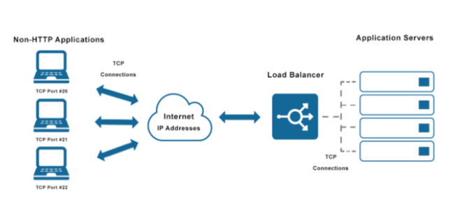

## 3.5 TCP 
- Là giao thức kết nối buộc phải thiết lập kết nối trước sau đó mới đến tiến trình truyền dữ liệu.
- Cung cấp cơ chế đánh số thứ tự gói tin

### 3.5.1 Kết Nối TCP
- Kết nối TCP không phải kết nối thực sử giữa hai điểm đầu mút giống như TDM hay FDM trong mạng chyển mạch kênh. Nó cũng không phải mạch ảo bởi vì trạng thái kết nối nằm hoàn toàn trên hệ thống đầu cuối.
- Kết nối TCP cung cấp đường truyền dữ liệu hai hướng. Nếu có kết nối TCP giữa tiến trình A chạy trên một máy tinhsvaf tiến trình B chạy trên máy tính khác,khi đó dữ liệu ứng dụng có thể truyền từ A tới B cùng lúc với dữ liệu truyền từ B sang A.
### 3.5.2 Cấu trúc TCP Segment 
- Các tiêu đề của TCP segment :
    + trường thứ tự 32 bit và trường số biên nhận 32 bit được gửi và bến nhận sử dụng trong việc cung cấp dịch vụ truyền dữ liệu tin cậy.
    + Trường độ lớn cửa sổ 16 bit được sử dụng để kiếm soát lưu lượng. Đấy chính là số lượng dữ liệu tối đa mà bên nhận có thể nhận được.
    + Trường độ dài tiêu đề 4 bit xác định độ dài của tiêu đề TCP theo đơn vị là các từ 32 bit. Tiêu đề TCP có thể có độ dài thay đổi.
    + Trường Option là tùy chọn có thể đổi tùy ý. trường này được sử dụng khi bên gửi, bên nhận có thể thương lượng về giá trị MMS hoặc giá trị gia tăng của cửa sổ trong mạng cao tốc.
### 3.5.3 Số thứ tự và số biên nhận
