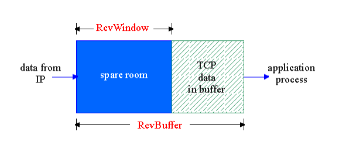

## 3.6 Kiểm Soát tắt nghẽn trong TCP 
- chiến lược cơ bản.
    + Trạm đầu cuối gửi các bản tin TCP vào trong mạng và các trạng này điều chỉnh theo tình trạng mạng quan sát được
- ACK được sử dùng để điều hòa tốc độ gửi dữ liệu của các trạm đầu cuối TCP.
- Kiểm soát luồng
    + Bảo đảm rằng hiệu quả là tốt
    + Không làm quá tải các bên
    + Các bên sẽ có cửa sổ kiểm soát

             Mô Hình Kiểm Soát Luồng trong TCP
