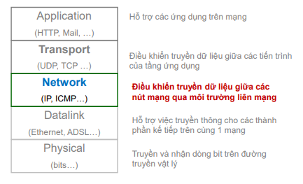
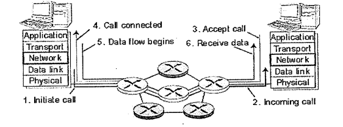
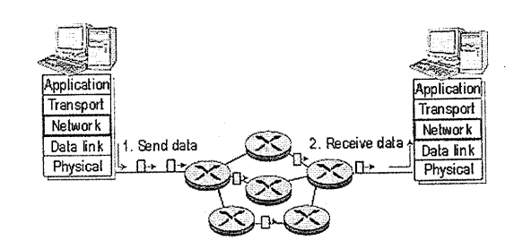

## 4.1 Tầng Mạng

- Truyền dữ liệu từ host-host
- Cài đặt trên mọi hệ thống cuối và bộ định tuyến
- Đơi vị truyền : datagram
- Bên gửi : nhận dữ liệu từ tầng giao vận, đóng gói
- Bên nhận : mở gói, chuyển phần dữ liệu trong payload cho tầng giao vận.
- Bộ định tuyến(router): định tuyến và chuyển tiếp gói tin.
- chức năng chính :
    + Xác định đường đi : Tầng mạng phải xác định các router trung gian hay tuyến đường mà gói tin được truyền từ nơi gửi đến nơi nhận.
    + Chuyển mạch : khi gói tin đến đầu vào, router phải quyết định gửi gói tin đến đấu ra thích hợp nào.
    + Thiếp lập đường truyền : cho phép bên gửi và bên nhận thiết lập các thông tin trạng thái cần thiết.
### 4.1 Mô Hình Dịch Vụ Mạng
- Chuyển mạch gói (datagram) và Chuyển mạch ảo (virtual circuit)
    + Thiết lập mạch ảo : trong cả gian đoạn thiết lập, phía gửi thông báo địa chỉ nhận với tầng mạng yêu cầu tầng mạng thiết lập mạch ảo.
    + Truyền dữ liệu : sau khi thiết lập, dữ liệu có thể được chuyển trong mạch ảo.
    + Giải phóng mạch ảo : Giai đoạn này bắt đầu khi phía gửi báo cho tầng mạng yêu cầu đóng mạch ảo
- Mô Hình Dịch Vụ Chuyển Mạch Ảo
    + 

- Mô Hình Chuyển Mạch Gói
    + 
 
    