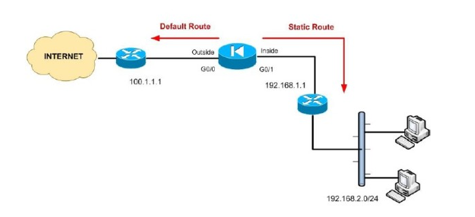

## 4.2 Định Tuyến và Chuyển Tiếp
- Định tuyến (Routing) là quá trình tìm kiếm và xác định đường đi tốt nhất trên một mạng máy tính để gói tin tới được đích thông qua các thiết bị định tuyến.
- Để làm được điều đó thì các thiết bị định tuyến cần phải dựa vào thông tin bẳng định tuyến (Routing Table) và giao thức định tuyến ( Routing Protocol).
### 4.2.1 Phân Loại Định Tuyến
- Static Route- Định tuyến tĩnh.
- Dynamic Route- ĐỊnh tuyến động.
- Default Route.

- Định Tuyến Tĩnh là phương pháp định tuyến theo phương thức người quản trị khai báo thông tin định tuyến cho thiết bị định tuyến theo phương thức thủ công.
- Ưu điểm:
    + Sử dụng ít băng thông hơn so với các phương thức định tuyến khác.
    + Không tiêu tốn tài nguyên để tính toàn và phân tích gói tin định tuyến.
    + Dễ dàng triển khai, cấu hình.
    + Có tính bảo mật tốt hơn.
- Nhược điểm:
    + Không có khả năng tự động cập nhật đường đi.
    + Phải cấu hình thủ công khi mạng có sự thay đổi.
    + Khả năng mở rộng kém, phù hợp với mô hình mạng nhỏ.
### 4.2.3 Các giải thuật và giao thức định tuyến
- Đồ thị với các nút (bộ định tuyến) và các cạnh (liên 
kết)
- Chi phí cho việc sử dụng mỗi liên kết c(x,y). 
- Băng thông, độ trễ, chi phí, mức độ tắc nghẽn.
- Giải thuật định tuyến: Xác định đường đi ngắn nhất giữa hai nút bất kỳ

