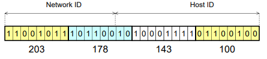

## 4.3 Địa Chỉ IPv4
- Địa chỉ IP : Một số 32 bit để định dạng cổng giao tiếp mạng trên nút đầu cuối(PC, server, smart phone).
- Mỗi địa chỉ IP được gán cho một cổng duy nhất.
- Địa chỉ IP có tính duy nhất trong mạng.
- Địa chỉ IP có 2 Phần : 
    + Host ID - phần địa chỉ máy trạm 
    + Netword ID phần địa chỉ mạng
        
### 4.3.1 Các Dạng Địa Chỉ
- Địa chỉ mạng
    + Định danh cho một mạng.
    + Tất cả các bit phân HostID là 0
- Địa chỉ quảng bá
    + Địa chỉ dùng để gửi dữ liệu cho tất cả các máy trạm trong mạng.
    + Tất cả các bit phần HostID là 1
- Địa chỉ máy trạm 
    + Gán cho một cổng mạng.
- Địa chỉ nhóm 
    + Định danh cho nhóm.
- Phân lớp địa chỉ IP

- Hạn chế của việc phân lớp địa chỉ
    + Lãng phí không gian địa chỉ làm hạn chế việc sử dụng không gian địa chỉ.