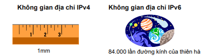
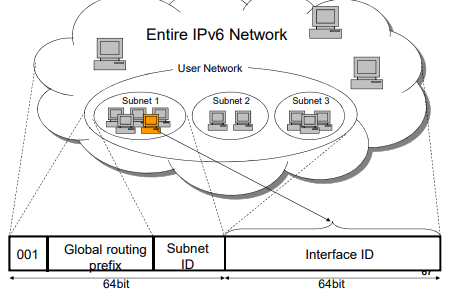
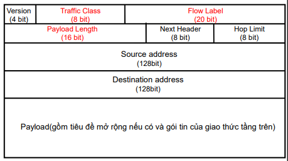

## 4.4 Giao Thức IPv6
- Xuất phát từ nhu cầu thực tế : địa chỉ IPv4 cạn kiệt, không đủ để cấp phát.
- cải tiến trên IPv6 :
    + Mở rộng không gian địa chỉ.
    + Sử dụng địa chỉ có độ dài 128 bit
    + Phân vùng địa chỉ

- Cách thức biểu diễn
    + 128 bit, biểu diễn bởi số hệ 16
    + Phân cách ":" giữa các nhóm gồm 4 số hexa
    + Bỏ qua chuỗi liên tiếp các số 0 
    + Sử dụng ký hiệu mặt nạ mạng/n
### 4.4.1 Cấu Trúc Địa chỉ IPv6 
- Gồm 2 Phần : Network prefix và Interface ID
- Network prefix : có 64 bit.
- Host ID : 64 bit
    + Chuẩn EUI-64
    + Trong trường hợp mạng Ethernet, Host ID Được xác định từ địa chỉ Mac
- Phân Vùng Địa Chỉ
    + Địa chỉ toàn cục: Network prefix có
        - Global routing prefix: 48 bit với 3 bit đầu là 001
        - SubnetID: 16 bit
    + Địa chỉ liên kết nội bộ: Network prefix có
        - 10 bit đầu là 1111 1110 10
        - 54 bit còn lại mang giá trị 0
    + Địa chỉ cục bộ: Network prefix có
        - 10 bit đầu là 1111 1110 11
        - 38 bit kế tiếp mang giá trị 0
        - SubnetID: 16 bit
- Địa chỉ toàn cục 

- Các dạng địa chỉ IPv6
    + Địa chỉ Unicast Address: gán cho một cổng giao tiếp mạng
    + Địa chỉ Anycast Address: gán cho một nhóm cổng giao tiếp mạng
        - Gói tin gửi tới địa chỉ anycast addr.được chuyển tiếp cho nút gần nhất xác định bởi giao thức định tuyến
    + Địa chỉ Multicast Address: gán cho một nhóm  cổng giao tiếp mạng trong một scope
        - Bắt đầu bởi 1111 1111
        - Gói tin gửi tới địa chỉ multicast addr. được chuyển tới tất cả các nút trong nhóm
### 4.4.3 Khuôn dạng gói tin IPv6 
- Version: Phiên bản giao thức(=110)
- Traffic Class: số hiệu giao thức tầng trên
- Flow Label: Điều khiển QoS
- Payload Length: kích thước phần dữ liệu
- Next header: Tiêu đề tiếp theo mở rộng tiếp theo
- Hop limit: tương tự TT

