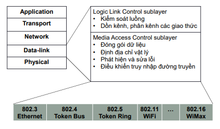

## 5.1 Tổng Quát về Tầng liên kết dữ liệu
#### Tầng Liên Kết dữ liệu trên mô Hình TCP/IP

- Các Chức Năng Chính:
    + Đóng gói 
        - Đơn vị dữ liệu : khung tin (frame)
        - Bên gửi : thêm header, trailer cho gói tin nhận được từ tầng mạng
        - Bên nhận : bỏ header và trailer, đẩy lên tầng mạng.
    + Địa chỉ hóa : sử dụng địa chỉ Mac
    + Điều Khiển truy nhập đường truyền : Nếu mạng đa truy nhập, cần có giao thức điều khiển đa truy nhập.
    + Kiểm soát luồng : đảm bảo bên nhận không bị quá tải.
    + Kiểm soát lỗi : phát hiện và sữa lỗi bit trong các khung tin.
    + Chế độ truyền : simplex, half-duplex,full-duplex.
- Định Địa chỉ 
    + Địa chỉ Mac : 48 bit, được quản lý bởi IEEE.
    + Mỗi cổng mạng được gán một MAC.
        - Không thể thay đổi địa chỉ vật lý.
    + Không Phân Cấp, có tính di động.
        - Không cần thay đổi địa chỉ Mac khi host chuyển sang mạng khác.
    + Địa chỉ quảng bá trong mạng LAN :
        - FF-FF-FF-FF-FF-FF
    