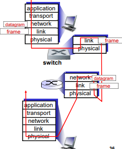
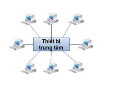
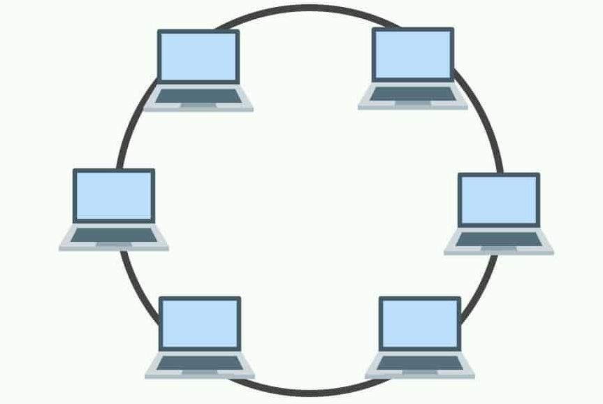

## 5.4.1 Các Thiết Bị Kết Nối Trong Mạng LAN
- Repeater(Bộ Lặp), Hub(Bộ Chia)
    + Đảm nhiệm chức năng tầng 1
    + Tăng cường tín hiệu -> mở rộng phạm vi kết nối
    + <= 4 repeater / 1 đoạn mạng.
- Bridge(Cầu), Switch(Bộ Chuyển Mạch)
    + Đảm nhiệm chức năng tầng 1 và 2.
    + Chia nhỏ miền đụng độ
    + Chuyển mạch cho khung tin dựa trên địa Mac.
    + Roter (Bộ Định tuyến)

#### Router và Switch
- xử lý gói tin : lưu và chuyển tiếp(store-and-forward)
    + Router : thiết bị tầng mạng.
    + Switch : thiết bị tầng liên kết dữ liệu.
- Chuyển tiếp gói tin :
    + Router : sử dụng thuật toán định tuyến toán bảng chuyển tiếp(Forwarding Table), chuyển tiếp địa chỉ IP đích.
    + Switch : sử dụng cơ chế tự học tính toán bảng Mac Table, chuyển tiếp theo địa chỉ Mac đích.

### 5.4.2 Các Hình Trạng cơ bản của Lan
- Tất cả các nut mạng sử dụng chung đường truyền - trục(backbone)
- Mỗi nút mạng kết nối vào trục bằng đầu nối chữ T.
- Phương thức truyền : điểm - đa điểm
    + Dữ liệu truyền theo 2 hướng
    + Nút nhận : kiểm tra địa chỉ đích của dữ liệu
- Hình Sao :
    + Một nút mạng đóng vai trò thiết bị trung tâm
        - Hub
        - Switch
        - Router
    + Các nút mạng khác kết nối trực tiếp với thiết bị trung tâm
    + Phương thức truyền
        - Điểm - điểm : Switch,router
        - Điểm - Đa Điểm : hub.
    
- Hình Vòng 
    + Các nút mạng chung đường truyền khép kín
    + Phương thức truyền : điểm- điểm hoặc điểm - đa điểm
    
    
