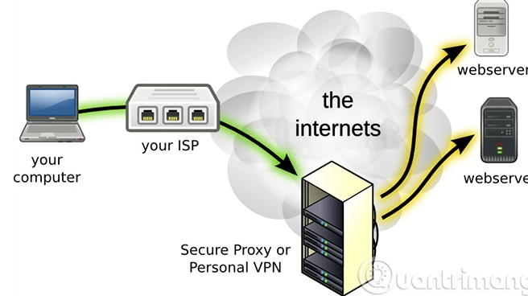
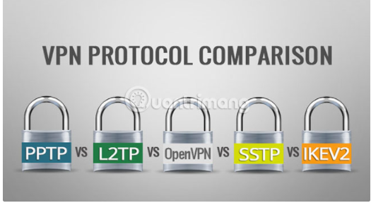
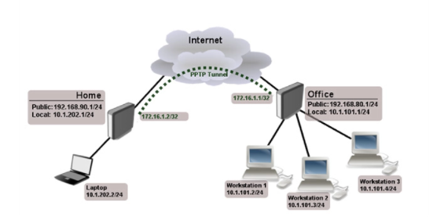
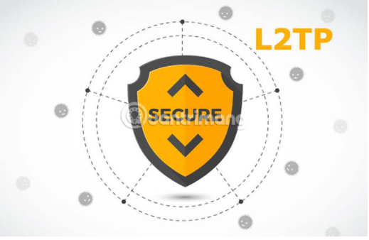

## 5.6 Mạng Riêng Ảo (VPN)
- là một công nghệ mạng giúp tạo kết nối mạng an toàn khi tham gia vào mạng công cộng như Internet hoặc mạng riêng do một nhà cung cấp dịch vụ sở hữu. Các tập đoàn lớn, các cơ sở giáo dục và cơ quan chính phủ sử dụng công nghệ VPN để cho phép người dùng từ xa kết nối an toàn đến mạng riêng của cơ quan mình.

### 5.6.1 Các Gia thức thường dùng trong VPN

- Bản chất của giao thức VPN là một tập hợp các giao thức. Có một số chức năng mà mọi VPN phải giải quyết được:
- Tunnelling (kỹ thuật truyền dữ liệu qua nhiều mạng có giao thức khác nhau) - Chức năng cơ bản của VPN là phân phối các gói (packet) từ điểm này đến điểm khác mà không để lộ chúng cho bất kỳ ai trên đường truyền. Để làm điều này, VPN đóng gói tất cả dữ liệu theo định dạng mà cả máy khách và máy chủ đều hiểu được. Bên gửi dữ liệu đặt nó vào định dạng tunnelling và bên nhận trích xuất để có được thông tin.
- Mã hóa: Tunnelling không cung cấp tính năng bảo vệ. Bất cứ ai cũng có thể trích xuất dữ liệu. Dữ liệu cũng cần phải được mã hóa trên đường truyền. Bên nhận sẽ biết cách giải mã dữ liệu từ một người gửi nhất định.
- Xác thực. Để bảo mật, VPN phải xác nhận danh tính của bất kỳ client nào cố gắng “giao tiếp” với nó. Client cần xác nhận rằng nó đã đến đúng máy chủ dự định.
- Quản lý phiên: Một khi người dùng được xác thực, VPN cần duy trì phiên để client có thể tiếp tục “giao tiếp” với nó trong một khoảng thời gian.

#### Point-To-Point Tunneling Protocol (PPTP)
- 

#### L2TP 
- Giao thức L2TP thường hoạt động với thuật toán mã hóa IPSec

