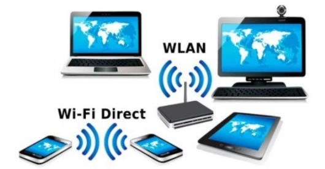
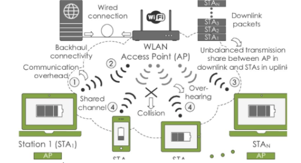
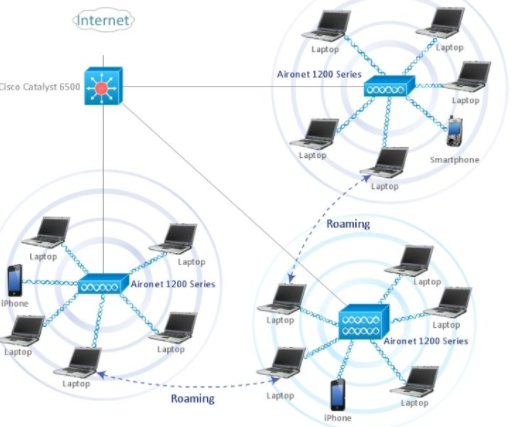
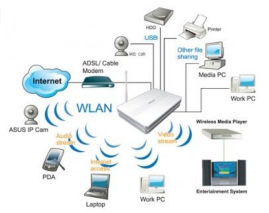

## 5.8 Mạng LAN Không dây(Wlan)
- Là mạng cho phép các thiết bị kết nối và giao tiếp không dây. Không giống như mạng LAN có dây truyền thống, trong đó các thiết bị giao tiếp qua cáp Ethernet. Các thiết bị trên mạng WLAN giao tiếp qua Wi-Fi.

### 5.8.1 Cách Thức Hoạt Động Của WLAN
- Mặc dù mạng Wlan có thể trông khác với mạng LAN truyền thống. Những chúng hoạt động theo cùng một cách. Các thiết bị mới thường được thêm vào và cấu hình vằng DHCP.Có thể giao tiếp với các thiết bị khác trên mạng giống như cách làm trên mạng có dậy.
- Khác biệt là cách dữ liệu được truyền. Mạng Lan dữ liệu được truyền qua cáp vật lý còn trong mạng Wlan dữ liệu được truyền qua mạng bằng một giao thức IEEE 802.11

### 5.8.2 Ưu Và Nhược Điểm của mạng Lan Không Dây
#### Ưu điểm của mạng WLAn
- Các thiết bị có thể kết nối không dây. Loại bỏ sự không cần thiết của dây cáp.
- Chi phí và phạm vi kết nối ...
- Có thể nâng cấp dễ dàng

#### Nhược Điểm Của Wlan
- An toàn kém hơn LAN. Bất kỳ thiết bị không dây nào cũng có thể cố gắng kết nối với mạng Wlan. Vì vậy điều quan trọng là phải hạn chế quyền truy cập vào mạng.

 
