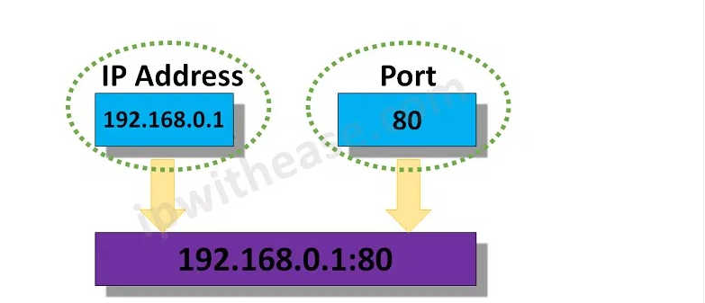

## I. Khai niệm về Prot
### 1. Prot mạng

- Port mạng là điểm cuối của quá trình giao tiếp trong hệ thống mạng máy tính. Port là giao thức bit 16 đứng đầu (chèn vào phần đầu header) của mỗi gói tin trong giao thức TCP, UDP hay còn gọi là cổng port, nơi quy định các tập dữ liệu riêng biệt.

- Port là một dạng thuật toán đã được định sẵn và mỗi máy tính cần phải có thì mới có thể nhận và gửi các gói tin đi được. Khi hoạt động Port cũng được quy đổi giống với số bit của bất kì một mã dữ liệu nào đó. Đơn giản thì đây giống như cánh cổng có quyền cho vào hay không với các dữ liệu muốn ra vào hệ thống máy tính của bạn. Khi có 1 địa chỉ IP, bạn sẽ xác định được một máy trong một mạng, nhưng nếu chúng chạy cùng nhiều dịch vụ khác nhau thì phải có cách để phân biệt được chúng và lúc này bạn cần đến Port
- Cổng mạng được cung cấp bởi các giao thức Lớp Truyền tải (Transport Layer) trong mô hình OSI. Mỗi giao thức và tổ hợp địa chỉ truyền tải được xác định thông qua port với giao thức 16-bit được gọi là số cổng, chẳng hạn như Giao thức TCP/IP và Giao thức UDP là một số phục vụ giao tiếp điểm cuối giữa hai máy tính.

### 2. Port Hoạt động
- Port hoạt động bằng cách xác định cổng cấp quyền cho dữ liệu được ra hay vào trong hệ thống máy tính của bạn trong mạng. Tất cả các thiết bị được kết nối mạng đều được trang bị các port được tiêu chuẩn hóa có số hiệu được ấn định. Những con số này được dành riêng cho một số giao thức nhất định và chức năng liên quan của chúng.
- Các port luôn được liên kết với địa chỉ IP của máy chủ cũng như các giao thức sử dụng cho việc giao tiếp trong mạng máy tính với nhau. Mỗi port được đặt tên bằng 1 số thứ tự nhất định và mỗi cổng sẽ phục vụ cho những dịch vụ cụ thể khác nhau nhằm mục đích cho phép các gói tin dễ dàng đến đúng nơi quy định. Bởi vì mục đích này mà các port có số thấp (từ 1024 trở xuống) thường được sử dụng cho các dịch vụ phổ biến từ trước đến nay. Còn các port có số cao hơn (từ 1024 trở lên) thì lại thường được sử dụng làm cổng tạm cho các dịch vụ ít phổ biến hơn.

- Để xác định lưu lượng đến nên được hướng đến giao thức nào, các số cổng khác nhau được sử dụng. Chúng cho phép một máy chủ lưu trữ với một địa chỉ IP duy nhất chạy các dịch vụ mạng. Mỗi số cổng có một dịch vụ riêng biệt và đối với mỗi máy chủ lưu trữ có thể có 65535 cổng cho mỗi địa chỉ IP. Tổ chức Internet Assigned Numbers Authority (IANA) chịu trách nhiệm quản lý việc sử dụng các cổng này.

### 3. Tác dụng của Port
- Port mạng là chìa khóa, địa chỉ nhận diện tập tin, dữ liệu 
    + Giống như một người lính gác, số địa chỉ nhà ở, khi bạn đăng ký các loại port trên hệ thống máy tính của bạn sẽ giúp cho các tập tin được truy cập, được đưa vào đúng với địa chỉ port khớp với đầu bit tập tin đó
- Port mạng có tác dụng chọn lọc tin 
    + Port sẽ quy định chỉ những tập tin nào mới được nhập vào máy và được thông qua xuất nhập trong hệ thống máy. Nếu như tập tin đúng với cổng bit thì sẽ được xâm nhập vào máy nhưng tất nhiên máy tính sẽ từ chối việc nhập dữ liệu nào đó nếu như không đúng cổng port. Điều này sẽ giúp phân loại và lựa chọn luôn những tập tin an toàn.
- Port mạng có tác dụng bảo vệ xâm nhập có hại cho máy tính
    +  Port cũng được xem là một trong những cổng bảo vệ an toàn cho máy tính của bạn. Port có thể phát hiện những tập tin xấu, có chứa virus làm ảnh hưởng đến các tập tin và máy tính. Nó sẽ loại bỏ những tập tin đó đi, loại bỏ virus xâm nhập, giúp máy tính luôn giữ được sự an toàn và đảm bảo tránh được những thông tin nhiễu.
### 4. Sự khác biệt giữa địa chỉ Ip và Port 

- Một địa chỉ IP xác định một máy trong một mạng IP và được sử dụng để xác định đích đến của một dữ liệu gói. Số cổng xác định một ứng dụng hoặc dịch vụ cụ thể trên hệ thống.
- Địa chỉ IP xác định một máy trong mạng IP và xác định đích của gói dữ liệu, trong khi số cổng xác định các ứng dụng hoặc dịch vụ cụ thể trên hệ thống.
- Địa chỉ IP là một địa chỉ logic được sử dụng để xác định một thiết bị trên mạng. Bất kỳ thiết bị nào được kết nối với internet đều được gán một địa chỉ IP duy nhất để nhận dạng. Thông tin nhận dạng này cho phép các thiết bị giao tiếp qua internet.
- Số cổng là một phần của thông tin địa chỉ giúp xác định người gửi và người nhận thông tin và một ứng dụng cụ thể trên thiết bị. Số cổng bao gồm các số 16 bit.

## II. Danh sách các port thông dụng 

1. 
- Cổng 80: Khi một người sử dụng địa chỉ IP hay HostName của các bạn trong bộ duyệt, bộ duyệt sẽ quan sát địa chỉ IP trên cổng 80 theo mặc định cho những trang Web.

2. 
- Cổng 81: Khi một người sử dụng nhập địa chỉ IP hay HostName của các bạn trong bộ duyệt, bộ duyệt sẽ quan sát địa chỉ IP trên cổng 80. Nếu Cổng thì bị tắc nghẽn, Cổng 81 được sử dụng như một Cổng xen kẽ cho một website hosting nào đó.

3. 
- Cổng 21: Khi người nào đó thử nối tới dịch vụ FTP của các bạn, khách hàng FTP sẽ cố gắng kết nối trên Cổng 21 theo mặc định. Thì cổng 21 mở cho những khách FTP đăng nhập và nối tới server của các bạn

4. 
- Cổng 22: Nếu bạn chạy một SSH Secure Shell, cổng này được yêu cầu cho Khách hàng SSH để nối tới người phục vụ của các bạn.

5. 
- Cổng 23: Nếu bạn chạy một người phục vụ Telnet, cổng này được yêu cầu cho Khách hàng Telnet để nối tới người phục vụ của các bạn. Telnet có thể được sử dụng cho những cổng khác kiểm tra những công tác dịch vụ, nhưng để sử dụng telnet cho admin và đăng nhập từ xa thì cổng 23 phải mở.

6. 
- Cổng 25: Khi người nào đó gửi một thư từ thông báo tới server SMTP của các bạn, thư từ sẽ cố gắng để đi vào tới server của các bạn trên Cổng 25. Đây là tiêu chuẩn SMTP (thủ tục vận chuyển Thư từ Đơn giản)
- Port 25 – port không mã hóa
- Port 465 – SSL/TLS port, cũng có thể được gọi là SMTPS

7. 
- Cổng 2525: Khi người nào đó gửi một thư từ thông báo tới server SMTP của bạn, thư từ sẽ để đi vào tới server của các bạn trên Cổng 25. Cổng 2525 xen kẽ được dùng bởi TZO cho những công tác lưu trữ và truyền lại. Đây là một cổng không tiêu chuẩn, nhưng sẻ hữu ích nếu SMTP (thủ tục vận chuyển Thư từ Đơn giản) bị tắc nghẽn

8. 
- Cổng 110: Khi bạn chạy một máy tính, những người sử dụng sẽ vào theo đường POP3 (Nghi thức cơ quan bưu điện) hay IMAP4 (giao thức truy nhập Thông báo Internet) khôi phục thư từ của họ. POP3 là nghi thức tốt nhất để truy nhập những hòm thư.
-  Mặc đình, port POP3 là:
    + Port 110 – port không mã hóa
    + Port 995 – SSL/TLS port, cũng có thể được gọi là POP3S

9. 
- Cổng 119: Khi bạn chạy một server Tin tức, điển hình những khách hàng Tin tức muốn nối tới người phục vụ Tin tức của các bạn sẽ nối trên cổng 119. Cái này chuyển những nhu cầu để mở để chạy server tin tức của mình.
10. 
- Cổng 143 :Internet Message Access Protocol (IMAP) Mail Server: giao thức truy cập thông báo Internet ngày càng trở nên phổ biến hơn bao giờ hết và cho phép sử dụng từ xa. Vì thế, các thông báo đều được giữ ở server để dễ dàng truy cập trực tuyến, online, offline.
    + Port 143 – port không mã hóa
    + Port 993 – SSL/TLS port, cũng có thể được gọi là IMAPS
