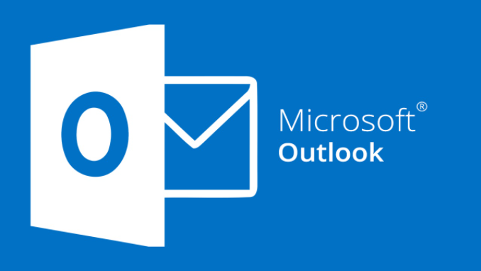
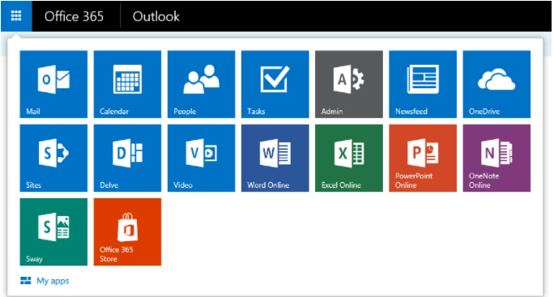

## 1. khai niệm Outlook

- Outlook là phần mềm quản lý thông tin cá nhân của Microsoft, bao gồm các công cụ: e-mail, lịch, công việc quản lý, quản lý liên lạc, ghi chú, tạp chí và duyệt web.

- Outlook có thể được sử dụng như một ứng dụng độc lập, hoặc có thể làm việc với các ứng dụng kết hợp khác cho nhiều người dùng trong một tổ chức, chẳng hạn như chia sẻ các hộp thư và lịch biểu, trao đổi thư mục công cộng, danh sách SharePoint và lịch trình cuộc họp. 
- Microsoft Outlook không phải là một công cụ miễn phí; bạn sẽ phải mua phiên bản hoàn chỉnh hoặc trả cước để sử dụng khi có nhu cầu. 

## 2. Ưu điểm của Outlook

- Tốc độ truy cập nhanh, không gian lưu trữ rộng mở
Đa số người dùng thường sử dụng tính năng email trên Outlook vì phần mềm này có tốc độ truy cập nhanh, không giới hạn không gian lưu trữ, email được sắp xếp theo dung lượng, thời gian nhận, thời gian gửi… dễ dàng tra cứu.

- Hỗ trợ việc gửi mail đính kèm tập tin có dung lượng lớn kết hợp với OneDrive, Skype Drive và khôi phục email đã xóa (trong phạm vi và thời gian cho phép) ngay cả khi bạn đã hoàn tất thao tác xóa email trong thùng rác.

- Tính bảo mật và khả năng chống spam cao
    

    + Khả năng chống spam cao với thao tác chặn email theo địa chỉ hoặc tên miền cụ thể. Khởi tạo địa chỉ email chỉ dùng một lần (dùng cho các hoạt động gửi mail một lần hoặc Email Marketing) giúp bạn tránh khỏi các bộ máy spam mail. Với Outlook, bạn có thể tạo, xóa và thay đổi các địa chỉ mail hay đăng nhập bằng mật khẩu tạm thời một cách dễ dàng. 
- Đa dạng kết nối
    + Tích hợp với các trang mạng xã hội đang chiếm ưu thế hiện nay như Facebook, Twitter hay LinkedIn… Giúp người dùng email có thể dễ dàng vừa check mail vừa lướt các kênh mạng xã hội này. Tích hợp Skype để trò chuyện thông qua Skype.

    + Ngoài ra, Outlook còn cho phép sử dụng HTML và CSS. Cụ thể, người dùng có thể thỏa sức sáng tạo để làm cho bức thư của mình thêm sinh động hơn khi có thể soạn thảo theo chế độ HTML. Phân nhóm thư đến, lọc thư riêng của cá nhân / doanh nghiệp.

- Cho phép sử dụng HTML và CSS
    + Cụ thể, người dùng có thể thỏa sức sáng tạo để làm cho bức thư của mình thêm sinh động hơn khi có thể soạn thảo theo chế độ HTML.

- Khôi phục email đã xoá
    + Outlook hỗ trợ khôi phục email đã xoá (trong phạm vi và thời gian ứng dụng cho phép) ngay cả khi bạn đã hoàn tất thao tác email trong thùng rác. 