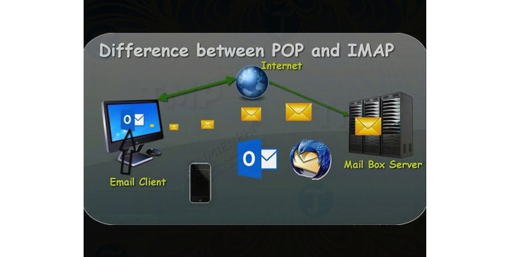

## I.Imap và POP

- IMAP là viết tắt của Internet Message Access Protocol và POP là viết tắt của Post Office Protocol. Cả IMAP và POP đều là giao thức email, cho phép người dùng đọc các email cục bộ bằng các ứng dụng của bên thứ 3 như Outlook, Thunderbird, Eudora GNUMail hay Mail (Mac).

## II. PHÂN BIỆT POP VÀ IMAP 
### 1.cách Thức Hoạt Động 
#### cách Thức Hoạt Động Của POP

- Kết nối với máy chủ (server).
- Lấy lại được tất cả các mail.
- Lưu trữ cục bộ dưới dạng mail mới.
- Xóa mail khỏi máy chủ (server).
- Ngắt kết nối.

- Hành vi mặc định của POP là xóa mail khỏi máy chủ (server). Tuy nhiên hầu hết POP client cũng cung cấp tùy chọn cho phép lưu lại bản sao mail tải xuống trên máy chủ.

#### Cách Thức Hoạt Động Của IMAP:

- Kết nối với máy chủ (server).
- Lấy nội dung người dùng yêu cầu và bộ nhớ cache cục bộ, chẳng hạn như danh sách mail mới, bản tóm tắt thư hoặc nội dung các email.
- Xử lý các thao tác của người dùng, chẳng hạn như đánh dấu email đã đọc. xóa email, ... .
- Ngắt kết nối.

- Rõ ràng cách thức hoạt động của IMAP phức tạp hơn chút so với POP. Về cơ bản cấu trúc thư mục và email được lưu trữ trong máy chủ và chỉ có bản sao được lưu trữ cục bộ.

- Thường thì các bản sao cục bộ này được lưu trữ tạm thời, tuy nhiên nếu muốn bạn có thể lưu trữ các bản sao vĩnh viễn.

### 2. Ưu điểm của POP và IMAP

#### Ưu Điểm Của POP
- Là giao thức đầu tiên, POP tuân theo ý tưởng đơn giản chỉ có một client yêu cầu truy cập mail trên máy chỉ và lưu trữ mail cục bộ là giải pháp tốt nhất. Chính vì vật mà POP có một số ưu điểm dưới đây:

    + Mail lưu trữ cục bộ, tức là có thể truy cập bất cứ lúc nào ngay cả khi không có kết nối Internet.
    + Chỉ yêu cầu kết nối Internet khi cần gửi và nhận mail.
    + Tiết kiệm không gian lưu trữ máy chủ.
    + Có thể lưu trữ bản sao mail trên máy chủ hoặc không.
    + Hợp nhất nhiều tài khoản email và máy chủ vào một hộp thư đến.

#### Ưu Điểm Của IMAP
- IMAP được tạo ra để cho phép truy cập từ xa các email được lưu trữ trên máy chủ từ xa. Ý tưởng này là cho phép nhiều client hoặc user (người dùng) quản lý cùng một hộp thư đến.
- Vì vậy nếu có đăng nhập từ xa trên một máy tính khác hoặc đăng nhập máy tính cá nhân của mình ở nhà, bạn sẽ thấy cùng một email và cấu trúc thư mục vì chúng được lưu trữ trên máy chủ và tất cả các thay đổi mà bạn thực hiện trên các bản sao cục sẽ được đồng bộ với máy chủ ngay lập tức.

### III. Sự lựa chọn 
#### Chọn POP Nếu:

- Muốn truy cập mail của bạn trên một thiết bị duy nhất.
- Cần truy cập email liên tục, ngay cả khi có kết nối Internet hay không.
- Bộ nhớ máy chủ hạn chế.

#### Chọn IMAP Nếu:

- Muốn truy cập email từ nhiều thiết bị khác nhau.
- Có kết nối Internet đáng tin cậy và liên tục.
- Tải email mới hoặc email trên máy chủ nhanh hơn.
- Không gian lưu trữ cục bộ hạn chế.
- Bạn cảm thấy lo lắng về việc sao lưu email.