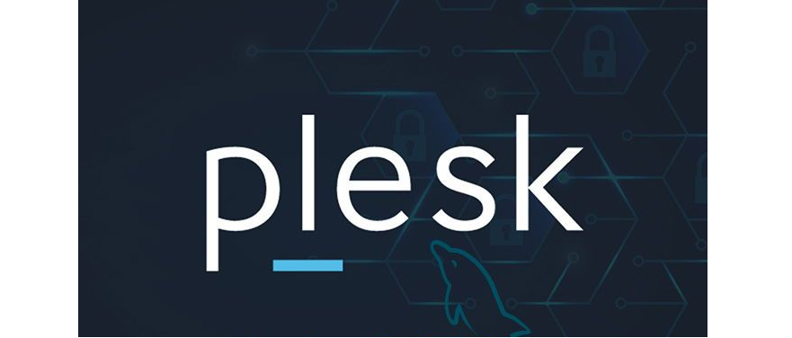

## I. Tìm hiểu về Plesk 

- Plesk là hệ thống quản lý hosting cấp cao rất được ưu chuộng hiện nay. Nhiệm vụ của phần mềm Plesk là hỗ trợ các chức năng quản lý các tác vụ liên quan đến website như hosting và tên miền

- Plesk cung cấp một hệ thống Web lưu trữ gồm thanh toán tự động và dự phòng, một Web builder được tích hợp sẵn và có thể truy cập đến hàng trăm ứng dụng trên Web. Điều này cho phép bạn có thể dễ dàng tạo ra các kế hoạch dịch vụ độc đáo, nhằm đáp ứng tối đa nhu cầu của khách hàng. Bên cạnh đó, bạn cũng có thể cung cấp đến khách hàng những công cụ xây dựng website, cùng một loạt ứng dụng, phiên bản web trên di động, tên miền, giấy chứng nhận SSL và làm tăng ARPU.

## II. Ưu điểm của Plesk 

- Có nhiều phần mềm hữu ích, ổn định và tin cậy: Vì Plesk được tích hợp thêm tính năng thiết kế website và nhiều ứng dụng khác như email, DNS, ...

- Dễ dàng sử dụng trên cả 2 hệ điều hành Window & Linux: Nhiều công ty lựa chọn để quản lý máy chủ vì plesk đa dạng trên cơ cấu hoạt động. 

- Hệ thống bảo mật tốt: Plesk đảm bảo độ riêng tư cho dịch vụ mail nhờ giao thức SNI và hệ thống bảo mật tốt với Mod Security & Fail2ban và SSL.

- Tích hợp đầy đủ các tính năng quản lý tác vụ để vận hành website.

- Giao diện thân thiện, dễ sử dụng: Người dùng tự do quản lý website mà không phân biệt Admin, User hay Reseller.

- Dễ dàng thiết lập nhiều host với cấu hình đã được định sẵn. 

- Có thể tạo nhiều tài khoản FTP và kết hợp với cấu trúc web linh hoạt

## III. Tổng quan tính năng của Plesk
- Hỗ trợ và chăm sóc khách hàng một cách tự động và nhanh chóng.
- Khả năng tự động hóa cao cấp. Điều này giúp người dùng tiết kiệm một khoảng thời gian đáng kể trong việc quản lý.
- Dễ dàng mở rộng mạng lưới kết nối kinh doanh, tăng doanh thu thông qua Parallels Storefront.
- Update liên tục các tính tính năng mới nhất. Điều này sẽ phục vụ nhu cầu và mục đích của từng phân khúc khách hàng.

## IV. Những tính năng nổi bật trên Plesk

- Giao diện thân thiện, đơn giản
    + Plesk sở hữu giao diện dễ dùng, cho phép quản trị web thực hiện các tác vụ chỉ với vài nhấp chuột. Công cụ cài đặt một nhấp chuột phù hợp với những người đang tìm kiếm giải pháp đơn giản để cài đặt CMS trên trang web.
    + Bảng điều khiển có thể được tùy chỉnh bao gồm các tiện ích bổ sung mà người dùng thường xuyên sử dụng. Người dùng có thể tìm lại tiện ích bổ sung mà họ cần trong hộp tìm kiếm được tích hợp trong bảng điều khiển.

    + Với Plesk, bạn có thể tạo tài khoản với phân quyền thấp hơn cho người dùng khác, điều này khiến họ không thể thực hiện bất kỳ thay đổi nào trong bảng điều khiển nếu không được cấp quyền.
- Hỗ trợ đã ngôn ngữ
    + Giao diện Plesk hỗ trợ nhiều loại ngôn ngữ được sử dụng phổ biến trên thế giới như Tiếng Anh, tiếng Tây Ban Nha, tiếng Nhật, Tiếng Đức...
- Sử dụng trình tạo trang miễn phí
    + Plesk cung cấp một trình tạo trang Web miễn phí, bạn có thể thực hiện việc tạo trang web chỉ với các bước kéo thả cực kỳ đơn giản. Ngoài ra, Plesk còn hỗ trợ hơn 100 mẫu dựng sẵn giúp bạn có nhiều lựa chọn tham khảo.
- Mức độ bảo mật cao
    + Plesk được bảo vệ thông qua hệ thống bảo mật cực mạnh, giúp máy chủ tránh khỏi thư rác.
    + Phần mềm Fail2ban liên tục được thực hiện để loại bỏ người dùng độc hại và ngăn chặn các cuộc tấn công nhắm đến máy chủ. Bạn có thể sử dụng chức năng chặn IP đối với các hacker.
    + Tường lửa ModSecurity giúp bạn thiết lập các quy tắc riêng. Plesk sử dụng SSL để mã hóa trang bảng điều khiển, bạn sẽ nhận thấy URL của bảng điều khiển sử dụng đầu ngữ HTTPs.
    + Trong lần đầu tiên truy cập vào bảng điều khiển, cảnh báo sẽ được hiển thị trên trình duyệt. Nếu không muốn người dùng nhận được thông báo, bạn nên sử dụng URL không được mã hóa.
- Tự động hóa 
    + Một số tình năng của Plesk được sử dụng tử động như trình cập nhật thành phần tự động và cơ chế tự động cập nhật khóa. Plesk cung cấp nhiều giao diện miễn phí cho bảng điều khiển, nếu không muốn sự dựng những giao diện này, bạn có thể thiết kế cho riêng mình một giao diện khác.
- Giám sát di động
    + Plesk hỗ trợ giám sát di động, bạn có thể theo dõi trang thái khi bạn không ở trung tâm máy chủ. Giám sát di động giúp bạn nhận biết sự cố trên máy chủ và thực hiện các phương án sửa chữa kịp thời.
