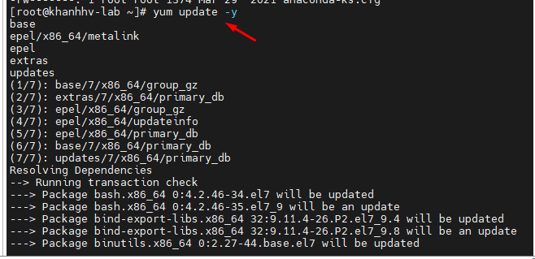
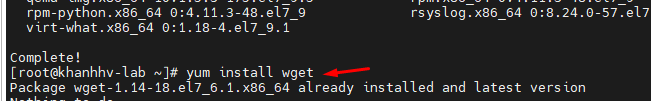
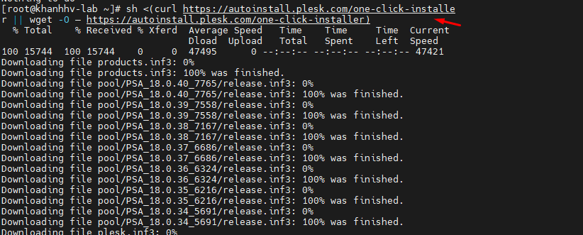
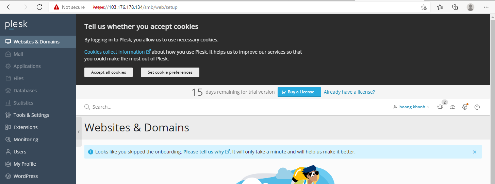
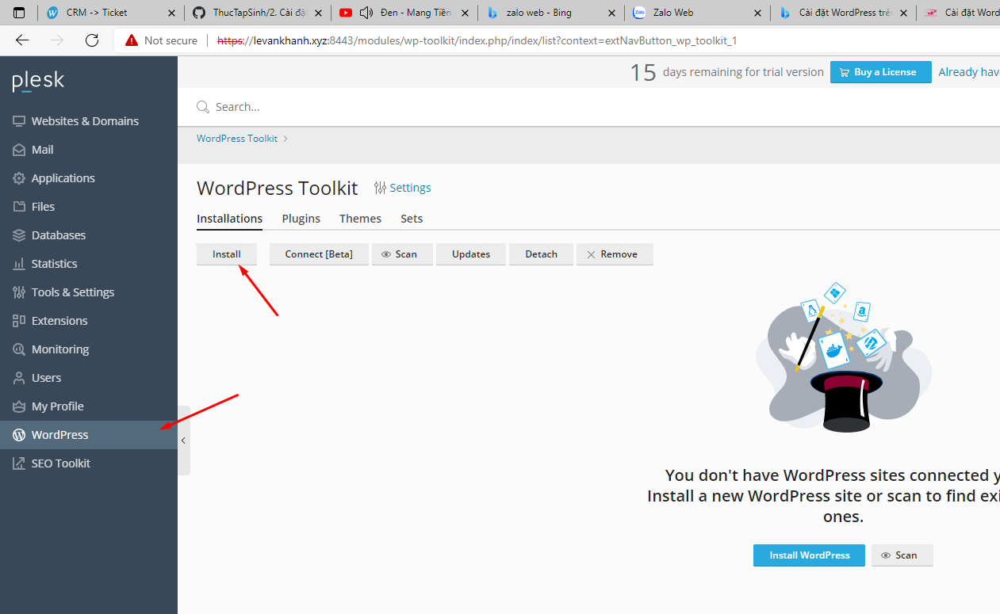
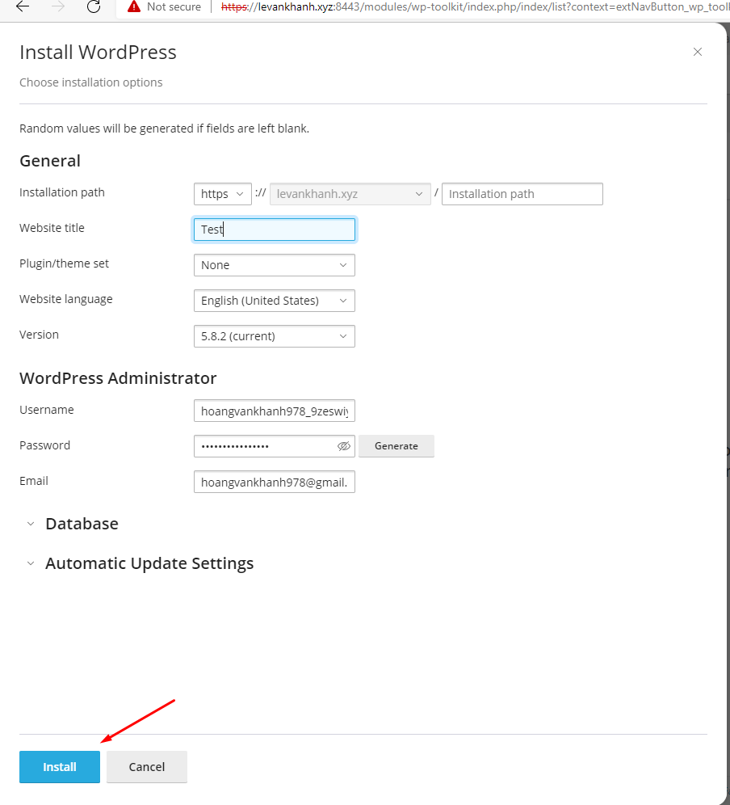
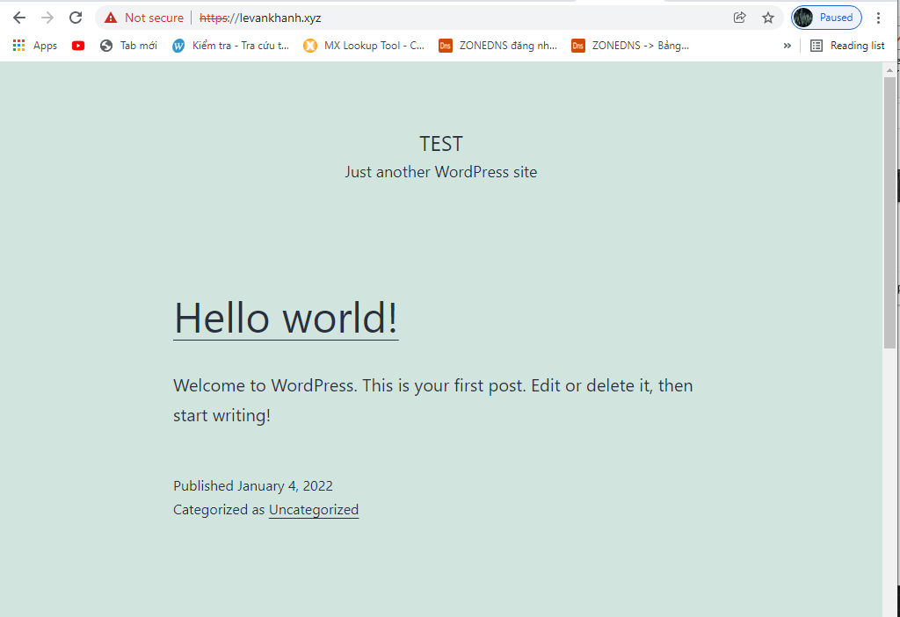

## I. Chuẩn bị
- Ram : Trên máy chủ Linux tối thiểu là 512MB
- Ổ đĩa : trên máy chủ Linux tối thiểu là 10GB
- OS Linux Centos 7/8

## II. Các bước cài đặt Plesk 
### Bước 1: Cập nhật hệ thống
- Ta sẽ chạy cập nhật hệ thống tất cả lên mới nhất
- `yum update -y`

- Cài đặt gói Wget để tải Plesk từ internet về
- `yum install wget`

### Bước 2: Cài đặt Plesk 
- `sh <(curl https://autoinstall.plesk.com/one-click-installer || wget -O – https://autoinstall.plesk.com/one-click-installer)`

### Bược 3: đăng nhập vào giao diện Plesk 

## III. Cài đặt WordPrss 
### Bước 1: Click Install WordPress trên domain

### Bước 2: Nhập thông tin:
- Installation Path: Đường dẫn website
- Website Title: Tên Website
- Plugin/theme set: Plugin/thêm sử dụng cho wordpress
- Website language: Chọn ngôn ngữ cho WordPress
- Version: Chọn phiên bản WordPress
- WordPress administrator: Đặt tên người dùng và mật khẩu quản trị.
- Database: Cơ sở dữ liệu sử dụng cho wordpress
- Auto update Setting: Tự động cập nhật
- Sau khi thiết lập xong, Click Install để cài đặt

### Bước 3: kiểm tra 

