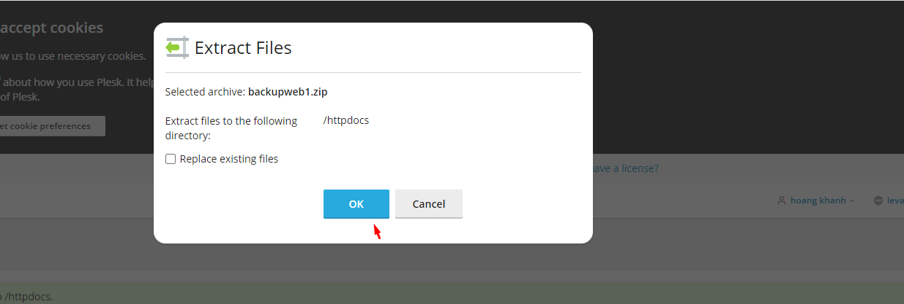

## I. Tiến hành Backup mã nguồn và database
### Bước 1: tiến hành Backup mã nguồn
#### Chọn file 

#### Chọn httpdocs

#### Chọn Archive -> chọn add Archive 

#### Thực hiện tải xuống file vừa backup

### Bước 2: Tiến hành Backup Database

#### Chọn databases

#### chọn Export Dump

#### Sau khi hoàn thành việc tải xuống ta sẽ có 2 file như sau

## II. Thực hiện Upload lên 

### Bước 1: Chọn File 

#### Chọn httpdos

#### Chọn Upload -> Tải file mã nguồn vừa backup lên

#### Chọn ExTract để tiền hành giải nén

#### Sau khi giải nén

### Bước 2: Tạo database và user
#### Chọn databases

#### Add Database

#### Điền database và user và passwd

### Bước 3: Upload data lên
#### Chọn Import Dump

#### Chọn Choose File -> chọn file data đã backup -> chọn Go 

### Bược 4: chỉnh sửa file cấu hình 
#### Chọn wp-config.php 

#### Chỉnh sửa tên database , user và passwd

### Bước 5: Tiến hành kiểm tra bằng cách đăng nhập lại trang web

