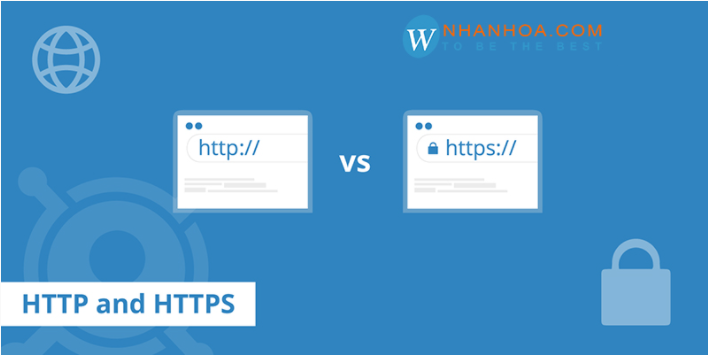
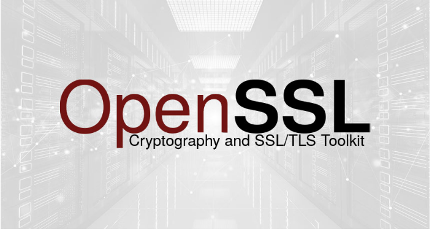

## I. Khái niệm về SSL

- SSL là cụm từ viết tắt của Secure Sockets Layer. Đây là công cụ được biết đến là tiêu chuẩn hóa của công nghệ bảo mật, truyền thông mã hóa được thực hiện giữa máy chủ Website server và trình duyệt.

- Hiện nay, việc tích hợp SSL Certificate cho website doanh nghiệp là điều phải làm, nhất là trong bối cảnh người dùng luôn lo sợ bị lộ thông tin cá nhân của mình đến cho những hacker, spammer.

- Với tiêu chuẩn này, dữ liệu truyền tải giữa máy chủ và trình duyệt của người dùng sẽ được đảm bảo riêng tư hoàn toàn. Hiện nay, SSL trên thế giới là tiêu chuẩn bảo mật cho hàng triệu website. Với công cụ này, nó sẽ giúp bảo vệ những đường truyền dữ liệu đi trên môi trường internet được an toàn, toàn vẹn.

## II.MỤc định của chứng chỉ SSL
### 1. Tăng thứ hạng SEO 

- Việc sử dụng SSL cho website sẽ giúp SEO và tăng thứ hạng từ khóa. Bởi vì, tiêu chí của Google đánh giá là website đó có an toàn cho người sử dụng, mọi giao thức bảo mật đều được Google cảnh báo cho các quản trị viên website để họ có thể khắc phục lỗ hỏng bảo mật, phòng chống hacker tận dụng cho mục đích xấu. Google luôn đánh giá cao các website sử dụng SSL bởi sự bảo mật cao của website, giúp người dùng của Google an toàn với những hacker đang lộng hành hiện nay.

### 2. Bảo mật cho trình duyệt
Những dữ liệu quan trọng của bạn sẽ luôn được đảm bảo an toàn và giúp doanh nghiệp phát triển mạnh mẽ. Vì các dữ liệu sẽ được mã hóa và chỉ người nhận đích thực mới có thể thực hiện những thao tác giải mã. Tránh được những hacker tấn công hệ thống website của bạn. 

### Tăng trafic cho website
Website có tích hợp SSL không những giúp website không bao giờ sập bởi hacker mà còn hỗ trợ người dùng lướt web an toàn, giúp tăng trafic cho website trở nên tích cực hơn cả về số lượng lẫn chất lượng. Mỗi khi khách hàng có nhu cầu tìm hiểu hay sử dụng dịch vụ của web site mình. Sẽ dễ nhớ đến link web của doanh nghiệp mình. 

## III. Các loại chứng chỉ SSL khác nhau

### 1. Chứng chỉ theo cấp độ xác nhận
- OV-SSL (Chứng chỉ tổ chức): OV (viết tắt của Organization Validation) chứng thư số SSL chứng thực cho Website và xác thực doanh nghiệp đang sở hữu website đó. Đây là chứng chỉ tối thiểu được đề nghị cho các cổng thông tin thương mại điện tử. hay các eCommerce. 

- Sự khác biệt chủ yếu giữa DV & OV là việc xác thực công ty được thực hiện bởi các nhà cung cấp chứng chỉ. Nó không lớn như EV (chi tiết bên dưới), nhưng có khả năng tốt hơn DV. 

- DV-SSL (Chứng chỉ xác thực domain): DV (Viết tắt của Domain Validation) giúp chứng thực tên miền cho website của bạn. Khi sử dụng loại SSL này, dữ liệu website sẽ được mã hóa an toàn trong suốt quá trình chuyển giao dữ liệu. cách xác nhực tên miền được thực hiện bằng email hoặc qua hồ sơ DNS. Loại chứng chỉ này lấy được trong một vài phút (hoặc đôi khi một vài giờ). Điều này khá lý tưởng cho những cá nhân không thuộc tổ chức và không quan tâm đến vấn đề bảo mật.

- EV-SSL (Chứng chỉ mở rộng): EV (viết tắt của Extended Validation) là loại SSL có độ bảo mật cao nhất, với tính năng pháp lý ưu việt. SSL này cho phép tên doanh nghiệp được đặt kế bên tên miền và có màu xanh lá. Chức năng này giúp tăng độ uy tín cho website của doanh nghiệp trong mắt người dùng. Đây là loại chứng chỉ hiển thị các tổ chức mà chứng chỉ được cấp cho trong trình duyệt.

### 2. Chứng chỉ theo số lượng tên miền

- Wildcard SSL (Wildcard SSL Certificate): Wildcard SSL vô cùng phù hợp với các trang thương mại điện tử, vì đó là những trang có thể tạo ra những gian hàng điện tử dành cho các chủ bán hàng. Mỗi một gian hàng điện tử là một tên miền nhỏ, sử dụng cùng một địa chỉ IP duy nhất. Vì vậy, với Wildcard SSL, nó có khả năng chia sẻ đến những tên miền phụ (tức e-store) với cùng 1 địa chỉ IP này nhằm bảo mật giao dịch online tốt hơn.

- Điều này đảm bảo sự không giới hạn các sub-domain và một tên miền duy nhất.

- SANs SSL (Subject Alternative Names): SANs – Nhiều tên miền hợp nhất trong 1 chứng thư số. Một chứng thư số SSL tiêu chuẩn chỉ bảo mật cho duy nhất một tên miền đã được kiểm định. 

- Loại chứng chỉ này có thể bảo mật đến 40 domain cùng server khác nhau, giúp người dung có thể linh hoạt hơn trong quá trình cài đặt, quản lý chứng chỉ SSL. SAN SSL sở hữu độ bảo mật tốt hơn so với Wildcard SSL, hỗ trợ tính tiết kiệm tốt cho quản trị viên website khi phải quản lý nhiều trang web cùng một lúc.

## IV. Một số chứng chỉnh miễn phí của SSL
### 1. Chứng chỉ Let’s Encrypt 

- Let’s Encrypt là chứng chỉ tiêu chuẩn an ninh công nghệ toàn cầu miễn phí. Được quản lý bởi  Internet Security Research Group (ISRG) - tập đoàn phi lợi nhuận của California. Với sứ mệnh nâng cao bảo mật trên môi trường internet, phá bỏ các rào cản về tài chính, công nghệ,....hướng tới mục đích an toàn chung.  

#### Nguyên tắc của Let's Encrypt
- Let’s Encrypt hoạt động dựa trên 6 nguyên tắc Miễn phí - Tự động - An toàn - Minh bạch - Mở - Hợp tác. 

- Let’s Encrypt  cung cấp chứng chỉ an ninh mạng hoàn toàn miễn phí cho các website sau khi yêu cầu thông tin xác minh. Chứng chỉ này có giá trị như SSL tính phí, đảm bảo trang web này chính chủ và an toàn với người dùng. 

- Các phần mềm chạy trên máy chủ web sở hữu Let’s Encrypt có thể tự động tương tác để lấy chứng chỉ một cách dễ dàng, tự động gia hạn.

- Let’s Encrypt  cung cấp chứng chỉ cho các trang web an toàn dựa trên những tiêu chuẩn bảo mật TLS và qua bên xét duyệt thứ ba - CA. 

- Các chứng chỉ Let’s Encrypt sau khi cấp phát và thu hồi đều được ghi lại công khai với tất cả người sử dụng. Giúp bạn có thể dễ dàng kiểm tra về độ an toàn của website trong những khoảng thời gian trước đây. 

- Let’s Encrypt là chứng chỉ cung cấp cho tất cả các website có nhu cầu. giao thức phát hành và gia hạn tự động sẽ được công bố như một tiêu chuẩn công khai 

- Let’s Encrypt  là sản phẩm phi lợi nhuận hướng tới mục đích an toàn chung trên không gian mạng, được sự quan tâm và hợp tác cùng phát triển của các tập đoàn lớn như facebook, mozilla, Cisco,... nỗ lực đem lại lợi ích cho cộng đồng. 

### 2. Chứng chỉ OpenSSl

- OpenSSL là một thư viện phần mềm có mã nguồn mở được sử dụng để mã hóa dữ liệu và triển khai các giao thức mạng. Công cụ này dùng cho toàn bộ các ứng dụng bảo mật truyền thông qua mạng máy tính để phòng chống nghe trộm hoặc cần phải xác định phe truyền thống ở phía đầu bên kia.

- OpenSSL ra mắt vào năm 1998 và có sẵn trong các hệ thống Linux, Windows, macOS và BSD. Với OpenSSL, người dùng có thể thực hiện các tác vụ liên quan đến SSL khác nhau như CSR (Yêu cầu ký chứng chỉ), tạo khóa riêng và cài đặt chứng chỉ SSL. Vì vậy, khi nhắc tới chứng chỉ SSL/TLS và cách thức triển khai chúng thì đây chính là công cụ thích hợp nhất.

- Hiện nay, chúng đang được ứng dụng rộng rãi trong các máy chủ web Internet nhằm phục vụ cho hầu hết các trang web.

#### OpenSSL được sử dụng để:

- Tạo các tham số chính RSA, DH và DSA
- Tạo chứng chỉ X.509, CSR và CRL
- Mã hóa và giải mã bằng mật mã
- Kiểm tra máy khách và máy chủ SSL/TLS
- Xử lý email đã ký hoặc mã hóa S/MIME

### 3. Chứng chỉ CloudFlare

- Cloudflare là dịch vụ DNS trung gian, giúp điều phối lượng truy cập giữa máy chủ và các client qua lớp bảo vệ CloudFlare. Hay nói một cách dễ hiểu thì thay vì bạn truy cập trực tiếp vào Website thông qua máy chủ phân giải tên miền DNS (Domain Name Server) thì bạn sẽ sử dụng máy chủ phân giải tên miền của CloudFlare. Các truy cập sẽ phải đi qua máy chủ của CloudFlare để xem dữ liệu website thay vì truy cập trực tiếp.

#### Mục đích của CloudFlare 
- Dừng các cuộc tấn công nhắm vào trang web.
- Tự động sửa đổi nội dung để cải thiện hiệu suất.
- Chèn ứng dụng vào các trang web.
- Cung cấp phân tích phong phú về tất cả các yêu cầu cho trang web của bạn.
- Tự động xác định đối tượng nào là tĩnh và có thể lưu vào bộ nhớ cache ở cạnh của mạng mà không có bất kỳ cấu hình người dùng nào.
- Cung cấp cổng mạng giữa các giao thức như IPv6 \ IPv4.
- Giúp cài đặt SSL linh hoạt và dễ dàng nhấp một lần.
- Và nhiều thứ khác mà CDN truyền thống không thể cung cấp.
