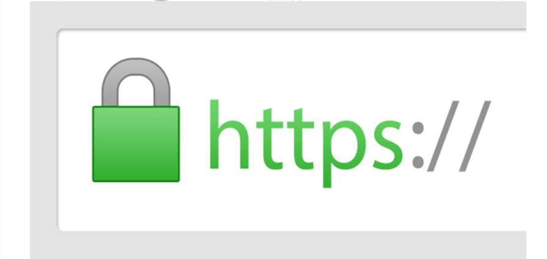
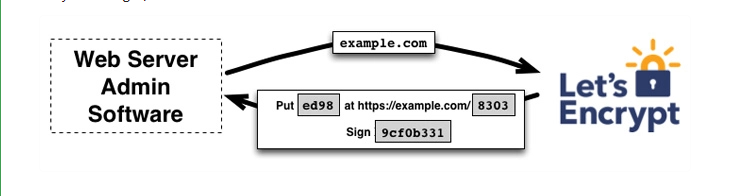
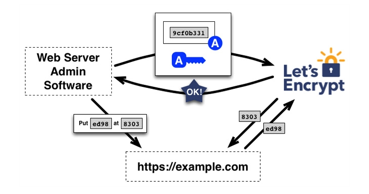
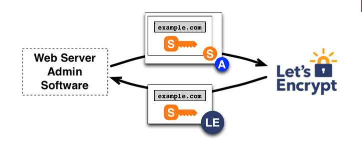
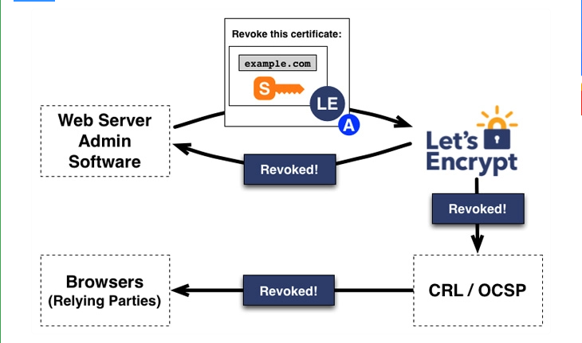

## I. Chứng chỉ Let’s Encrypt
- Let's Encrypt là nhà cung cấp chứng chỉ SSL miễn phí, tự động, hoạt động vì lợi ích của cộng đồng. Nó được quản lý bởi Internet Security Research Group (ISRG).

- Let's Encrypt cung cấp cho những người quản trị website một chứng nhận số cần thiết để kích hoạt HTTPS (SSL hoặc TLS) cho website của mình, hoàn toàn miễn phí, và theo cách thân thiện nhất có thể. Tất cả dựa trên mục tiêu tạo ra một môi trường Web an toàn, riêng tư và tôn trọng người dùng hơn.

- Let's Encrypt cung cấp chứng chỉ SSL loại Domain Validation, tức là sau khi cài đặt, trang web của bạn sẽ có một ổ khóa màu xanh trên thanh địa chỉ của trình duyệt, khi người dùng truy cập vào.

## II. Lợi ích khi cài đặt chứng chỉ Let's Encrypt

- Miễn phí: Chỉ cần sở hữu một tên miền, bạn có thể sử dụng Let's Encrypt để có được chứng chỉ tin cậy mà không tốn một xu nào.
- Tự động: Phần mềm chạy trên máy chủ web có thể tương tác với Let's Encrypt để có được chứng chỉ một cách nhanh chóng, cấu hình an toàn để sẵn sàng sử dụng và tự động thay mới khi cần.
- An toàn: Let's Encrypt sẽ hoạt động như một nền tảng thúc đẩy những TLS tốt nhất, cả về phía CA (Certificate Authority) và giúp các nhà khai thác trang web đảm bảo an toàn cho máy chủ một cách đúng đắn.
- Minh bạch: Tất các các chứng chỉ được ban hành hoặc thu hồi sẽ được ghi công khai và bất cứ ai cũng có thể kiểm tra.
Không hạn chế: Giao thức phát hành và gia hạn tự động sẽ được công bố như một tiêu chuẩn công khai và người khác có thể áp dụng.
- Hợp tác: Giống như những giao thức Internet cơ bản khác, Let's Encrypt nỗ lực để mang lại lợi ích cho cộng đồng và không nằm dưới sự kiểm soát của bất kỳ một tổ chức nào.

## III. Các bước tạo chứng chỉ Let's Encrypt tạo chứng chỉ SSL miễn phí.
- Mục tiêu của Let's Encrypt và giao thức ACME là thiết lập máy chủ HTTPS và để nó tự động có được chứng nhận đáng tin cậy trên trình duyệt mà không cần có bất kỳ sự can thiệp nào của con người. Điều này được thực hiện bằng cách chạy một trình quản lý chứng chỉ trên máy chủ web.

- Để hiểu công nghệ của Let's Encrypt làm việc như thế nào, hãy cùng tìm hiểu quá trình thiết lập trang web https:.//example.com/ với trình quản lý chứng chỉ hỗ trợ Let's Encrypt.

- Có 2 bước trong quá trình này. Đầu tiên, trình quản lý sẽ chứng minh với CA rằng máy chủ web đang kiểm soát một tên miền. Sau đó, trình quản lý có thể yêu cầu, đổi mới hoặc thu hồi chứng chỉ cho tên miền đó.

### Bước 1: Xác nhận tên miền :
- Let's Encrypt xác định quyền quản trị máy chủ bằng khóa công khai. Lần đầu tiên, phần mềm quản lý tương tác với Let's Encrypt, nó tạo ra một cặp khóa mới và chứng minh với Let's Encrypt CA rằng máy chủ đang kiểm soát một hoặc vài tên miền. Điều này cũng tương tự như quá trình CA truyền thống tạo tài khoản và thêm tên miền vào tài khoản đó.

- Để khởi động quá trình này, trình quản lý yêu cầu Let's Encrypt CA cung cấp thông tin cần thiết để chứng minh rằng nó đang kiểm soát example.com. Let's Encrypt sẽ xem xét và đưa ra các yêu cầu, bạn cần hoàn thành nó để chứng minh mình có quyền kiểm soát tên miền. Bạn có hai lựa chọn:
    + Cung cấp một bản ghi DNS dưới tên example.com
    + Cung cấp nguồn HTTP dưới URL được biết đến trên https://example.com/

- Sau khi hoàn thành các yêu cầu, Let's Encrypt sẽ cung cấp cho trình quản lý chứng chỉ một cặp khóa riêng để chứng minh rằng nó kiểm soát cặp khóa.

- Đến đây, trình quản lý đặt một tập tin trên đường dẫn được chỉ định trên trang web https://example.com. Trình quản lý cũng ký một khóa riêng, sau khi hoàn thành sẽ thông báo cho CA rằng nó đã hoàn thành xác nhận.

- Công việc tiếp theo của CA là kiểm tra xem các yêu cầu đưa ra đã được thỏa mãn hay chưa. CA xác minh chữ ký, cố gắng tải về tập tin từ máy chủ web và chắc chắn rằng nó sẽ lấy được nội dung mong muốn.

- Nếu chữ ký hợp lệ, các yêu cầu đã được thỏa mãn, trình quản lý được xác định bằng khóa công khai được ủy quyền để làm quản lý chứng chỉ cho example.com. Cặp khóa mà trình quản lý sử dụng cho example.com được gọi là "cặp khóa ủy quyền".

### Bước 2: Cấp chứng chỉ và thu hồi
- Khi trình quản lý có được "cặp khóa ủy quyền" thì việc yêu cầu, đổi mới, thu hồi chứng chỉ SSL trở nên đơn giản, chỉ cần gửi thông điệp quản lý chứng chỉ và ký với cặp khóa ủy quyền.

- Để có được chứng chỉ cho tên miền, trình quản lý tạo PKCS#10 Certificate Signing Request, yêu cầu Let's Encrypt CA phát hành chứng chỉ cho example.com với một khóa công khai được chỉ định. Như thường lệ, CSR bao gồm chữ ký bằng khóa riêng tương ứng với khóa công khai trong CSR. Trình quản lý cũng ký cả CSR với khóa ủy quyền cho example.com để Let's Encrypt CA biết nó đã được ủy quyền.

- Khi Let's Encrypt CA nhận được yêu cầu, nó sẽ xác minh cả hai chữ ký. Nếu tất cả mọi thứ có vẻ tốt, nó đưa ra một chứng chỉ cho example.com với khóa công khai từ CSR và trả lại cho trình quản lý.

- Việc thu hồi chứng chỉ hoạt động theo cách tương tự. Trình quản lý ký yêu cầu thu hồi với cặp khóa ủy quyền cho example.com và Let's Encrypt CA xác minh rằng yêu cầu đó đúng là đã được ủy quyền. Khi đó, nó sẽ xuất thông tin thu hồi chứng chỉ vào các kênh thu hồi thông thường (như CRL, OCSP), dựa trên các bên thứ 3, như trình duyệt để chúng không chấp nhận chứng chỉ đã bị thu hồi.

