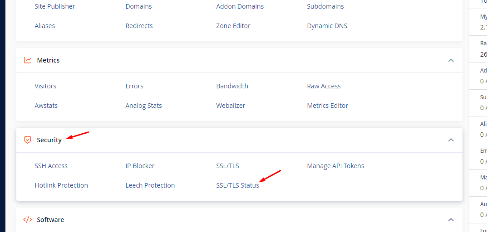
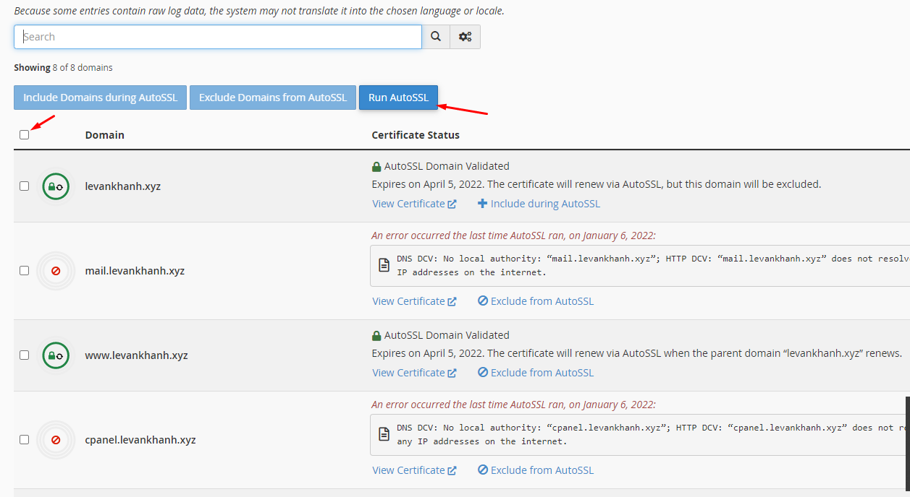
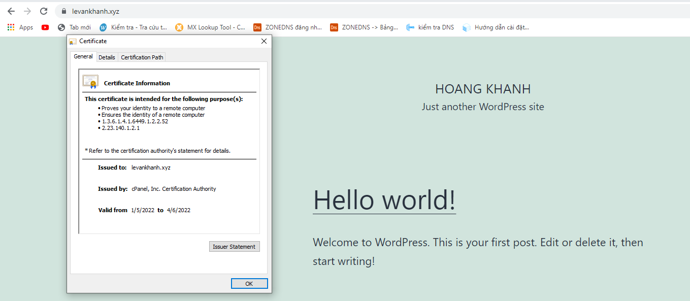

## I. Cài đặt chứng chỉ Let’s Encrypt trên giao diện 
### Bước 1: Truy cập vào control cPanel hosting của bạn tại mục SECURITY chọn tính năng SSL/TLS Status.

### Bước 2: Tại giao diện SSL/TLS Status quý khách tích chọn domain cần cài và chọn Run AutoSSL để cài đặt SSL.

### Bước 3: Kiểm tra 

