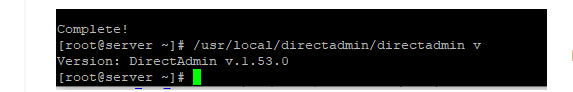
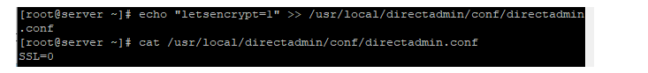
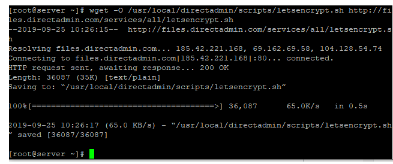
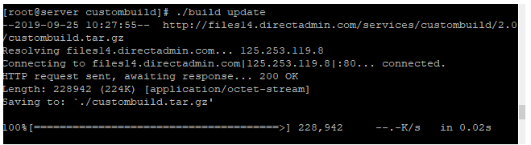
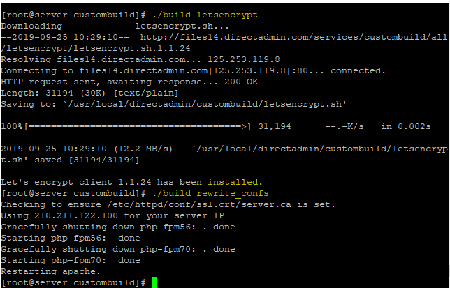

## Bước 1: Kiểm tra và update version DirectAdmin lên bản 1.5 hoặc cao hơn
- Kiểm tra version của control DirectAdmin
- `/usr/local/directadmin/directadmin v `

## Bước 2: Bật tính năng Let's Encrypt trên DirectAdmin

- `echo "letsencrypt=1" >> /usr/local/directadmin/conf/directadmin.conf`

## Bước 3:
- `echo "enable_ssl_sni=1" >> /usr/local/directadmin/conf/directadmin.conf`

## Bước 4: khởi động lại dịch vụ DirectAdmin
- `etc/init.d/directadmin restart`

## Bước 5: Update license Let's Encrypt

- `wget -O /usr/local/directadmin/scripts/letsencrypt.sh http://files.directadmin.com/services/all/letsencrypt.sh`

## Bước 6 : Update web-server configs trên DirectAdmin
- `cd /usr/local/directadmin/custombuild`
- `./build update`
- `./build letsencrypt`
- `./build rewrite_confs`

## Bước 7: kiểm tra và cài đặt SSL vớ Let's Encrypt trên DirectAdmin

