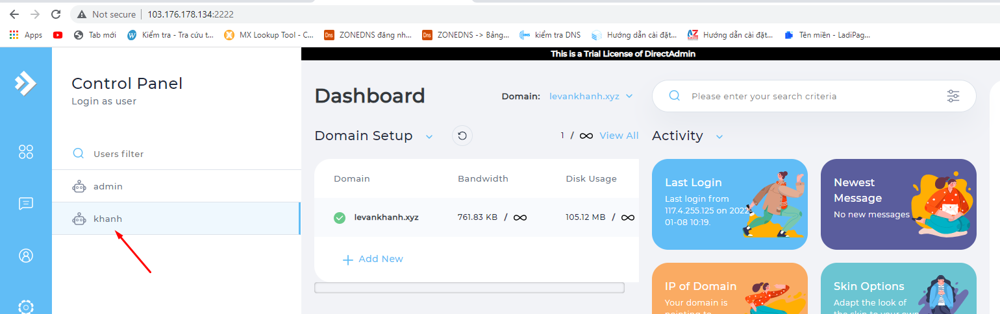
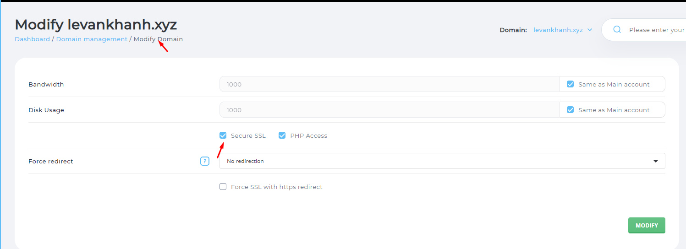
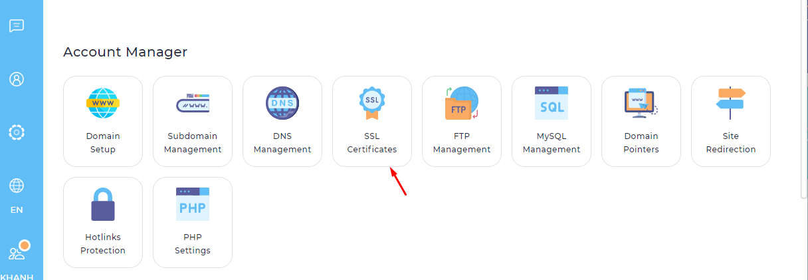
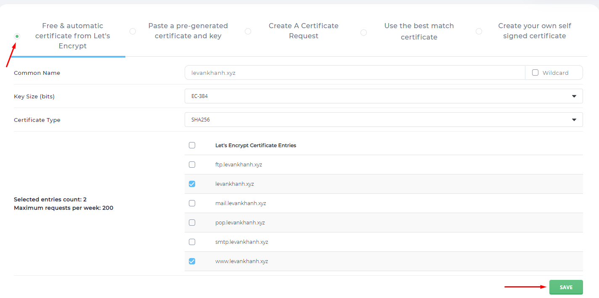

## Bước 1: đăng nhập vào DirectAdmin

## Bược 2: Chọn Modify Domain

## Bước 3: Chọn SSL Certificates

- Chọn Free & automatic certificate frome Let't Encrypt

## Bước 4: Kiểm tra chứng chỉ sau khi cài đặt

- Vì tên miền này không ở DNS của nhân hòa nên chưa được
