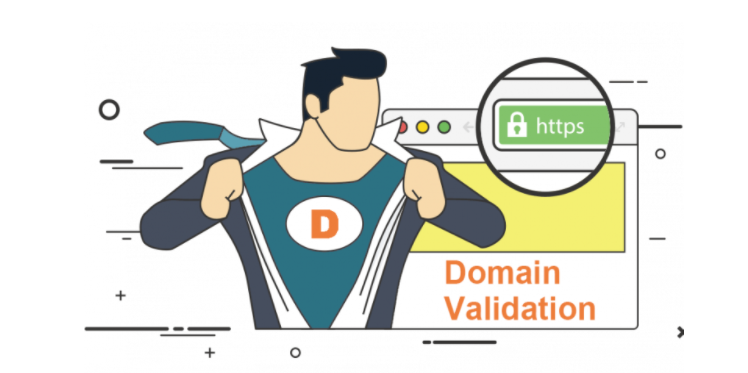
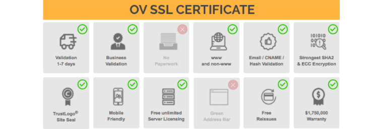
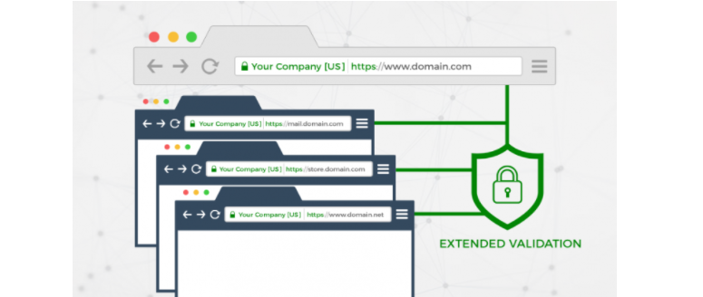

## Các loại chứng chỉ SSL dựa trên mức độ xác thực dành cho Website của bạn.
- Dựa trên mực độ xác thực, hiện nay chứng chỉ SSL gồm 3 Loại DV, OV và EV. Mỗi loại sẽ phù hợp với những đối tượng khác nhau. Vì vậy, trước khi trang bị SSL cho Website của mình, bạn nên tiến hành tìm hiểu về từng loại chứng chỉ SSL.

### 1. DV (Domain Valodation) Chứng chỉ xác thực tên miền

- DV SSL (Domain Validation) – Đây là loại chứng chỉ cơ bản nhất dành cho cá nhân và doanh nghiệp. DV SSL sẽ xác minh dựa theo người sở hữu tên miền.

- DV SSL có vai trò xác thực tự động để đảm bảo rằng tên miền đã được đăng ký và được quản trị viên phê duyệt yêu cầu. Để hoàn tất quá trình xác thực này, quản trị viên website chỉ cần xác thực qua email hoặc định bản ghi DNS cho trang web.

- Tuy nhiên chứng chỉ này không hỗ trợ thêm hình thức xác thực danh tính khác nên về độ uy tín có thể sẽ thấp hơn so với các chứng chỉ còn lại.

- Thời gian để xác thực: Vài phút đến vài giờ.

- Chứng chỉ DV SSL cung cấp rất ít cách nhận dạng SSL, nên loại chứng chỉ này chỉ được khuyến nghị dùng cho các website mà khách hàng không quá đề cao tầm quan trọng của việc bảo mật hoặc không bắt buộc người dùng cung cấp thông tin cá nhân khi truy cập website.

### 2. OV (Organization Validation) – Chứng chỉ xác thực tổ chức

- OV SSL (Organization Validation) là loại chứng chỉ được xác nhận bởi tổ chức, yêu cầu các đại lý xác thực quyền sở hữu tên miền, cộng với các thông tin của tổ chức (tên, thành phố, tiểu bang, quốc gia). Nó tương tự như một chứng chỉ đảm bảo thấp, yêu cầu tài liệu bổ sung để xác thực danh tính công ty.

- Thời gian để xác thực: 5 – 7 ngày thậm chí lâu hơn nếu cần thêm thông tin.

- Để có được chứng chỉ này, người được chứng thực phải là tổ chức hoặc một doanh nghiệp được cấp giấy phép hoạt động. Vì thế mà những website dùng chứng chỉ này sẽ có độ uy tín cao hơn và nó được khuyên dùng cho các doanh nghiệp và công ty.

### 3. EV (Extended Validation) – Chứng chỉ xác thực mở rộng

- EV SSL (Extended Validation) là loại chứng chỉ mở rộng cho chứng chỉ OV SSL vừa nói ở trên. Tuy nhiên nó có sự khác biệt chính là hiển thị tên tổ chức/công ty trên thanh trình duyệt nên sẽ có mức phí đắt hơn.

- Nhưng hiện nay các trình duyệt phiên bản mới đã không còn hỗ trợ hiển thị tên doanh nghiệp của chứng chỉ dạng EV SSL nữa.

- Thời gian xác thực: Vài ngày đến vài tuần hoặc lâu hơn nữa, do cần có thời gian để xác minh danh tính.

- Chứng chỉ này có thể được sử dụng cho tất cả doanh nghiệp thương mại điện tử.

- Nói chung, dù bạn là doanh nghiệp hây cá nhân thì việc trang bị SSL cho website của mình là một điều vô cùng cần thiết. Tuy nhiên cần chọn lựa những nhà cung cấp uy tín để tránh gây ra cho mình những sự cố nghiêm trọng về bảo mật thông tin.

- Kdata là một đơn vị đã có nhiều năm kinh nghiệm trong việc cung cấp dịch vụ trên nền điện toán đám mây. Và hiện tại chúng tôi đã trở thành một trong những nhà cung cấp SSL uy tín cho các doanh nghiệp. Đặc biệt, chúng tôi hiện giảm giá 20% khi đăng ký chứng chỉ SSL. Hãy nhanh chóng đăng ký ngay hôm nay!
