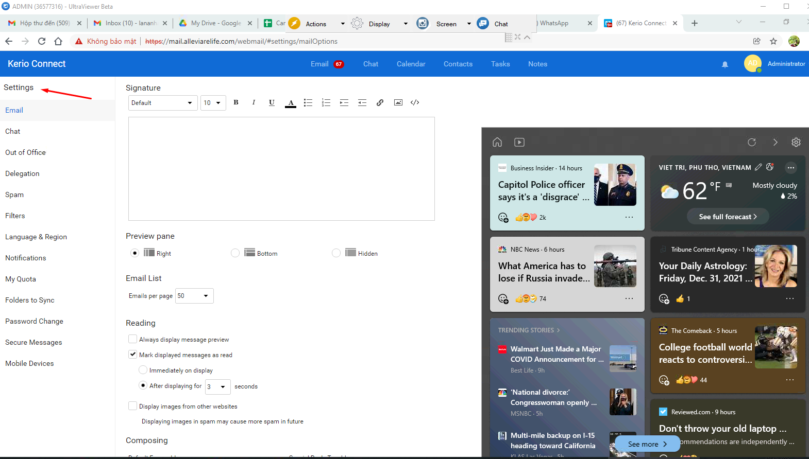
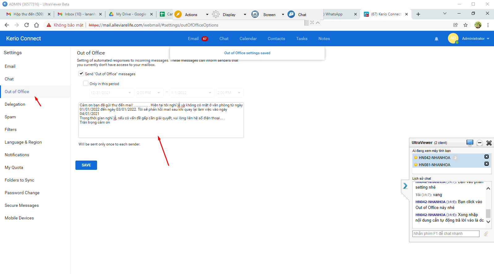

## 1. Hỗ trợ khách hàng trả lời mail tự động 

- Yêu cầu của khách hàng là vào ngày nghỉ vẫn muốn trả lời mail tự động những outlook không mở nên cài trên webmail

### Bước 1 : chọn setting 

### Bược 2 : chọn Out of Office

### Bược 3 : thực hiện ghi nội dung trả lời tự động 
