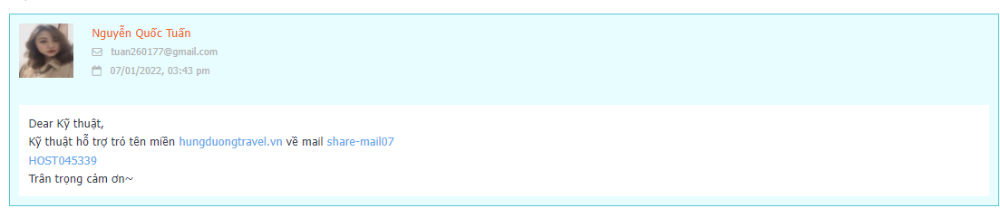
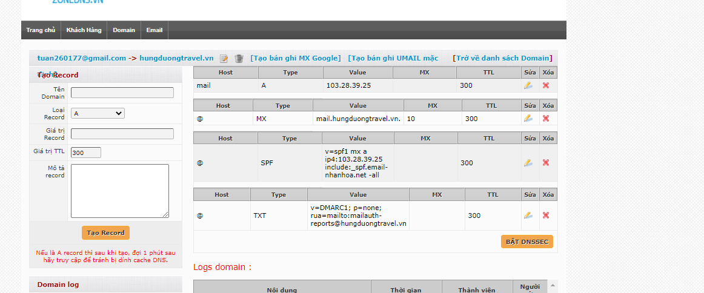

## 1. Yêu cầu

- trỏ tên miền 
- Kỹ thuật hỗ trợ trỏ tên miền hungduongtravel.vn về mail share-mail07
HOST045339

## 2. cách tạo bản ghi

- Tạo bản ghi A với Gamil với địa chỉ Ip hosting

- Tạo bản ghi MX cho tên miền 

- Tạo bản ghi SPF 
    + `v=spf1 mx a ip4:103.28.39.25 include:_spf.email-nhanhoa.net -all`
    + với giá trị ip là ip hosting

- Tạo bản ghi txt cho tên miền
    + ` v=DMARC1; p=none; rua=mailto:mailauth-reports@hungduongtravel.vn`

