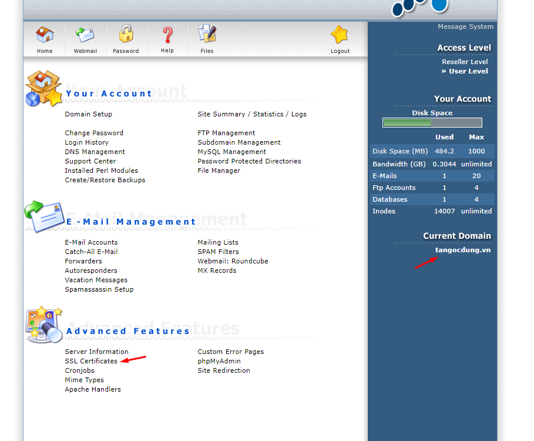
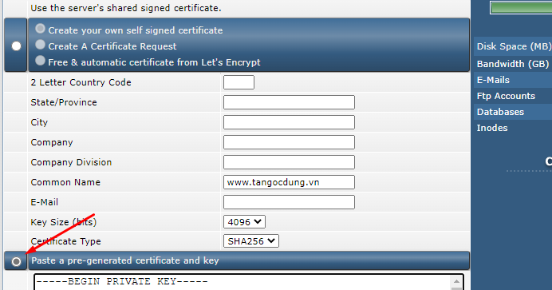
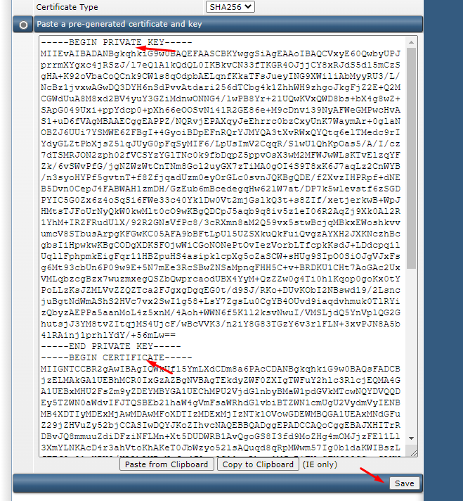
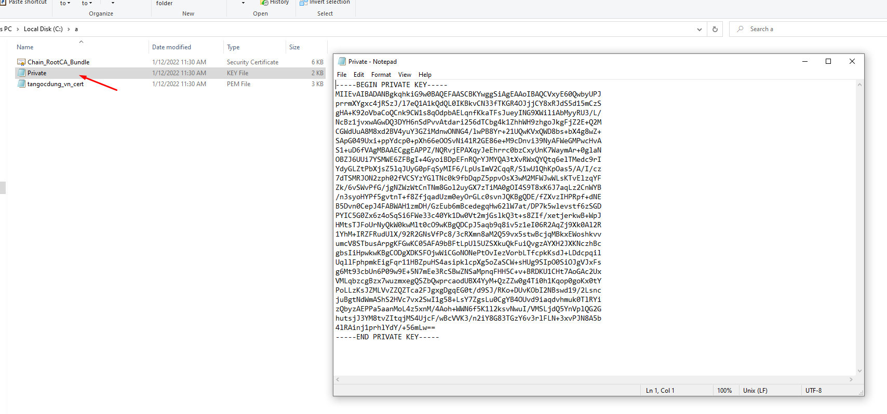
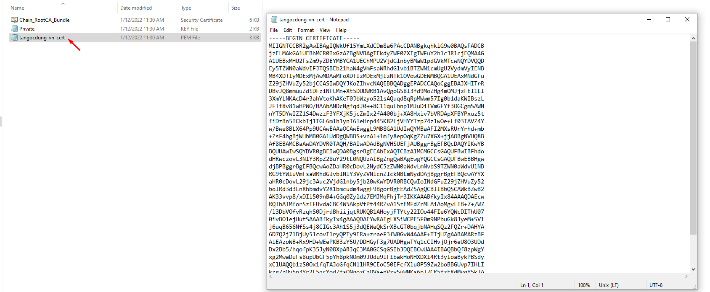
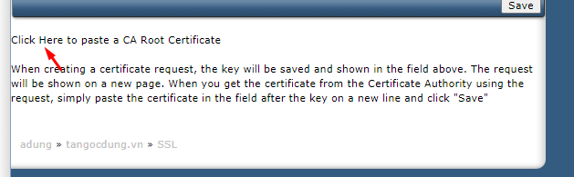
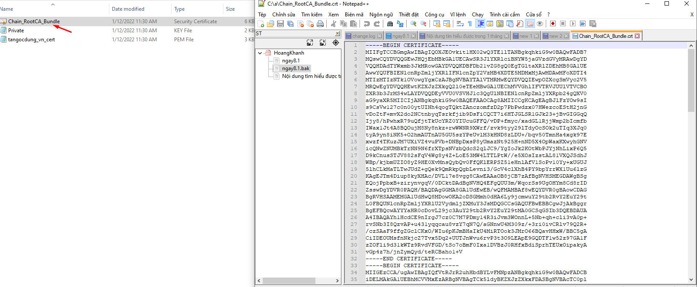
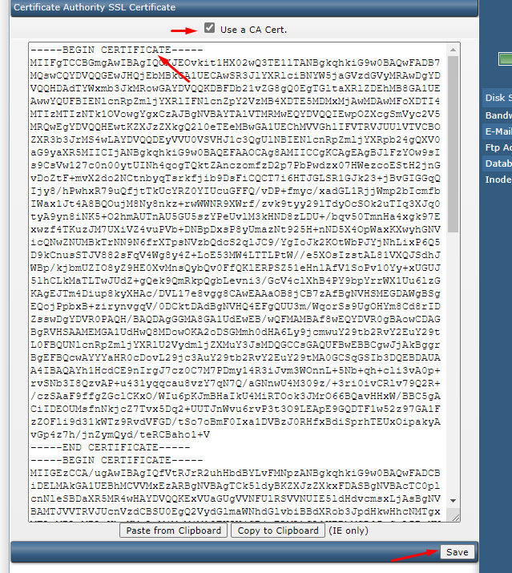
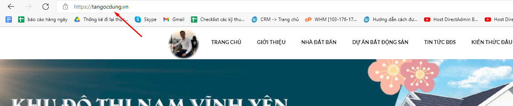

## Bước 1: Đăng nhập vào DirectAdmin

## Bước 2: Chọn SSL Certificates cho tên miền cần SSL

## Bước 3: Chọn Paste a pre-generated certificate and key

### Thêm KEY Và CERT CÙNG 1 file 
- Đầu tiên add file key 

- Xong đến add cert

- Chọn Save để lưu lại 

### Chọn click Here

- Add CA vào và lưu

## Bước 4: kiểm tra 

