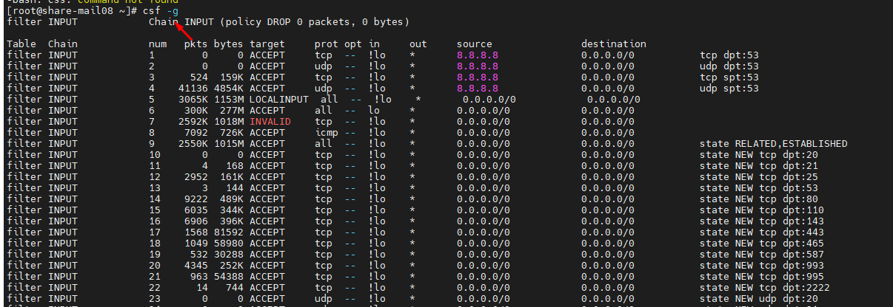
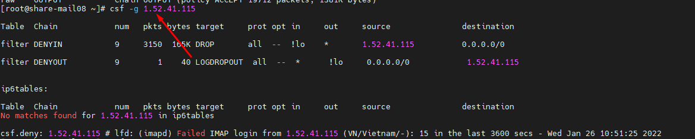
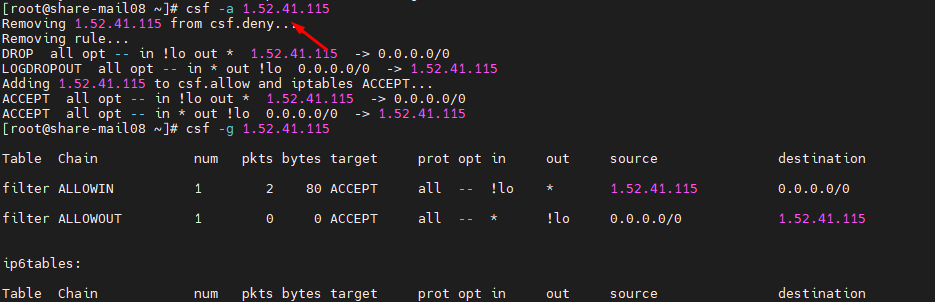
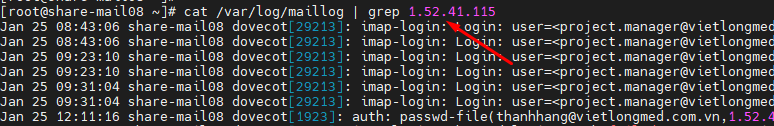
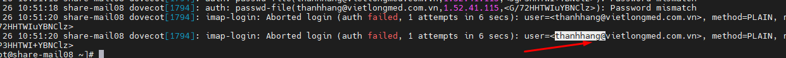

- Đăng nhập ssh vào mail server

- Dùng lệnh 
- `cfs -g 1.52.41.115`

- Trong đó ip là địa chỉ ip máy bị chặn không cho đăng nhập

- `cfs -a 1.52.41.115`
- Để tiến hàng allow bỏ chặn địa chỉ ip đó 

- `cat /var/log/maillog | grep 1.52.41.115`
-  để xem user nào đã đăng nhập sai nhiều lần nhất

