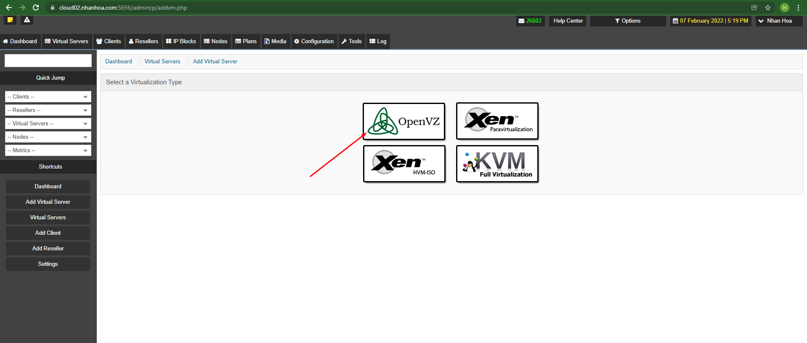

## Bước 1 : Tạo 1 con VPS để bắt đầu cài đặt
 

- Điền các thông số đối với mail Kerio thì CPU core chỉ cần cho 2 core và đối với zimbra thì là 4 core

## Bước 2: Tiến hành ssh và cài đặt mail Kerio

- Tiếp tục đăng nhập và cài đặt kerio theo hướng dẫn

