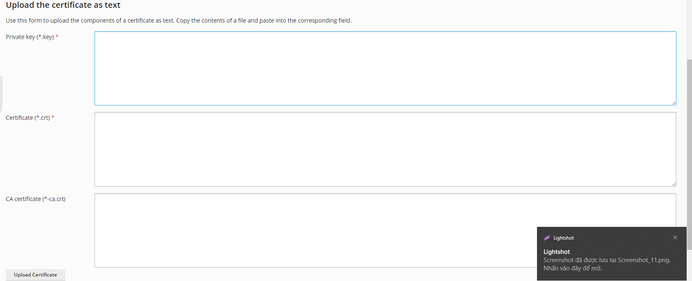

## I. Yêu cầu

### Bược 1: Kiểm tra file key
- Muốn cài SSl tối thiệu cần 3 file 
1. PrivateKey 

2. dulicdaianh_com_vn_cert

3. file Chain_RootCA_Bundle

### Bược 2: Đăng nhập vào hosting để cài đặt 
- Tài khoản quản trị hosting

- Vào tạo Name ssl

- Thêm Cái file key ở trên theo thứ tự

### Bược 3: lựa chọn cài đặt sử SSL naem nào

- Chọn seting và chỉnh sửa name SSL vừa tạo và thay đổi 

### Bước 4: Kiểm tra lại

