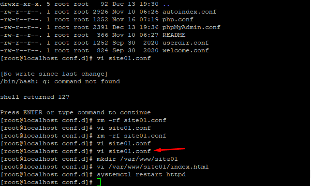
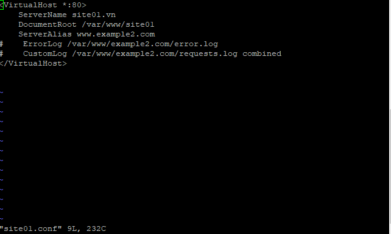
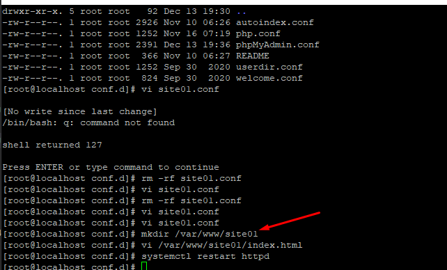
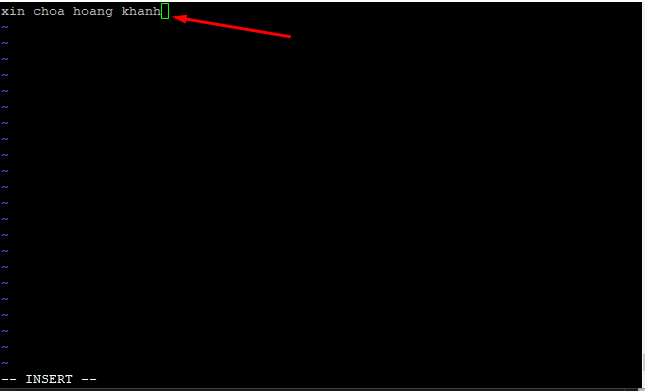
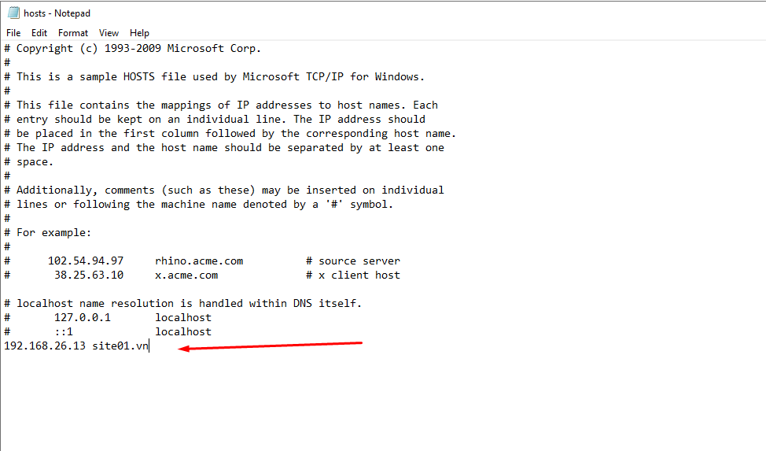
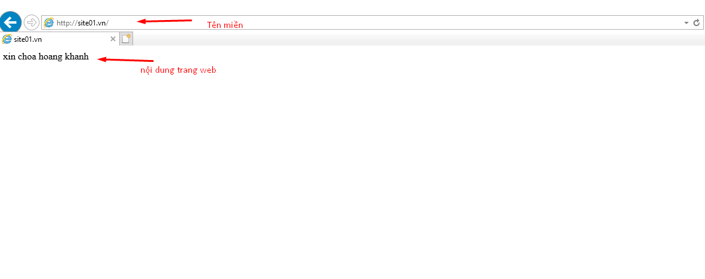
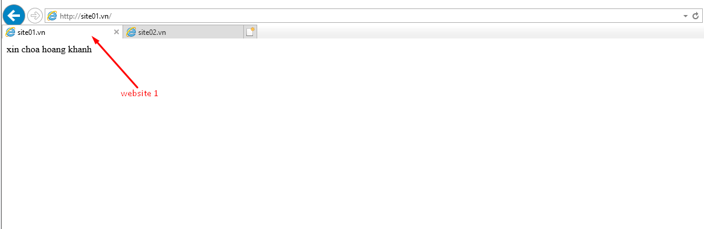
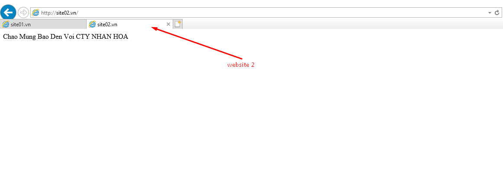

### Thay đổi cách chạy từ IP sang tên miền
#### Bước 1 : tạo 1 file vi có tên site01
- `vi /ect/httpd/conf.d/site01.conf`

#### Bước 2 : Tạo 1 thư mục 
- `mkdir /ect/httpd/conf.d/var/www/site01`

#### Bước 3Tạo 1 file vi 
- `vi /var/www/site01/index.html`

    
- Nội dụng sẽ hiện của trang web 

#### Bước 4 : thực hiện thay đổi file hosts trên window server.
- Tìm đến file host và chạy bằng Notepad theo quyền admin(\windows\System32\drivers\etc)
- Thực hiện điền địa chỉ ip và tên miền

#### Bước 5 : Kiểm tra và chạy theo tên miền của website

 
### Vẫn tiếp tục các bước trên để tạo 1 websiet thứ 2 tên site02.vn
- kết quả đạt được

