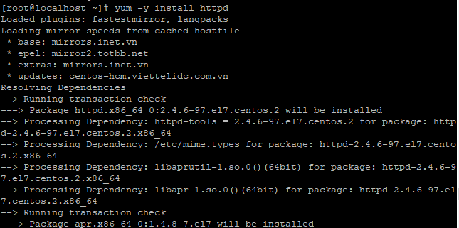

## Cài đặt PhpMyAdmin
### Bước 1: cài đặt các gói cần thiết và MariaDB
- Cài đặt các gói lưu trữ
    + ` rpm --import /etc/pki/rpm-gpg/RPM-GPG-KEY*`
    + `yum -y install epel-release `
    
- Cài đặt MariaDB
    + `yum -y install mariadb-server mariadb`
    

- Start và enable mariaDB
    + `systemctl start mariadb.service`
    + `systemctl enable mariadb.service`

- Cài mật khẩu cho MySql
    + `mysql_secure_installation`
    
    
### Bước 2: Cài đặt Apache2
- Cài đặt
    + `yum -y install httpd`

    
- Start và enable httpd
    + `systemctl start httpd.service`
    + `systemctl enable httpd.service`

    
- Stop firewall hoặc mở cổng 
    + `systemctl stop firewall.service`

    
- Kiểm tra 
    + `nhập địa chỉ ip`

    
    
### Bước 3: Cài đặt Php 
- Cài đặt Php 7.3
    + `yum -y install http://rpms.remirepo.net/enterprise/remi-release-7.rpm `
    + `yum -y install epel-release yum-utils`
    + `yum -y install php php-cli php-fpm php-mysqlnd php-zip php-devel php-gd php-mcrypt php-mbstring php-curl php-xml php-pear php-bcmath php-json`
    
- Disable Php5.4 vaf enable Php 7.3
    + `yum-config-manager --disable remi-php54`
    + ` yum-config-manager --enable remi-php73`

    

- Tạo một file php để kiểm tra 
    + `vi /var/www/html/info.php`
    + Kết quả  


    
### Bước 4 Cài đặt PhpMyAdmin
- cài đặt 
    + `yum install phpMyAdmin`
     
     
- Chỉnh sửa file cấu hình 
    + `vi /etc/httpd/conf.d/phpMyAdmin.conf`
    + Làm thay đổi cách thức truy cập của PhpMyadmin, có thể truy cập PhpMyadmin bên ngoài internet và cung cấp giao diện để quản trị database
    + ``` <Directory /usr/share/phpMyAdmin/>
        Options none
        AllowOverride Limit
        Require all granted
        </Directory>
    
   
- Restart lại httpd 
    + `systemctl restart httpd.service`
- Kiểm tra


    
    