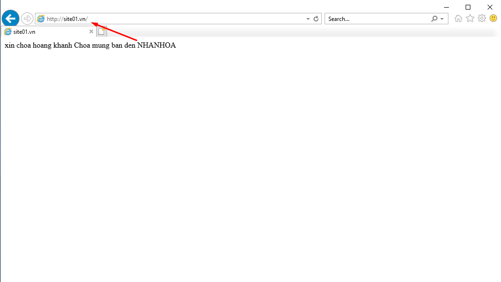
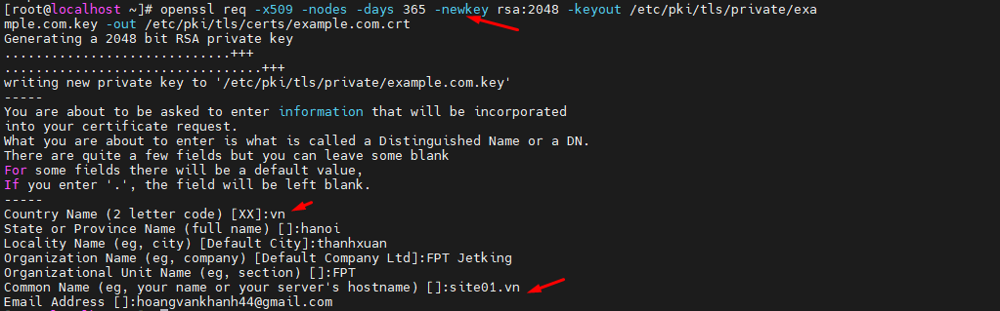
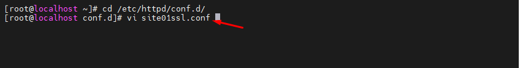
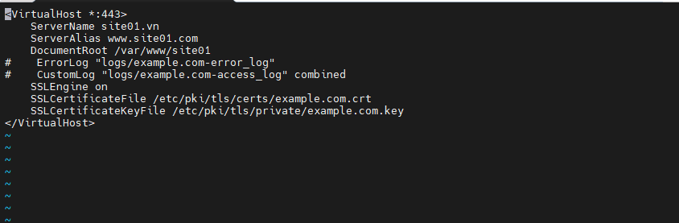
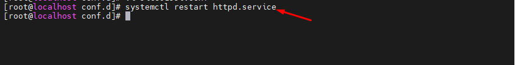
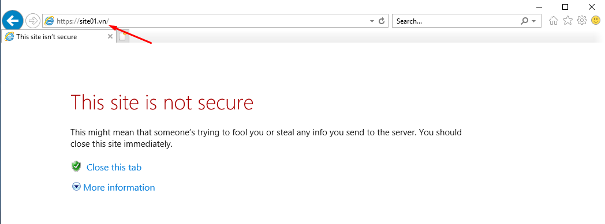
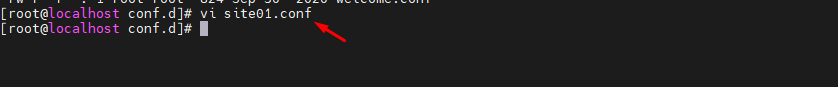
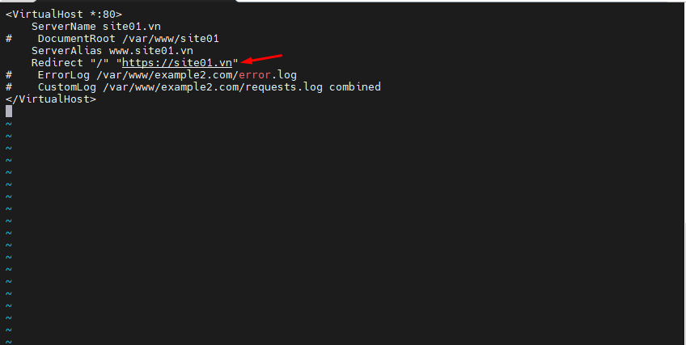

## I. Cài đặt https cho Website
### Bước 1: chuẩn bị
- Đã cài đặt 1 web bằng http


### Bước 2: Cài đặt SSL 
- `yum install mod_ssl`



### Bước 3: Tạo chứng chỉnh cho SSL
- ```
        openssl req -x509 -nodes -days 365 -newkey rsa:2048 -keyout /etc/pki/tls/private/example.com.key -out /etc/pki/tls/certs/example.com.crt

### Bước 4: cấu hình cho https
- Tạo 1 file lưu cấu hình
- `vi /etc/http/conf.d/site01ssl.conf`



- Nội dung như sau :
    + ```
          <VirtualHost *:443>
            ServerName site01.vn
            ServerAlias www.site01.vn
            DocumentRoot /var/www/site01
            ErrorLog "logs/example.com-error_log"
            CustomLog "logs/example.com-access_log" combined
            SSLEngine on
            SSLCertificateFile /etc/pki/tls/certs/example.com.crt
            SSLCertificateKeyFile /etc/pki/tls/private/example.com.key
            </VirtualHost>




- Restart lại http



### Bước 5: kiểm tra bằng cách đăng nhập website bằng https




## II. Cấu hình web từ http chuyển hướng sang https

- `vi /etc/http/conf.d/site01.conf`


- Chỉnh sửa nội dung :
    - Coment dòng documentRoot lại
    - và Thêm dòng chuyển hướng `Redirect "/" "https://site01.vn"`


- Kiểm tra lại


