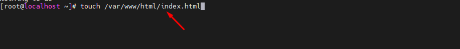
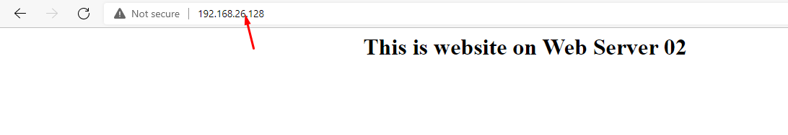
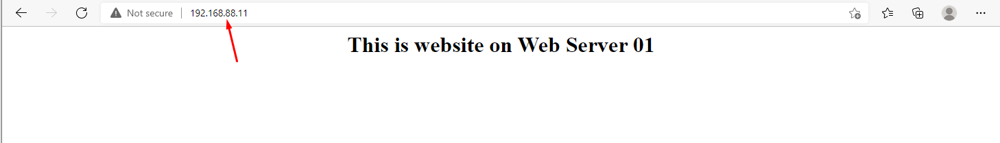
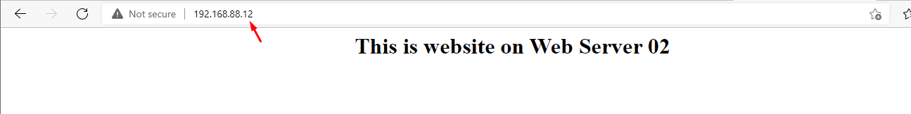

## I. Chuẩn bị 
- Sử dụng 3 máy server Centos 7 bao gồm:
    + Nginx Load Balancer:  192.168.26.126 kết nối với End User bên ngoài và 192.168.88.10 Kết nối tới các Apache Web Server bên trong để điều phối Request.
    + Apache Web Server 01: 192.168.26.127 để kết nối với internet và 192.168.88.11 và kết nối với Nginxload Balancer
    + Apache Web Server 02: 192.168.26.128 để kết nối với internet và 192.168.88.12 và kết nối với Nginxload Balancer

## II. Cài đặt
### Bước 1: Cài đặt Apache trên 2 webserver 01 và 02
- `yum -y update && yum -y install httpd`


- Khởi động và enable httpd
- `systemctl start httpd.service && systemctl enable httpd.service`

- Tiếp theo cấu hình firewall mở port http/https, mặc định trong centos 7 sử dụng FirewallD.
    + ```
          firewall-cmd --permanent --zone=public --add-service=http 
          firewall-cmd --permanent --zone=public --add-service=https
          firewall-cmd --reload

#### Tạo 1 file Web Servee 01 và 02 để chạy thử 
- Tạo web cho server 1
- `touch /var/www/html/index.html` 
- `echo "<center><h1>This is website on Web Server 01</h1></center>" > /var/www/html/index.html`


- Tạo web cho server 2
- `touch /var/www/html/index.html` 
- `echo "<center><h1>This is website on Web Server 02</h1></center>" > /var/www/html/index.html`




### Bước 2: Cài đặt Nginx Load Balancer
- Cài đặt các repo cần thiết :
    + ``` 
          yum install epel-release -y 
          rpm -Uvh http://rpms.famillecollet.com/enterprise/remi-release-7.rpm 
          rpm -Uvh http://nginx.org/packages/centos/7/noarch/RPMS/nginx-release-centos-7-0.el7.ngx.noarch.rpm


- Cài đặt Nginx
    + `yum install -y nginx`


- Khởi động lại Nginx
    + `systemctl start nginx.service && systemctl enable nginx.service`


- Tiếp theo cấu hình firewall mở port http/https, mặc định trong centos 7 sử dụng FirewallD.
    + ```
          firewall-cmd --permanent --zone=public --add-service=http 
          firewall-cmd --permanent --zone=public --add-service=https
          firewall-cmd --reload


### Bước 3: Cấu hình Load Balancing theo thuật toán Round Robin
- Mở file /etc/nginx/nginx.conf:
    + `nano /etc/nginx/nginx.conf`
    + ```
            upstream backends {
              server 192.168.88.11:80;
              server 192.168.88.12:80;
            }

- Mở file Virtual host của nginx
    + `nano /etc/nginx/conf.d/default.conf`
    + ```
          proxy_redirect off;
          proxy_set_header X-Real-IP $remote_addr;
          proxy_set_header X-Forwarded-For $proxy_add_x_forwarded_for;
          proxy_set_header Host $http_host;
    + Tại block location / {} sửa 
    + ```
           location / {
           proxy_pass http://backends;
          }
- Khởi động lại Nginx
- `systemctl restart nginx.service`


### Bước 4: kiểm tra kết quả
- Tắt kết nối ở 2 card mạng kết nối với internet của Web 01 và web 02
- Tiến hành kiểm tra.




