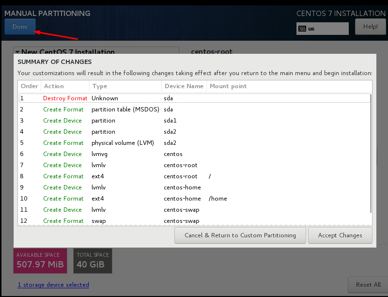

## Các bước cài đặt CentOs 7
### I. Chuẩn bị
- Phiển bản CentOs : `CentOS-7-x86_64-Minimal-1804`
- Môi trường cài đặt : VM ware 20.04
- Một máy với cấu hình tối thiểu 1Cpu, 1GB RAM, 10GB Disk
### II. Bắt đầu quá trình cài đặt
#### Bước 1 : Cài đặt ngôn ngữ 
- lựa chọn ngôn ngữ cho hệ điều hành 

#### Bước 2 : Lưu chọn mũi giờ 
- Lựa chọn mũi giờ là Hồ Chí Minh

#### Bước 3 : Tùy chỉnh phân vùng ổ đĩa
- Có thể thực hiện tùy chỉnh tự động của hệ thống

- Hoặc chọn tự cài đặt
    + Chia /boot
    

    + Chia /home
    

    + chia /
    

    + Chia swap 
    

    + Kiểm tra lại 
    

#### Bước 4 Cài đặt địa chỉ Ip 
- 1. Chọn Network & hostname

- 2. Cài đặt địa chỉ Ip tĩnh 

#### Bước 5 Cài đặt mật khẩu cho root

#### Bước 6 Chọn reboot để hoàn thành và đăng nhập

#### Bước 7 kiểm tra địa chỉ ip đã cài và ổ địa đã cài

