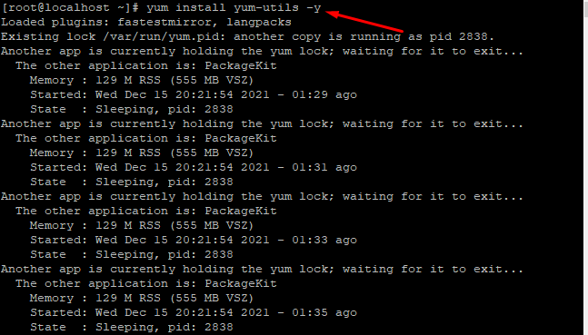
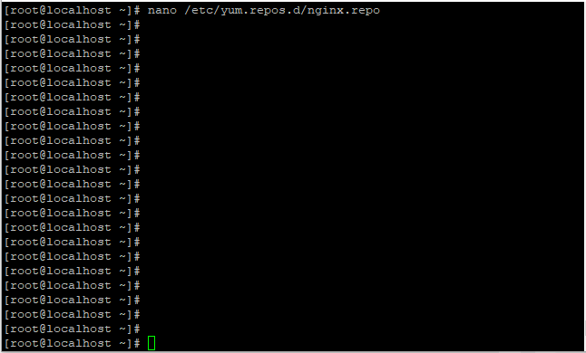
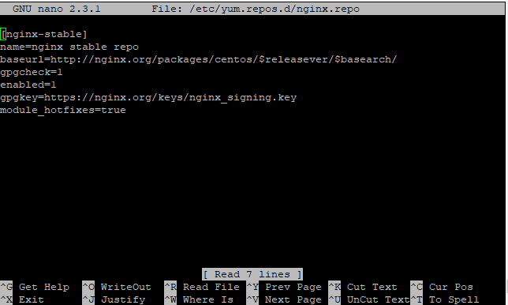
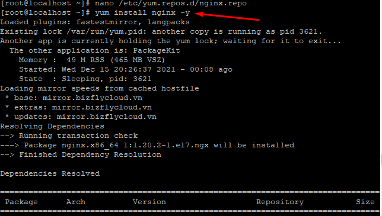
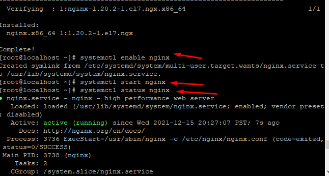
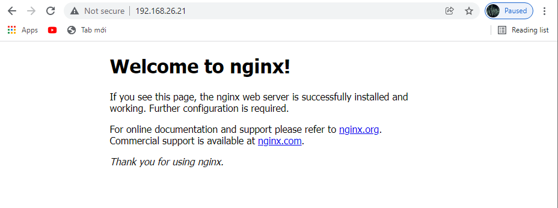

## Các bước cài đặt NginX
### Bước 1: Cài đặt các gói cần thiết
- `yum install yum-utils -y `

### Bước 2 : Thêm yum repository
- Cần thiết lập nginx repository để có thể cài đặt được Nginx thông qua yum
- Tạo 1 file nano
- `nano /etc/yum.repos.d/nginx.repo`

### Bước 3 : Cài đặt NginX
- ` yum install nginx -y`

### Bước 4 Khởi đông lại NginX
- `systemctl enable nginx`
- `systemctl start nginx`

### Bước 5: Kiểm trả kết quả

