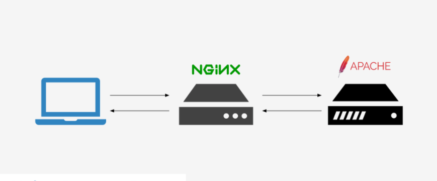
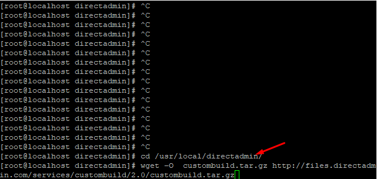
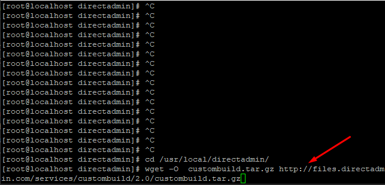
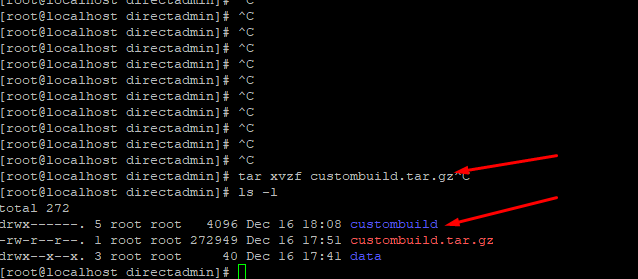
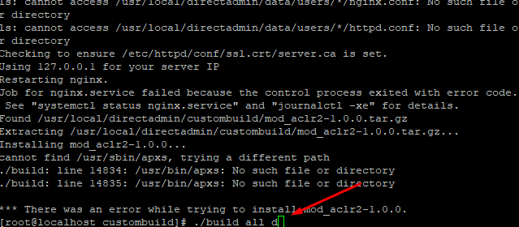
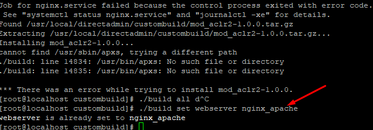
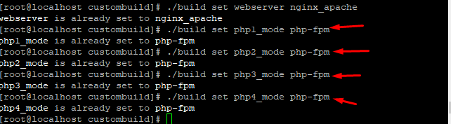
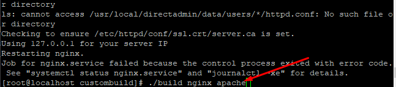
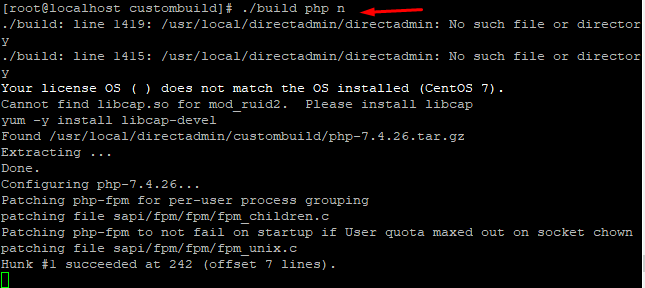

## Bước 1: Cài đặt và cấu hình custombuild 2.0 cho DirectAdmin

### Di chuyển đến thư mục directadmin
- `cd /usr/local/directadmin`

### Tải custombuild 2.0 về 
- `wget –O  custombuild.tar.gz http://files.directadmin.com/services/custombuild/2.0/custombuild.tar.gz`

### thực hiện giải nén
- `tar xvzf custombuild.tar.gz`

- chuyển tiếp đến thư mục custombuild
- `cd custombuild`
- Tải custombuild script
- `./build ` hoặc `./build all d`

## Bước 2 Điều chỉnh cấu hình webserver thành nginx_apache
- `./build set webserver nginx_apache`

## Bước 3 chỉnh chế độ cho các phiên bản php
- Chỉnh phiên bản PHP1
- ` ./build set php1_mode php-fpm`

- Chỉnh phiên bản PHP2
- `./build set php2_mode php-fpm`

- Chỉnh phiên bản PHP3
- `./build set php3_mode php-fpm`

- Chỉnh phiên bản PHP4
- `./build set php4_mode php-fpm`

## Bước 4 : Cài đặt reverse-proxy Nginx-Apache Directadmin
- `./build nginx_apache`

## Bước 5 : Cấu hình lại toàn bộ phiên bản php để phù hợp với phiên bản mới 
- `./build php n`

