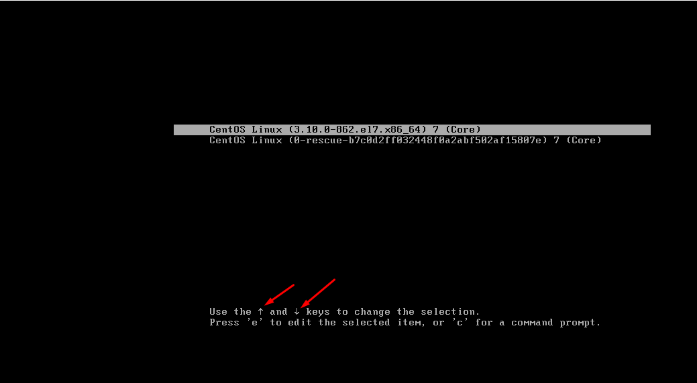
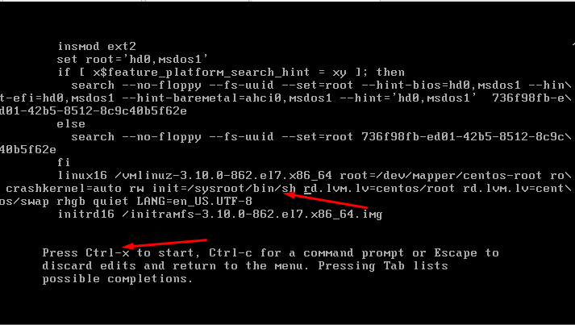
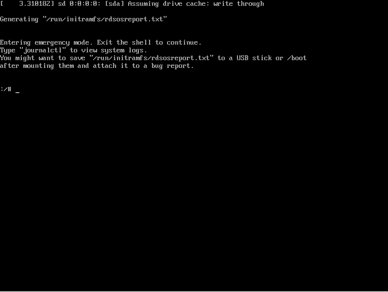
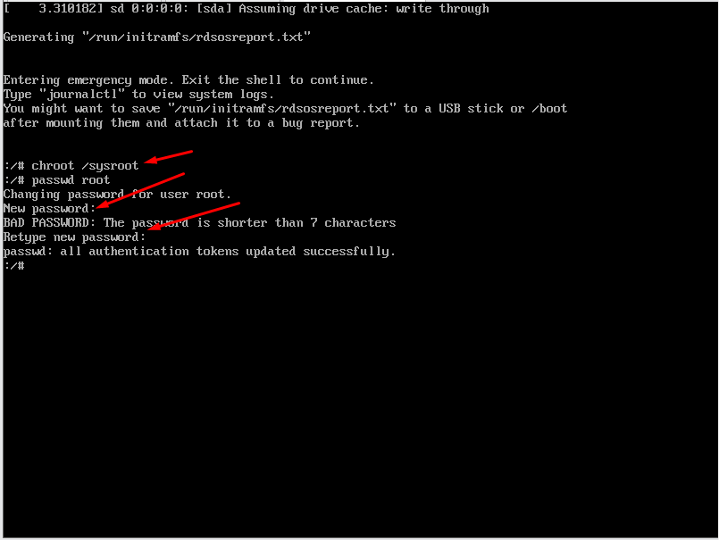
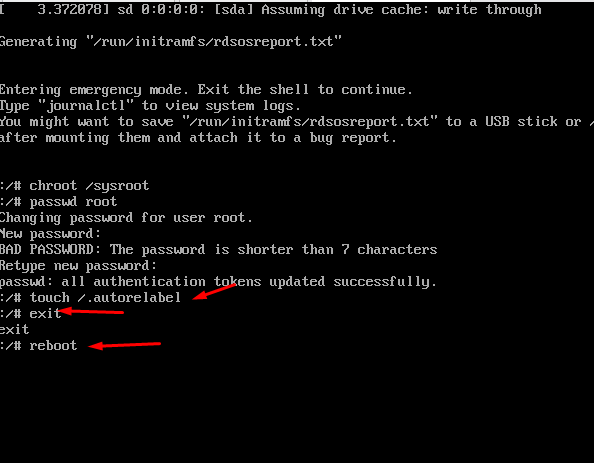
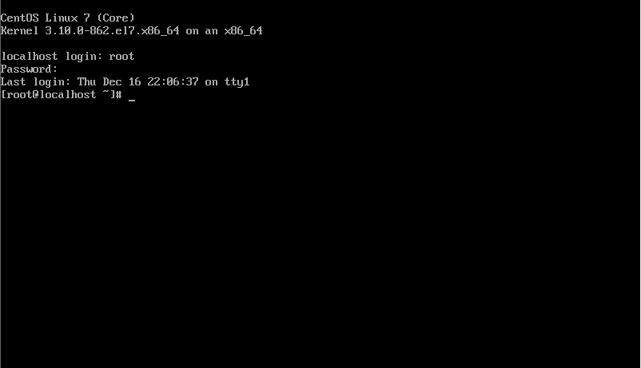

## Bước 1 : khỏi động lại hệ thống và ấn múi tên lên hoặc xuống để dừng khởi động 
- Ấn `e` để vào phần điều chỉnh

## bước 2: điều chỉnh ro thành rw init = /sysroot/bin/sh 
- `init = /sysroot/bin/sh`

## bước 4: ấn x để xếp lại và chuyển sang chế độ single user mode

## Bược 5: thực hiện đổi mật khẩu
- `chroot /sysroot`

- `passwd root`
- thực hiện nhập mật khẩu mới cho root 

## bước 6 : Update selinux information : touch /.autorelabel

## bước 7 : thực hiện đăng nhập lại mật khẩu vừa tạo và xem kết quả

