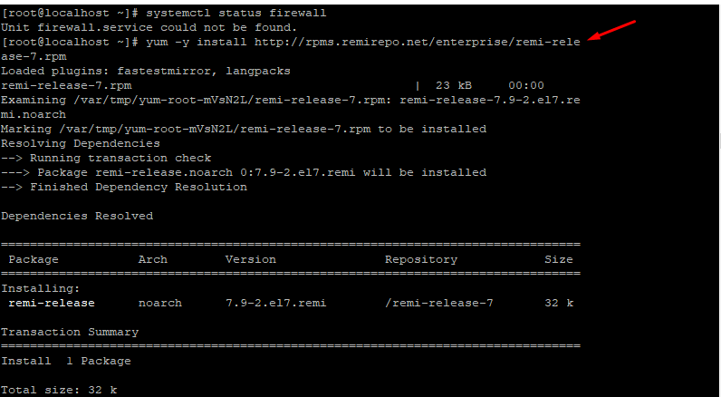

## Cài Đặt PHP
1. Cài đặt PHP 7.3

- `sudo yum -y install http://rpms.remirepo.net/enterprise/remi-release-7.rpm`

- `sudo yum -y install epel-release yum-utils`

2. Tạo 1 file php với vi /var/www/html

3. Chạy và kiểm tra

- Lưu ý mỗi khi thay đổi ta cần thức hiện restart lại http 

## Cài Đặt Wordpress
1. Cài đặt Phpmyadim 
- `yum install phpMyAdmin`
2. cài đặt wget để tải Wordpress từ internet 
- Tải wget
    + `yum install wget`

 
- Tải Wordpress
    + `wget http://wordpress.org/latest.tar.gz`
- Giải nén file wordpress
    + `tar -xzvf latest.tar.gz`
- Tạo Database cho wordpress
    + Tạo Database 

+ Tạo User database
 

- Thêm database vừa tạo vào wordpress

 

- Tạo tài khoản wordpress và tạo chỉnh sửa trang web 
    + Tạo tài khoản wordperss

   

   + Chỉnh sửa trang web

 
  
