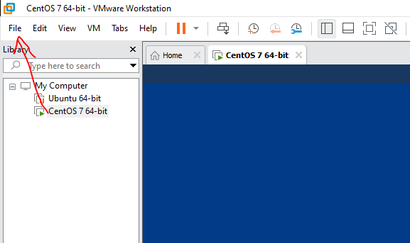
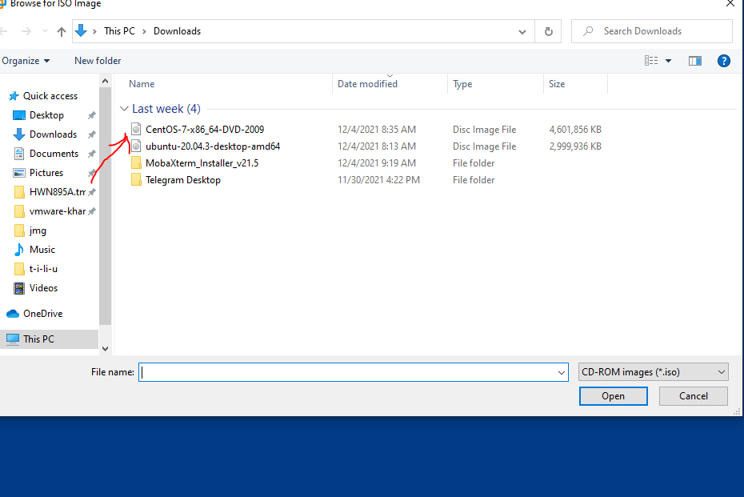

## Hướng Dẫn Cài Đặt CentOS 7 
- Centos là một hệ điều hành miễn phí được xây dựng và phát triển dựa trên hệ điều hành mã nguồn mở Linux. Centos là chữ viết tắt của “Community Enterprise Operating System”. CentOS ra mắt vào tháng 5/2004 và được phát triển dựa trên bản phân phối của Red Hat Enterprise Linux (RHEL).
- Bạn muốn trải nghiệm, tìm hiểu về hệ điều hành linux nhưng lại ngại việc cài đặt hệ điều hành linux trực tiếp trên máy tính. Tùng Phát Computer sẽ hướng dẫn các bạn cách cài đặt centos 7 trên máy ảo VMware.
 ### Các bước cài đặt centos 7 trên VMware :
- Bước 1 : Chuẩn Bị 
    + Tải CentOS 7 Theo đường link : http://mirror.horizon.vn/centos/7.9.2009/isos/x86_64/
    + Cấu hình tối thiểu : Ổ cứng : 40 GB , RAM : 4G
    + Cấu hình khuyến cáo : Ổ cứng : 100GB , RAM : 8GB đối với 64bit.
    + Đã Cài đặt VMware Wokstation 20.04.3
- Bước 2 : Cài đặt CentOs 7
   + Tạo file
    
    
    + Chọn Đĩa có file CentOs 7 
    
    
