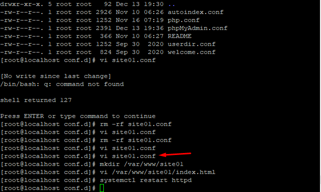
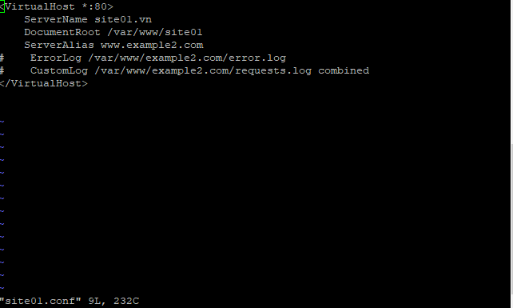
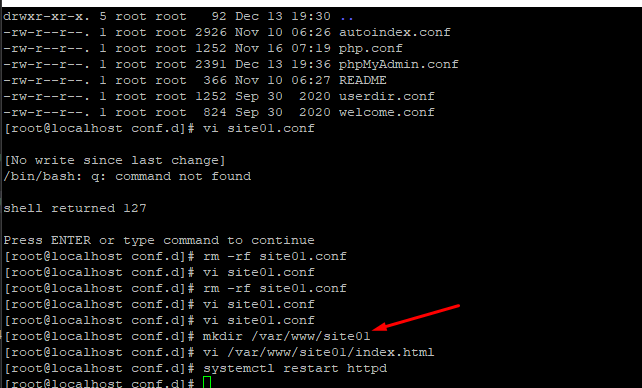
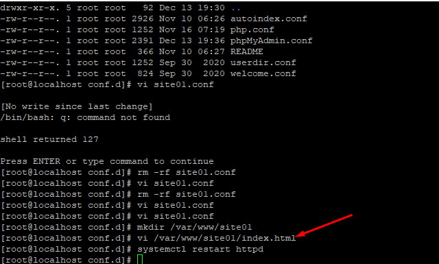
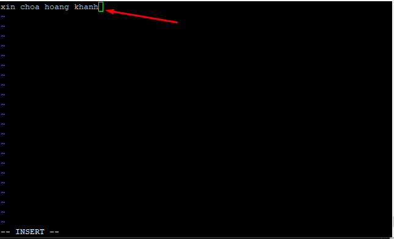
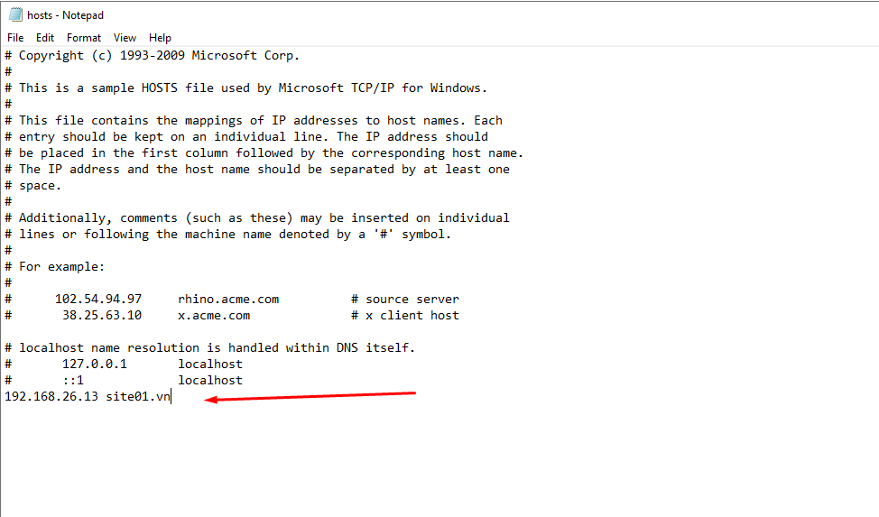
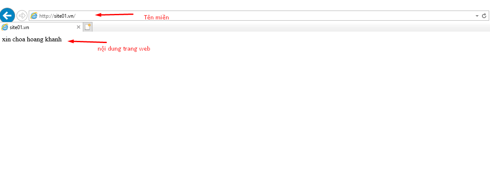

### Thay đổi cách chạy từ IP sang tên miền
- Bước 1 : tạo 1 file vi có tên site01
- `vi /ect/httpd/conf.d/site01.conf`

- Bước 2 : Tạo 1 thư mục 
- `mkdir /ect/httpd/conf.d/var/www/site01`

- Bước 3 : thực hiện thay đổi file hosts trên window server.
    + Tìm đến file host và chạy bằng Notepad theo quyền admin
    + Thực hiện điền địa chỉ ip và tên miền

- Bước 3 : Kiểm tra và chạy theo tên miền của website

