### Hướng dẫn cài đặt MobaXterm
##### Bược 1 : tải MobaXterm
+ Tải MobaXterm theo link : https://mobaxterm.mobatek.net/download.html
##### Bước 2 : Mở file cài đặt đã tải về trước đó
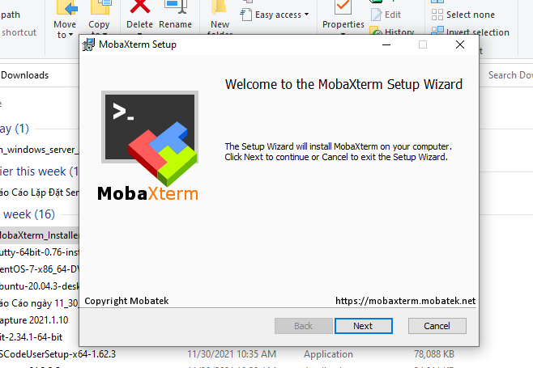

##### Bước 2 : Chấp nhận yêu cầu và tiếp tục cài đặt
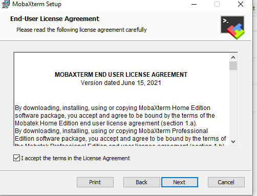

##### Bước 3: Chọn nơi lưu 
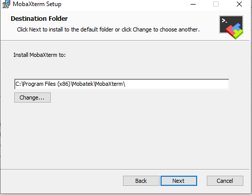

##### Bước 4 : Tiến hành cài đặt 
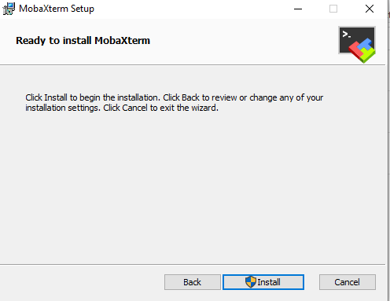

##### Bước 5 : Hoàn Thành quá trình cài đặt và sử dụng
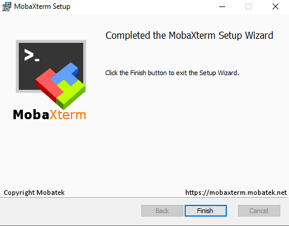
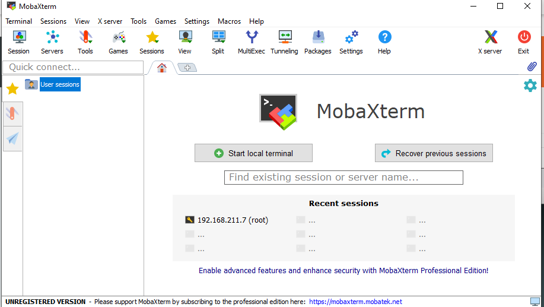

### 2 Kết Nối CentOS 7 đến MobaXterm 
##### Bước 1 : cấu hình địa chỉ ip tĩnh cho CenOs 7 
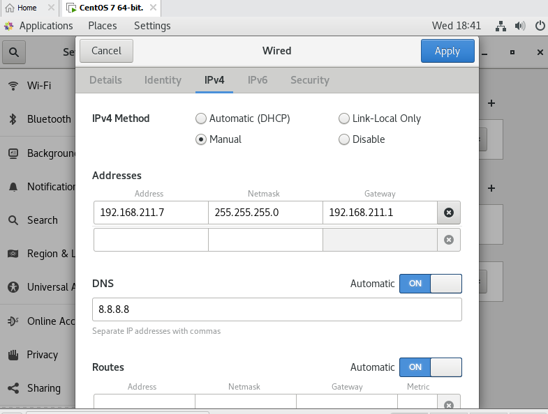

##### Bước 2 : Tạo 1 User điều khiển từ xa
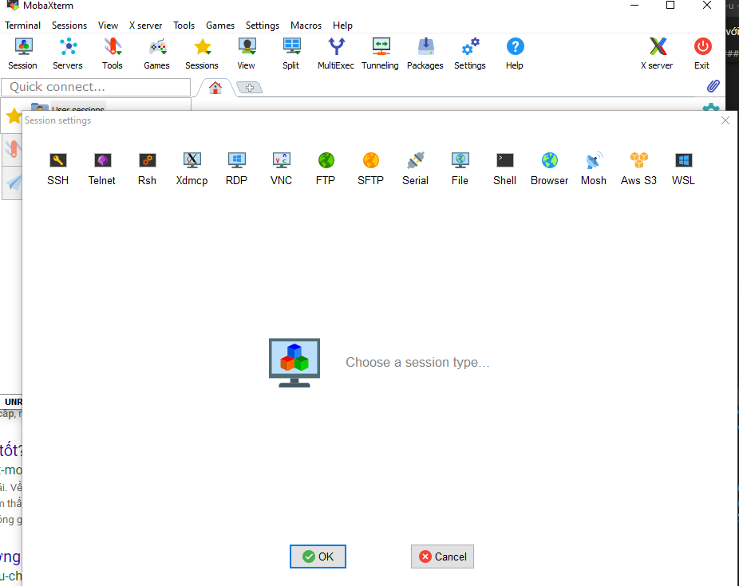

##### Bước 3 : Chọn Cách thức điều khiển SSH
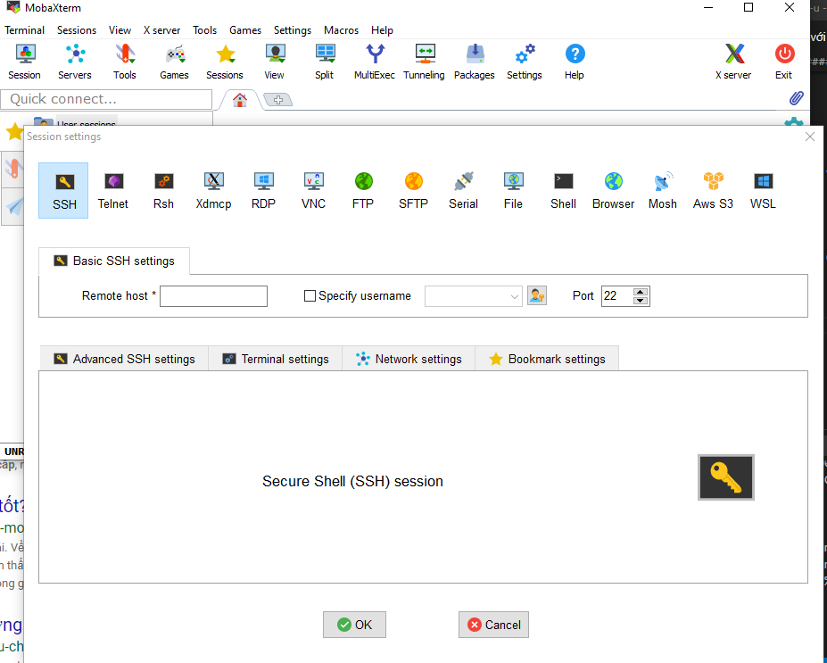

##### Bước 4 : Nhập Địa chỉ IP đã cấu hình cho CentOs 7 
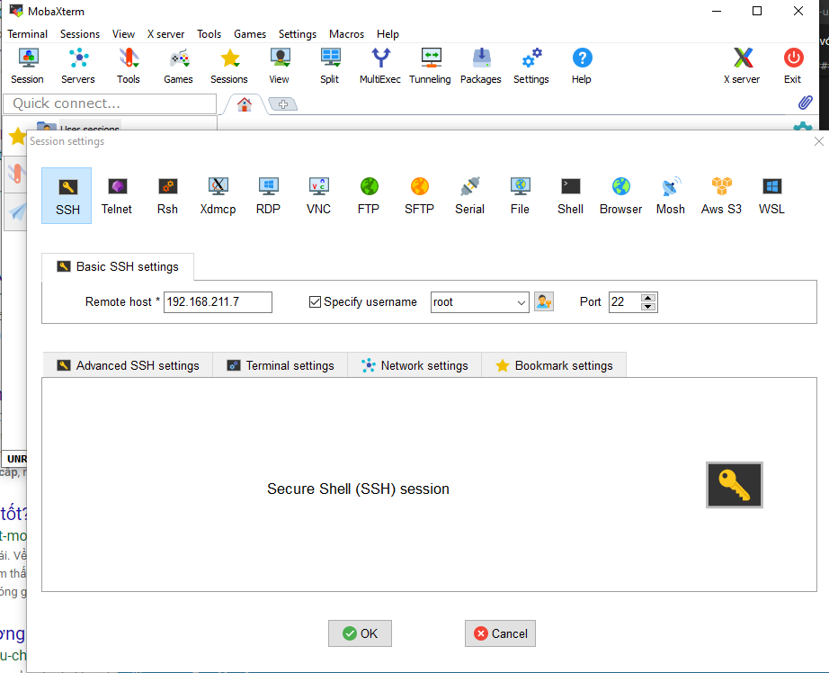

##### Bước 5 : Hoàn Thành và sử dụng 
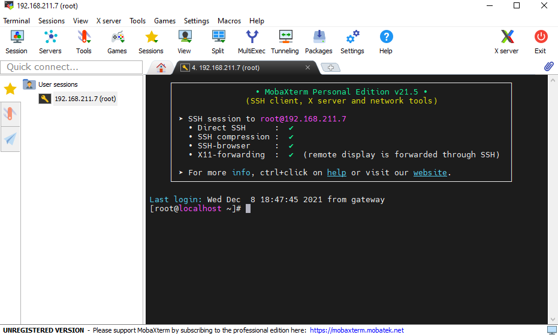

