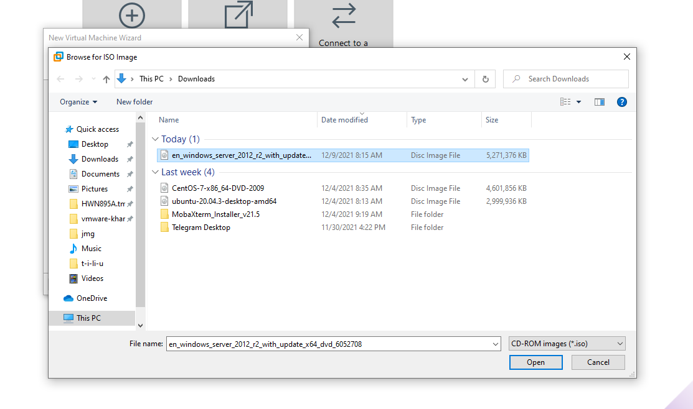
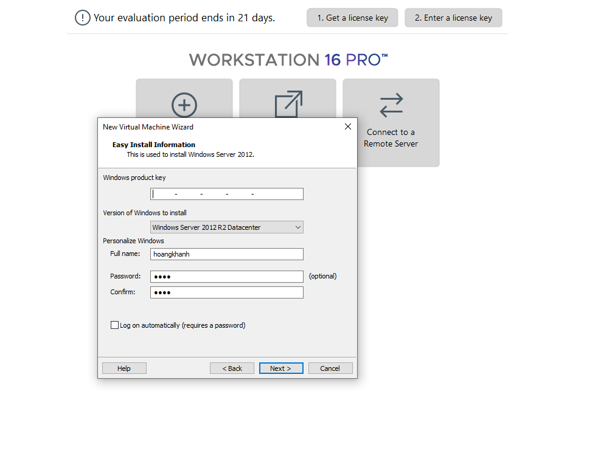
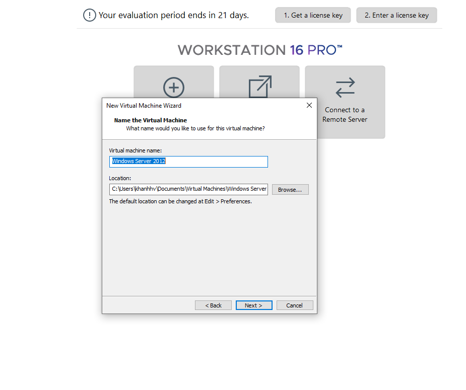
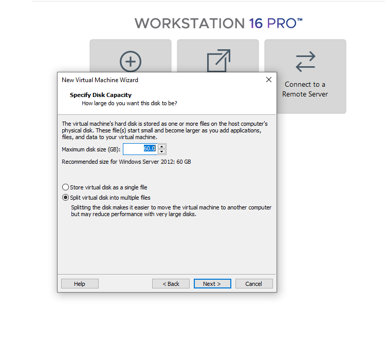
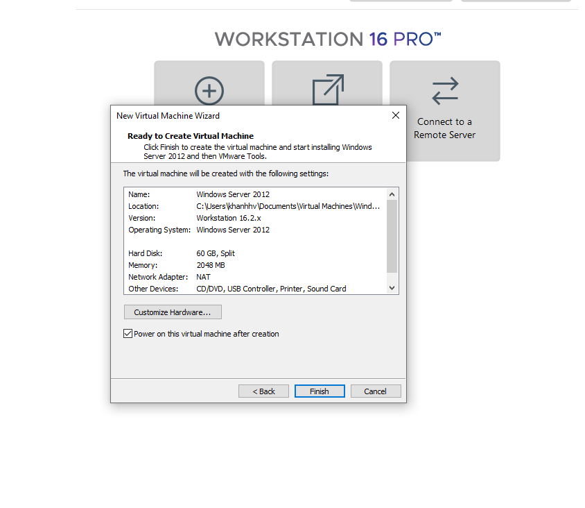
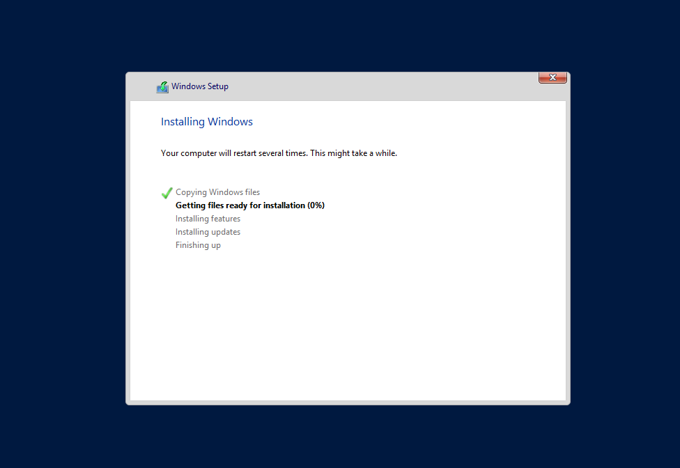
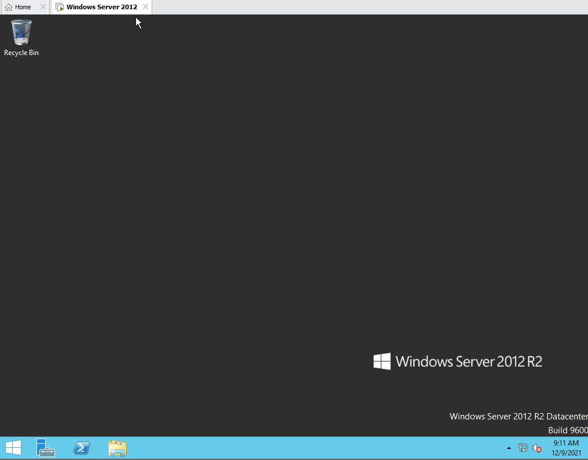

- Bước 1 : Chuẩn Bị 
    + Tải Windows server 2012 Theo đường link : https://drive.google.com/u/0/uc?id=10udieHZpZwDQGjRGqr__R0u53JDsfoPe&export=download
    + Cấu hình tối thiểu : Ổ cứng : 40 GB , RAM : 4G
    + Cấu hình khuyến cáo : Ổ cứng : 100GB , RAM : 8GB đối với 64bit.
    + Đã Cài đặt VMware Wokstation 20.04.3
- Bước 2 : Cài đặt Windows server 2012
   + Tạo file
        - 
        
    + Chọn Đĩa Windows server 2012 đã tải về từ trước đó.
        - 
- Bước 3 Nhập Tên và Mật khẩu đăng nhập Windows server 2012
  
  - Bước 4 Thay đổi tên và chọn nơi lưu
  
- Bước 5 : Thay đổi dung lượng bộ nhớ 
  
- Bược 6 : Kiểm tra lại thông số và bắt đầu quá trình cài đặt
  
- Bược 7 : Chờ đợi quá trình cài đặt 
 

- Bước 8: Hoàn thành và và sử dụng Windows server 2012

