### Bước 1 Cài đặt máy chủ Web Server Nginx
- `sudo apt update`
- apt là cung cấp chỉ mục gói của máy chủ.
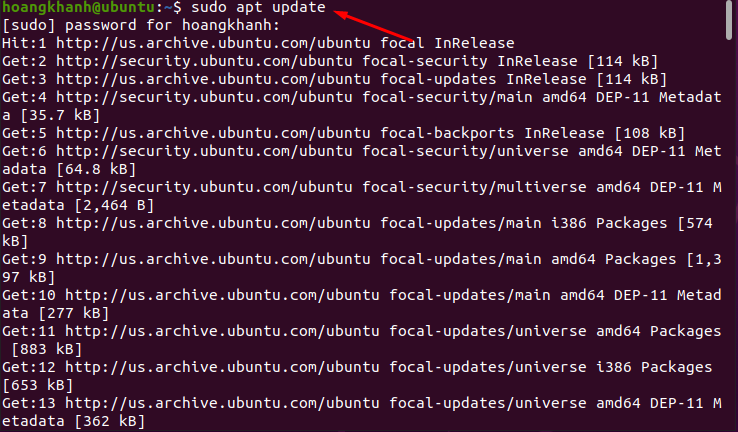

- `sudo apt install nginx`
- cài đặt Nginx
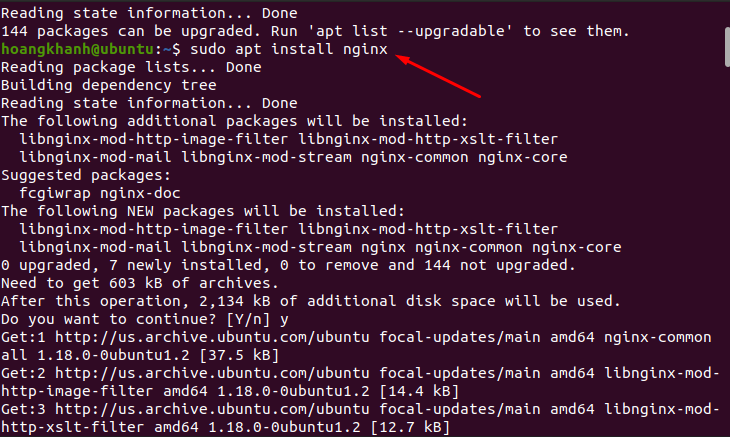

### Bước 2: Cài đặt MySQL 
- `sudo apt install mysql-server`
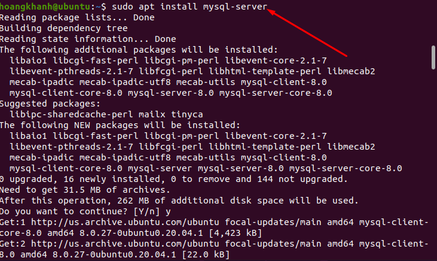

- Cài đặt bảo mật cho mysql
- `sudo mysql_secure_installation`
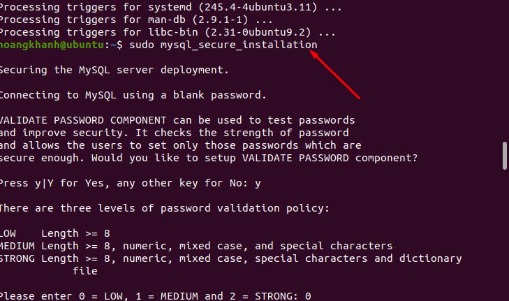

### Bước 3 : cài đặt PHP
- `sudo apt install php-fpm php-mysql`
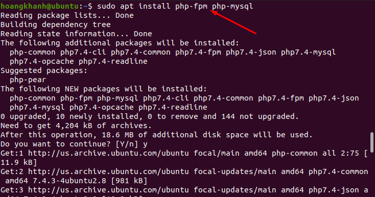

### Bước 4: Tạo thư mục gốc cho trang web có tên thietkewebs.net
- `sudo mkdir /var/www/thietkewebs.net`
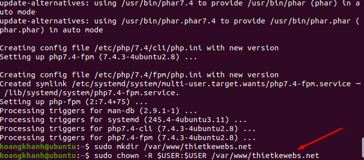

- Cấp quyền cho thư mục
- `sudo chown -R $USER:$USER /var/www/thietkewebs.net`
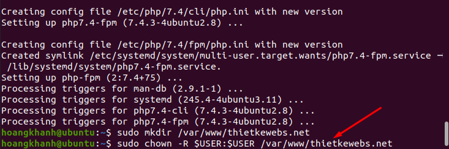

### Bước 5: Tạo file cấu hình mới trong "/etc//nginx/sites-availablet"
- `sudo nano /etc/nginx/sites-available/thietkewebs.net`
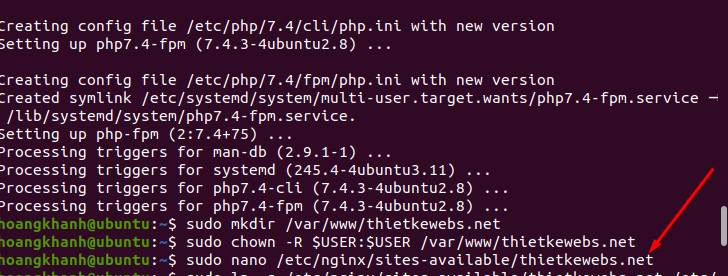
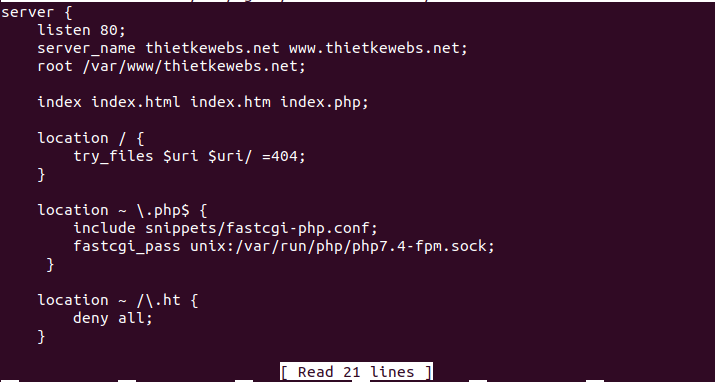

+ Với listen : xác định cổng vào với trường hợp này là 80 cho HTTP.
+ server_name : Xác định tên miền.
+ root : Xác định nới lưu trữ các tệp của trang web đó 
- kích hoạt file cấu hình 
- `sudo ln -s /etc/nginx/sites-available/thietkewebs.net /etc/nginx/sites-enabled/`

### Bước 6: Tạo nội dụng trang web bằng 1 file index.html
- `nano /var/www/thietkewebs.net/index.html`
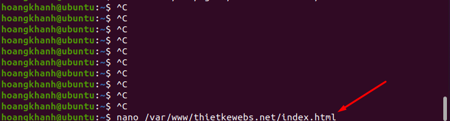
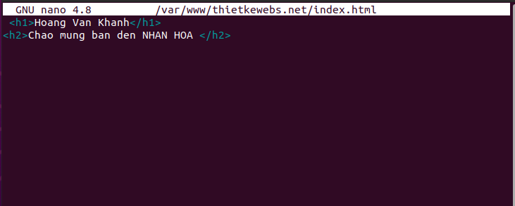

### Bước 7 : thêm địa chỉ ip và tên miền vào file hosts trên Win server 
- `192.168.26.29 thietkeweb.net`
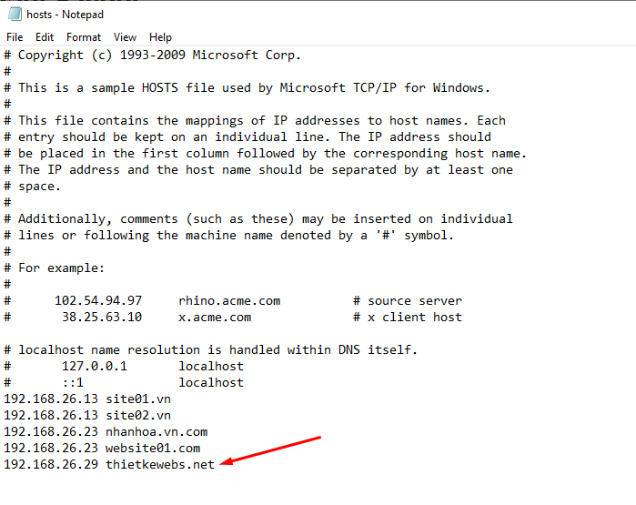

### Bước 8: Kiểm tra kết quả 
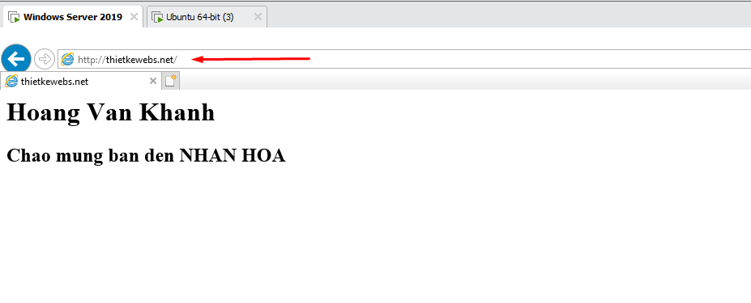

## II. Tạo nhiều Website chạy trên 1 server
### 1. Thực hiện các bước tạo như trên với 1 Website có tên là hoangkhanh.vn
- Kết Quả 
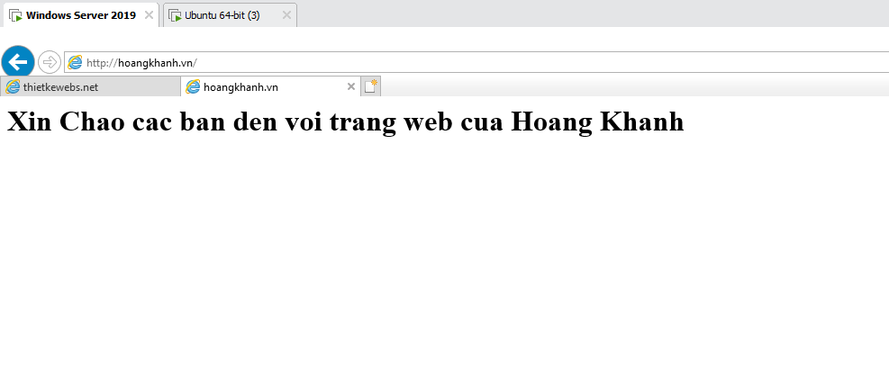