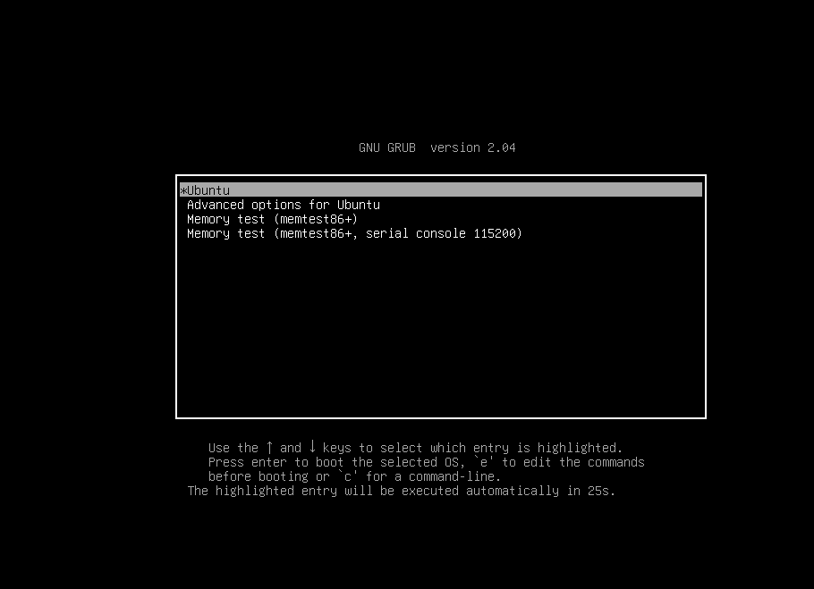
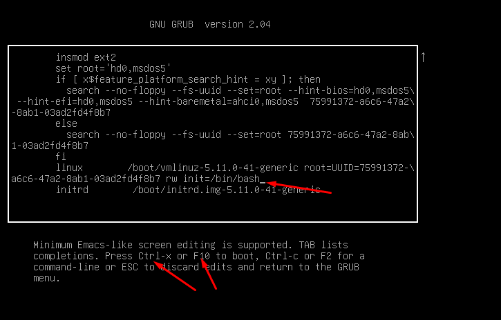
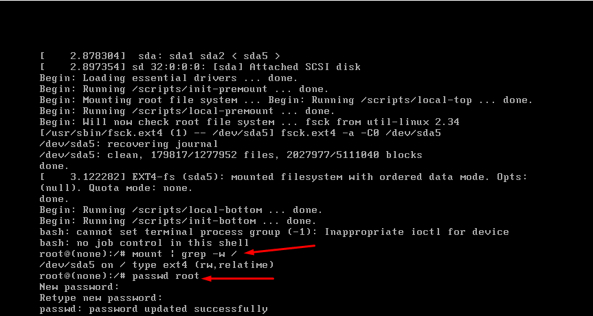
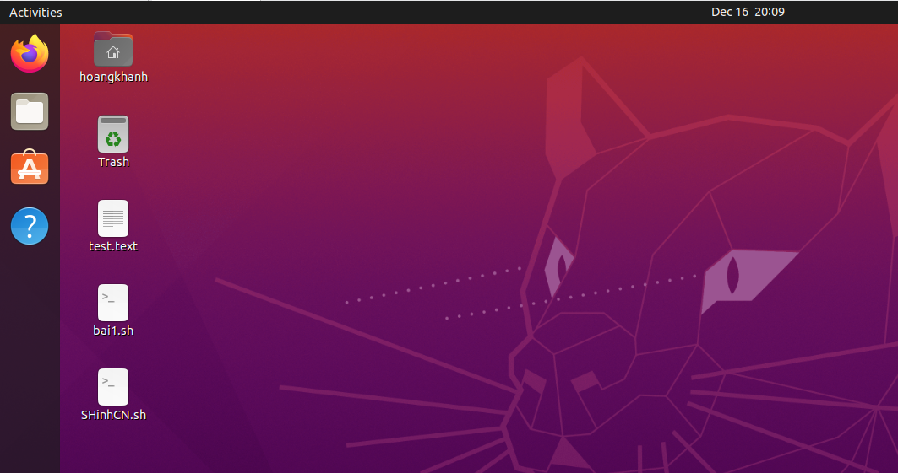

## Bước 1 : khỏi động lại hệ thống ấn 'shift' để dừng khởi động
- Ấn `e` để vào phần điều chỉnh

## bước 2: điều chỉnh ro thành rw init = /bin/bash 
- `init = /bin/bash`

## Bược 3: thực hiện đổi mật khẩu
- `mount | grep -w /`

- `passwd root`
- thực hiện nhập mật khẩu mới cho root 

## bước 4 : thực hiện đăng nhập lại mật khẩu vừa tạo và xem kết quả

