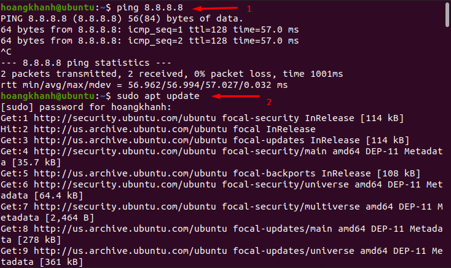
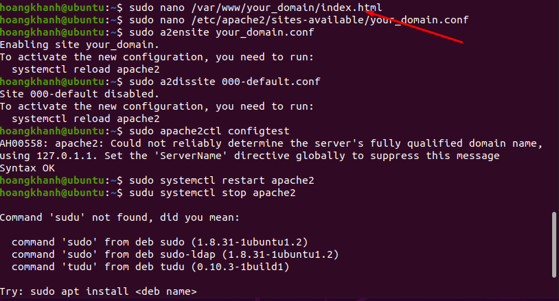

### Các Bước Cài Đặt Apache trên Ubuntu 20.4
- Đầu tiền cần kiểm tra kết nối mạng
- Tiếp theo thực hiện update apt
- `sudo apt update `

- `sudo apt install apache2`

- Kiểm tra trạng thái sau khi cài đặt hoàn thành
- `sudo service apache2 status or sudo systemctl status apache2`

### Kiểm tra cài đặt Apache trên Ubuntu 20.04 có thành công không.

### Thiết Lập Virtual Hosts
- Đầu tiên tạo thư mục cho your_domain
- `sudo mkdir -p /var/www/your_domain`

- Tiếp theo, cấp quyền sở hữu thư mục với user Apache www-data
- ` sudo chown -R www-data:www-data /var/www/your_domain`

- Tiếp theo, tạo trang index.html:
- ` sudo nano /var/www/your_domain/index.html`

- Nhập nội dung trang web

- Tiếp theo cần tạo file Virtual Hosts /etc/apache2/sites-available/your_domain.conf 
- ` sudo nano /etc/apache2/sites-available/your_domain.conf`

- Nội dung file Virtual Hosts

- Khởi động lại Apache 
- ` sudo systemctl restart apache2`

- Kiểm tra kết quả  
