 - Bước 1 : Chuẩn Bị 
    + Tải Ubuntu Theo đường link : https://download.com.vn/download/ubuntu-server-edition-13351?linkid=35520
    + Cấu hình tối thiểu : Ổ cứng : 40 GB , RAM : 4G
    + Cấu hình khuyến cáo : Ổ cứng : 100GB , RAM : 8GB đối với 64bit.
    + Đã Cài đặt VMware Wokstation 20.04.3
- Bước 2 : Cài đặt Buntu server
   + Tạo file
        - 
        
    + Chọn Đĩa CentOs 7 đã tải về từ trước đó.
        - 
- Bước 3 Nhập Tên và Mật khẩu đăng nhập Ubuntu
  
  - Bước 4 Thay đổi tên và chọn nơi lưu
  
- Bước 5 : Thay đổi dung lượng bộ nhớ 
  
- Bược 6 : Kiểm tra lại thông số và bắt đầu quá trình cài đặt
  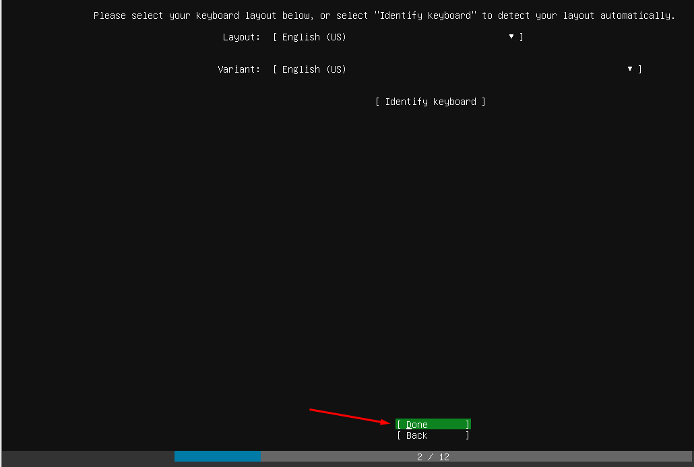
- Bược 7 : Chờ đợi quá trình cài đặt 
 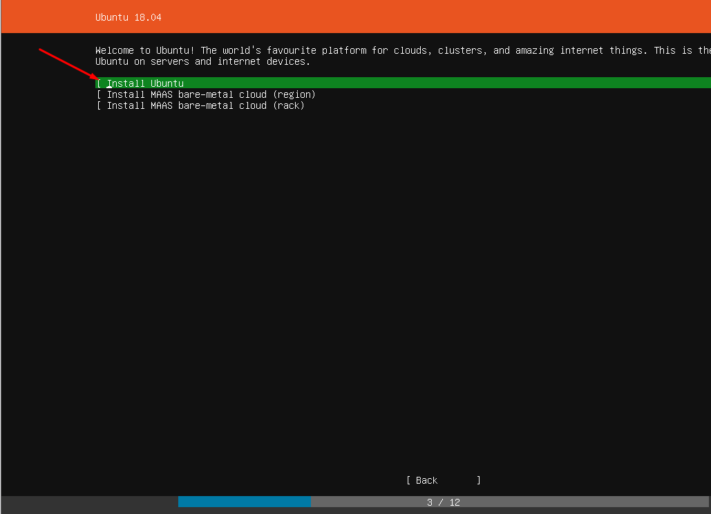

- Bước 8: Hoàn thành và đăng nhập vào Ubuntu

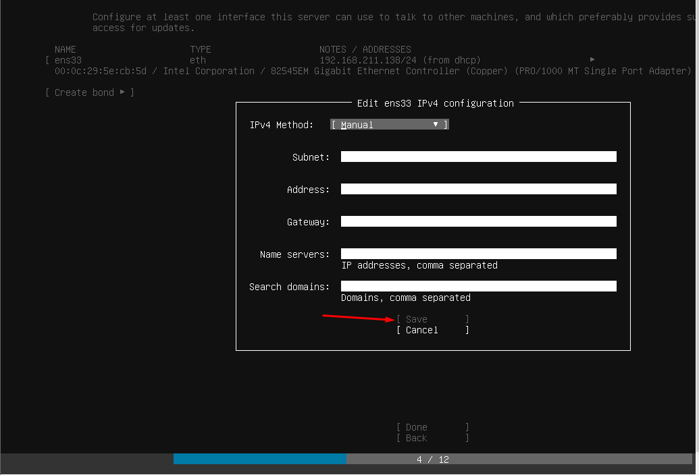

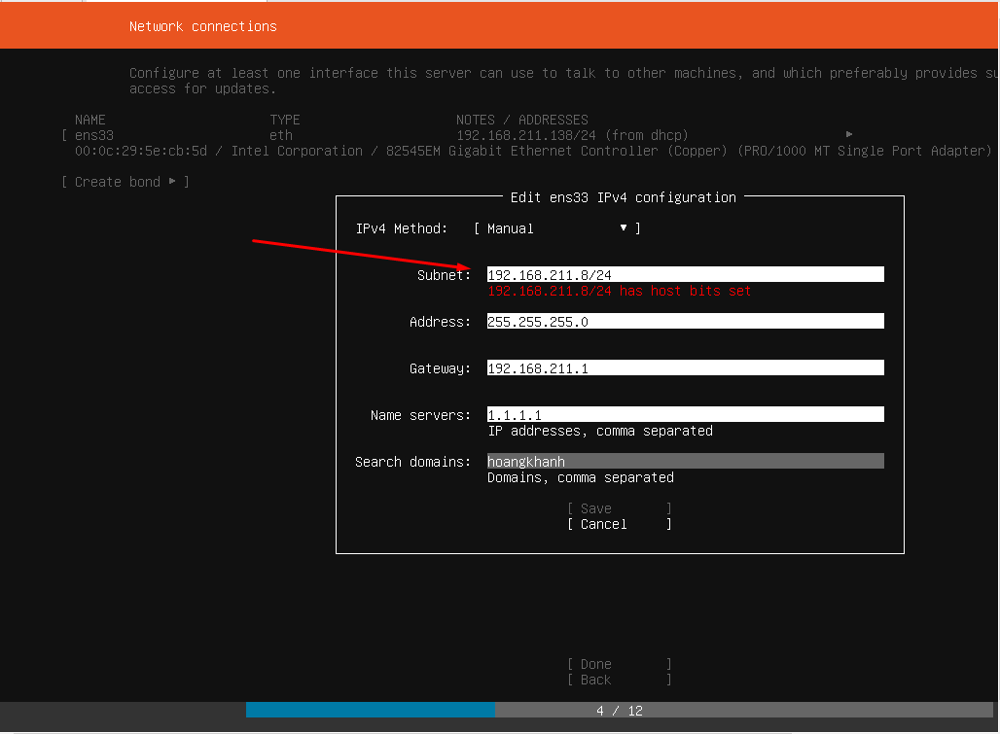

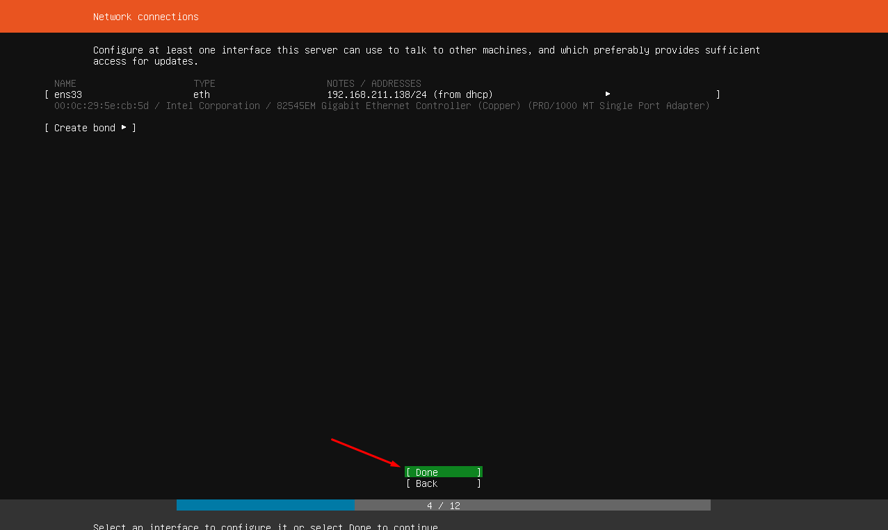
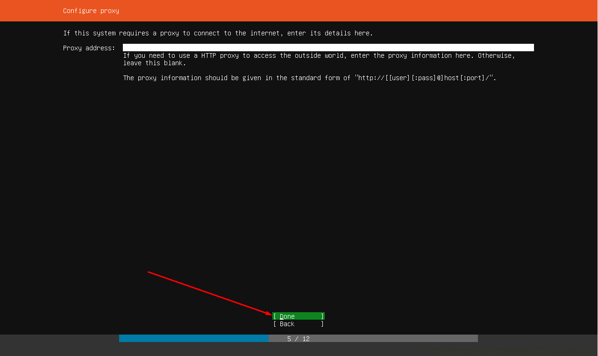
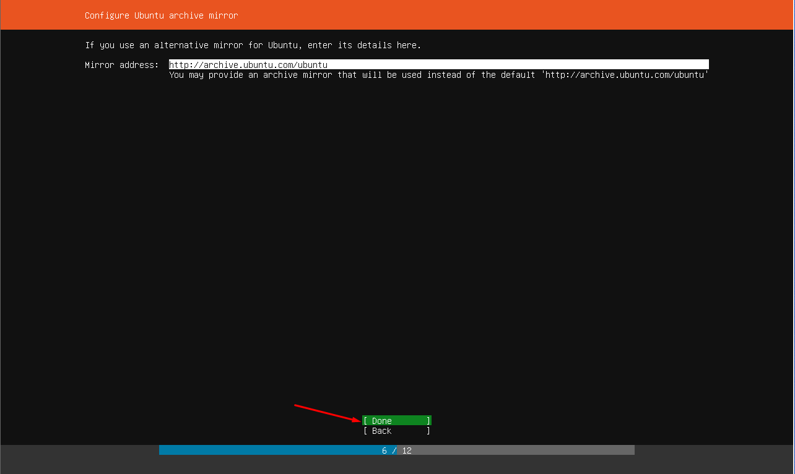
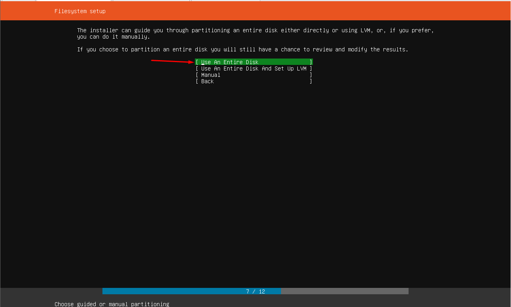
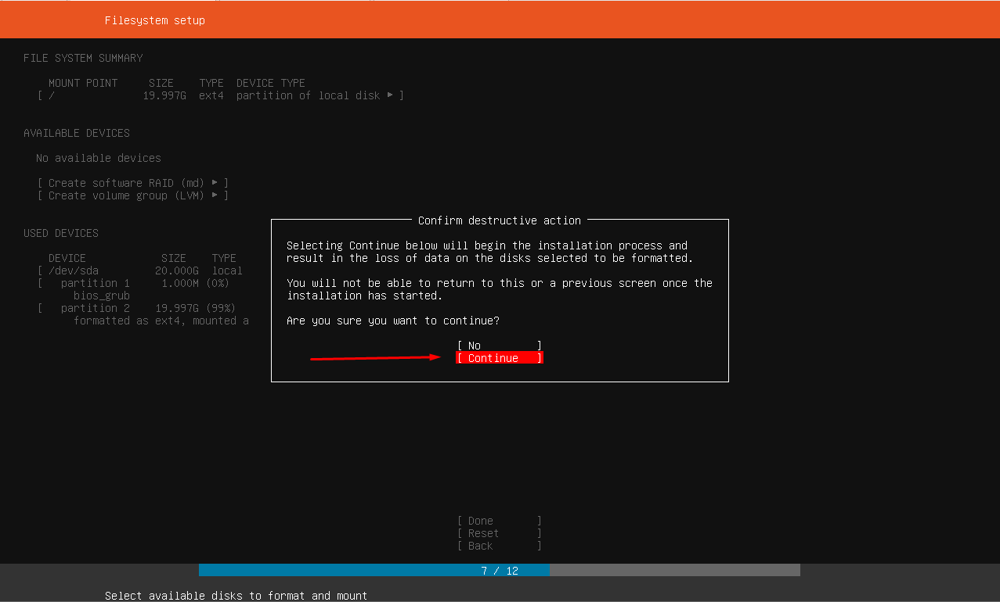
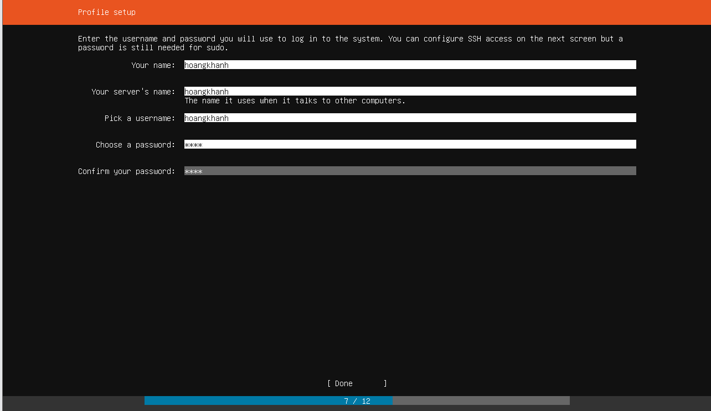
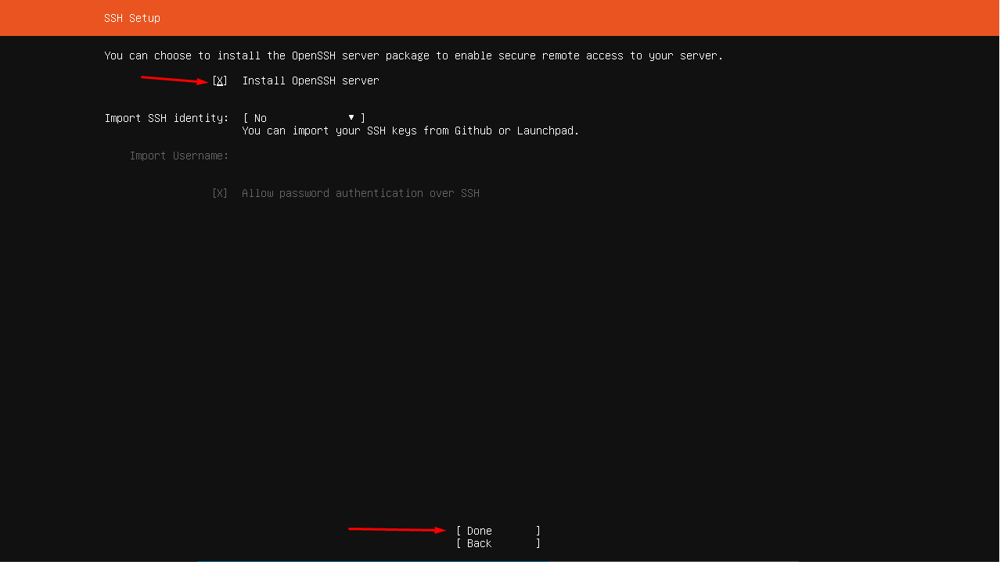
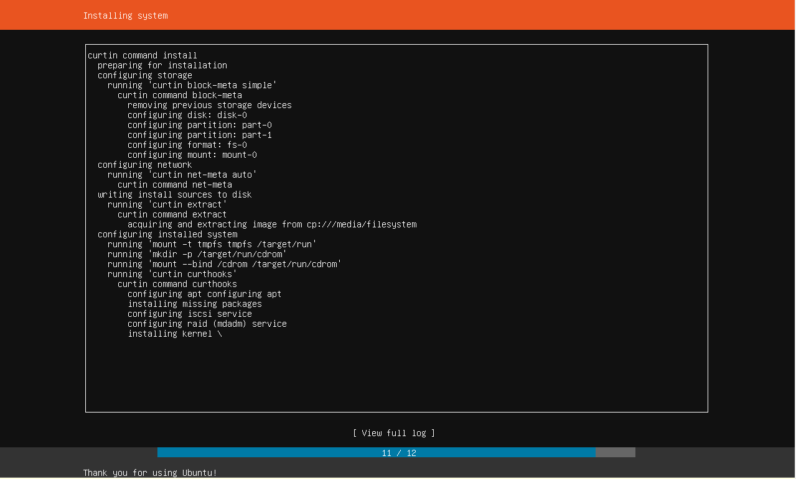
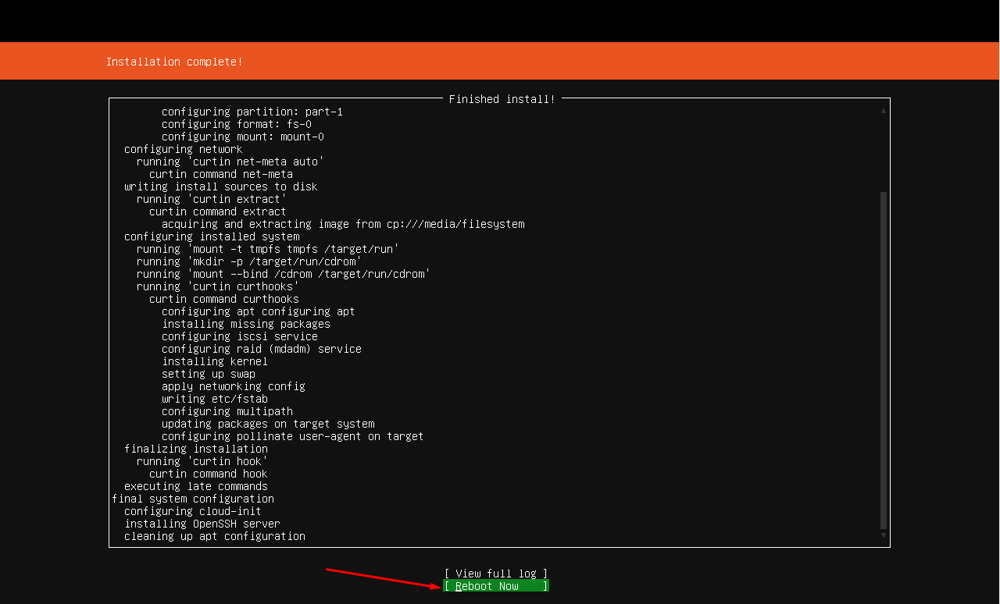

    