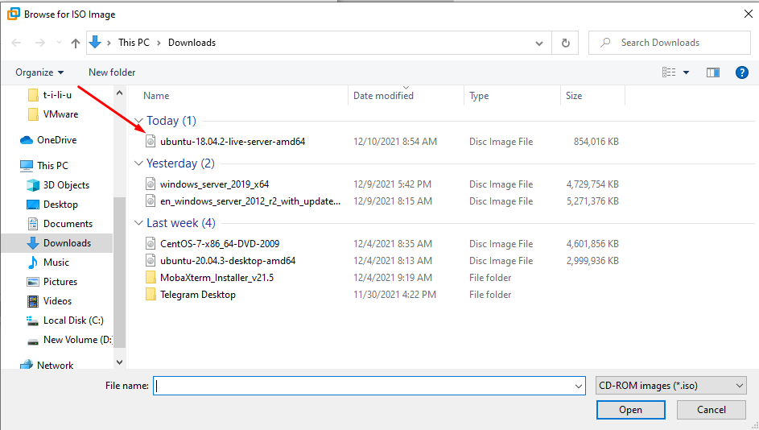
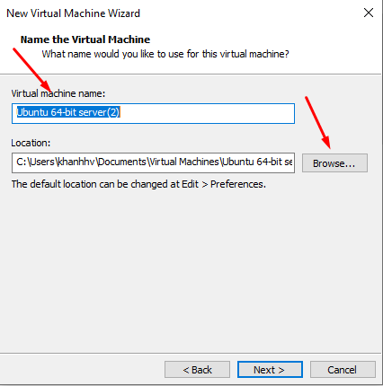
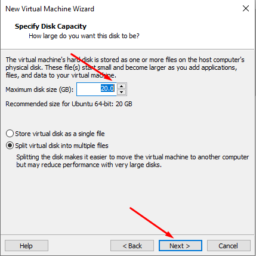
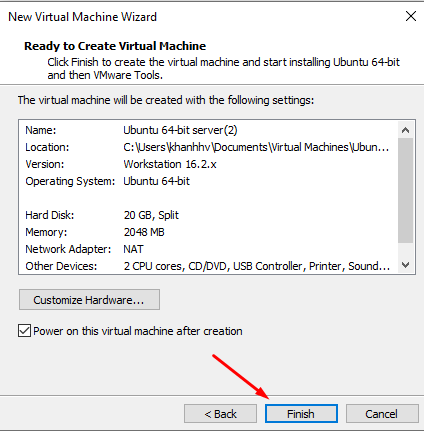
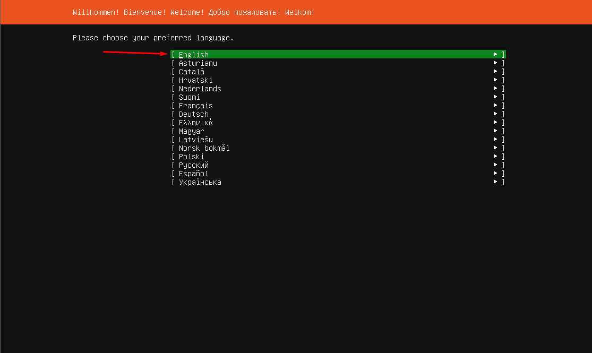
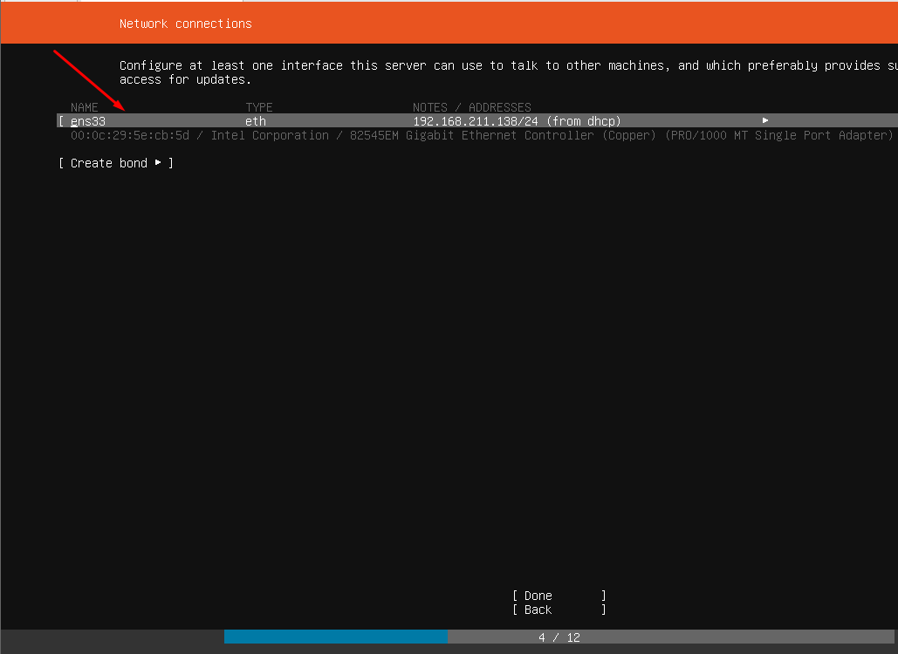
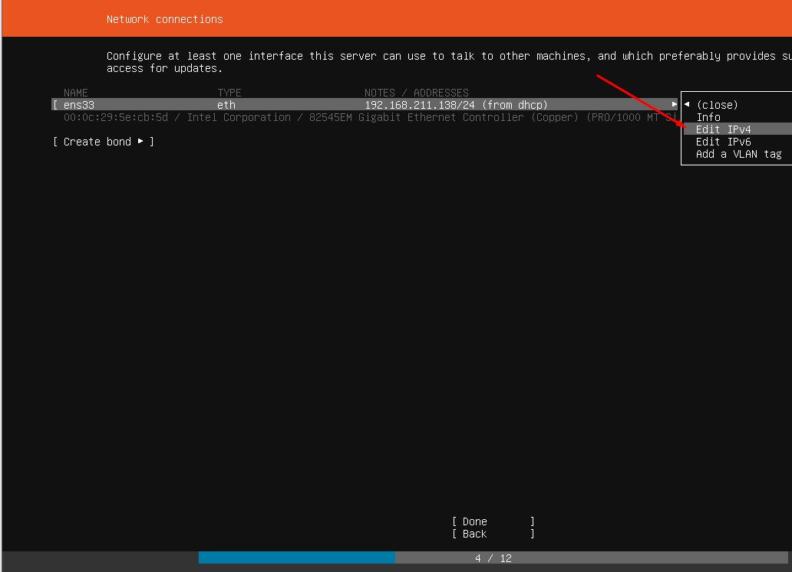
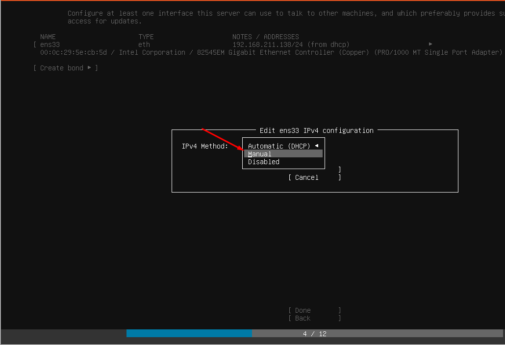
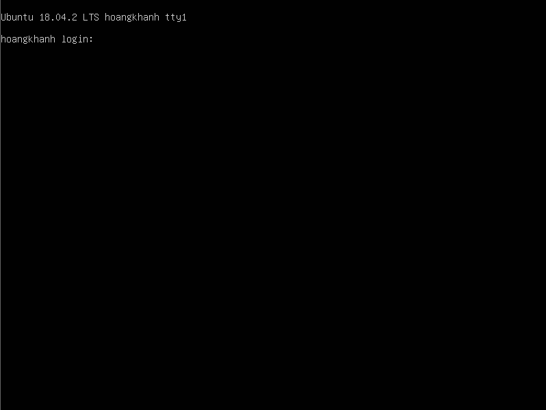
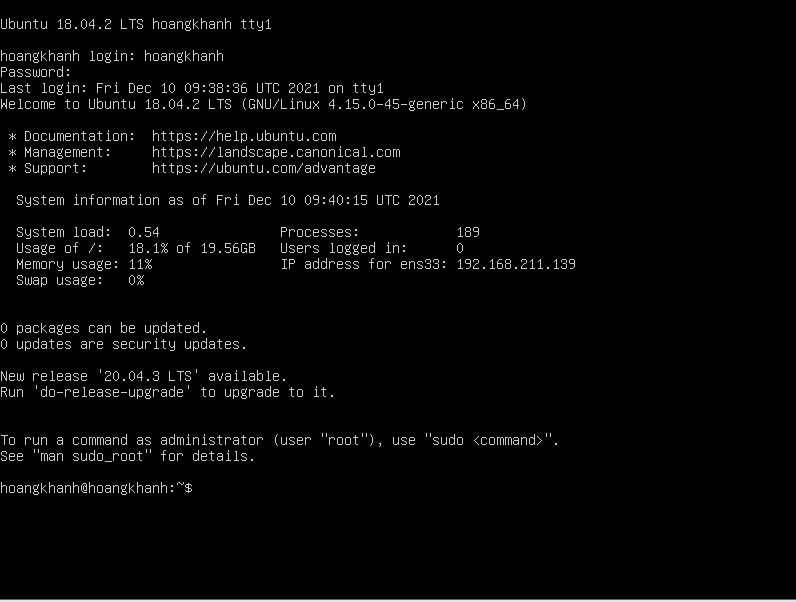

 - Bước 1 : Chuẩn Bị 
    + Tải Ubuntu Theo đường link : https://download.com.vn/download/ubuntu-server-edition-13351?linkid=35520
    + Cấu hình tối thiểu : Ổ cứng : 40 GB , RAM : 4G
    + Cấu hình khuyến cáo : Ổ cứng : 100GB , RAM : 8GB đối với 64bit.
    + Đã Cài đặt VMware Wokstation 20.04.3
- Bước 2 : Cài đặt Buntu server
   + Tạo file
        - 
        
    + Chọn Đĩa Ubuntu server đã tải về từ trước đó.
        - 

- Bước 3 Thay đổi dung lượng bộ nhớ

- Bước 4 Bắt đầu quá trình cài đặt

- Bước 5 : Chọn ngôn ngữ 

- Bược 6 : Cài đặt địa chỉ Ip Tĩnh 

- Bước 8: Hoàn thành và đăng nhập vào Ubuntu

    