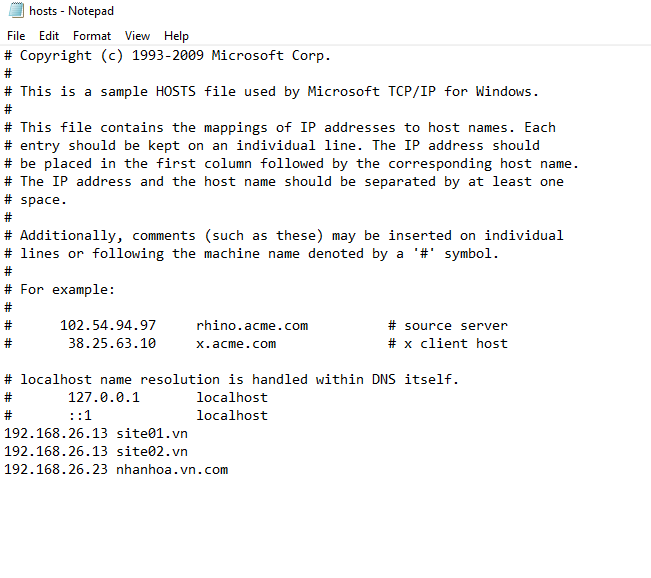

## Tạo web và chạy trên WinServer bằng tên miền
#### bước 1 Tạo thư mục với tên la nhanhoa.vn
- `sudo mkdir -p nhanhoa.vn`

#### Bước 2 : Gán quyền sở hữu thư mục với user Apache www-data
- `sudo chown -R www-data:www-data /var/www/nhanhoa.vn`

#### Bước 3 : Phân quyền cho thư mục nhanhoa.vn
-  `sudo chmod -R 755 /var/www/nhanhoa.com`

#### Bước 4 : Tạo trang index.html
- `sudo nano /var/www/nhanhoa.vn/index.html`

- Nội dung của file 

#### Bước 5 : Tạo file Virtual Hosts
- `sudo nano /etc/apache2/sites-available/nhanhoa.vn`

#### Bước 6 : kiểm tra Virtual Hosts được cấu hình chính xác chưa
- ` sudo apache2ctl configtest`

#### Bước 7 : Khởi động lại apache 2 trước khi chạy 
- ` sudo systemctl restart apache2 `

#### Bước 8 : thực hiện thay đổi file hosts trên window server.
- Tìm đến file host và chạy bằng Notepad theo quyền admin(\windows\System32\drivers\etc)
- Thực hiện thêm địa chỉ ip và tên miền

#### Bước 9 : kiểm tra kết quả thực hiện bằng cách gõ tên miền 
- `nhanhoa.vn.com`

## Vẫn các bước trên tạo thêm 1 website có tên là "website01.com"
- Cùng lúc chạy cả hai web site "nhanhoa.vn.com" và "website01.com"

