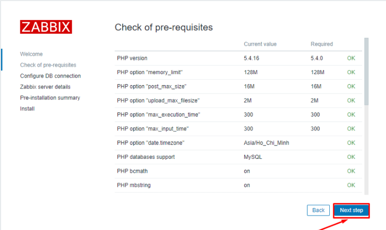
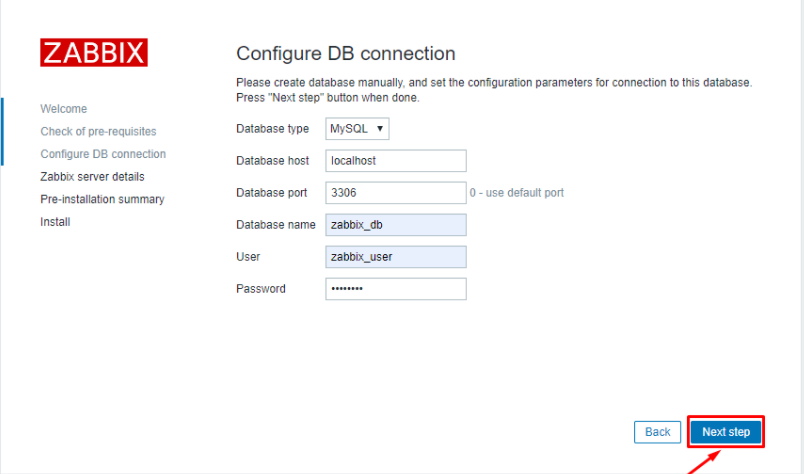
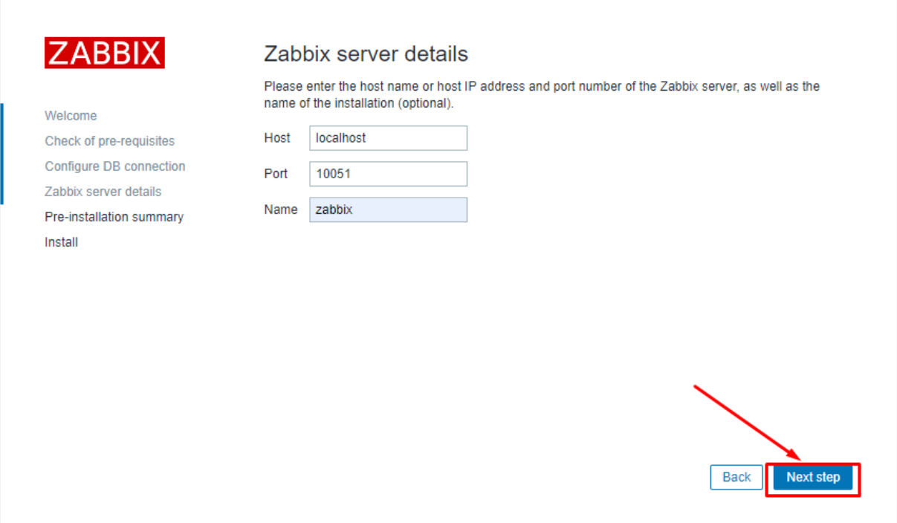
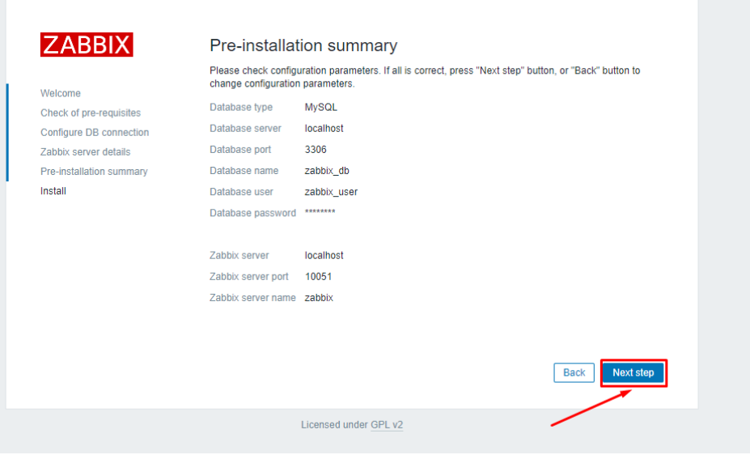
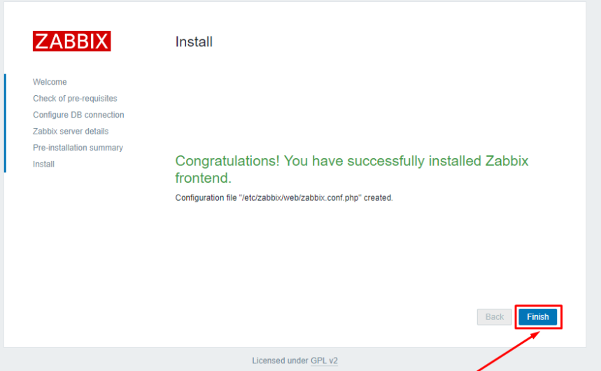
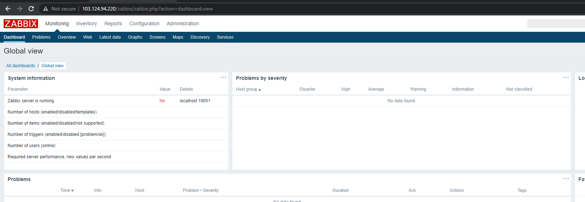

## Bước 1. Update các gói cần thiết 
- `yum install epel-release`
- `yum update -y`


## Bước 2: Download repo zabbix

- `rpm -ivh https://repo.zabbix.com/zabbix/4.0/rhel/7/x86_64/zabbix-release-4.0-1.el7.noarch.rpm`

- `yum -y install zabbix-server-mysql zabbix-web-mysql mysql mariadb-server httpd php`

### Create Database
- Start service mariadb và tự động start khi khởi động lại server.
- `systemctl start mariadb`
- `systemctl enable mariadb`


### Thiết lập passwd root cho mysql
    
-  `mysql_secure_installation`

## bước 3. Tạo một database cho zabbix
### Login database mysql 
- `mysql -u root -p`

### Xóa database zabbix_db nếu đã tồn tại.
- `DROP DATABASE IF EXISTS zabbix_db;`

### Tạo database có tên zabbix_db cho zabbix server
- `create database zabbix_db character set utf8 collate utf8_bin;`

### Gán quyền cho user zabbix_user với mật khẩu là password cho database zabbix_db.
- `grant all privileges on zabbix_db.* to zabbix_user@localhost identified by 'password';`

### Áp dụng thay đổi và thoát khỏi mysql.
- `flush privileges;`
-  `exit;`

## Bước 4 . Import database zabbix

- `cd /usr/share/doc/zabbix-server-mysql-4.0.3`
- `gunzip create.sql.gz`
- `mysql -u root -p zabbix_db < create.sql`

## Bước 5. Config Database

- `sed -i 's/# DBHost=localhost/DBHost=localhost/g' /etc/zabbix/zabbix_server.conf`
- `sed -i "s/DBName=zabbix/DBName=zabbix_db/g" /etc/zabbix/zabbix_server.conf`
- `sed -i "s/DBUser=zabbix/DBUser=zabbix_user/g" /etc/zabbix/zabbix_server.conf`
- `sed -i "s/# DBPassword=/DBPassword=password/g" /etc/zabbix/zabbix_server.conf`

## Bước 6. Configure PHP Setting
- `sed -i 's/max_execution_time = 30/max_execution_time = 600/g' /etc/php.ini`
- `sed -i 's/max_input_time = 60/max_input_time = 600/g' /etc/php.ini`
- `sed -i 's/memory_limit = 128M/memory_limit = 256M/g' /etc/php.ini`
- `sed -i 's/post_max_size = 8M/post_max_size = 32M/g' /etc/php.ini`
- `sed -i 's/upload_max_filesize = 2M/upload_max_filesize = 16M/g' /etc/php.ini`
- `echo "date.timezone = Asia/Ho_Chi_Minh" >> /etc/php.ini`


## Bước 7 Restart service zabbix-server, http, mariadb
- ```
        systemctl start zabbix-server
        systemctl enable zabbix-server
        systemctl start httpd
        systemctl enable httpd
        systemctl restart zabbix-server
        systemctl restart httpd
        systemctl restart mariadb

## Bước 8: Cấu hình web dashboard zabbix
- http://ipserver/zabbix


- Bước 1: Thông số config php. Click Next step


- Bước 2 : Nhập thông số về database zabbix đã thiết lập 


- Bước 3: Zabbix server details


- Bước 4 : Pre-installation summary




- Bước 5: Kết thúc cài đặt. Click Finish



- Bước 6: Login dashboard zabbix server


