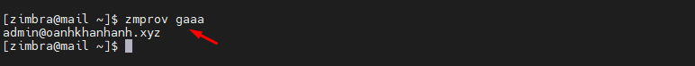

## Bước 1. SSH vào email server và chuyển sang thao tác với user zimbra
- `su - zimbra`

## Bước 2: Kiểm tra những user nào có quyền admin
- `zmprov gaaa`

## Bước 3: Thay đổi mật khẩu account có quyền admin
- `zmprov sp <admin email address> <new password>`
- VD
    + `zmprov sp admin@oanhkhanhanh.xyz 123456a@`

