## 1. Xử lý tiket hỗ trợ trỏ tên miền
- Nội dung tiket cần xử lý
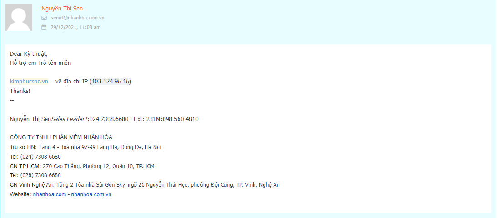

- Nội dụng trỏ
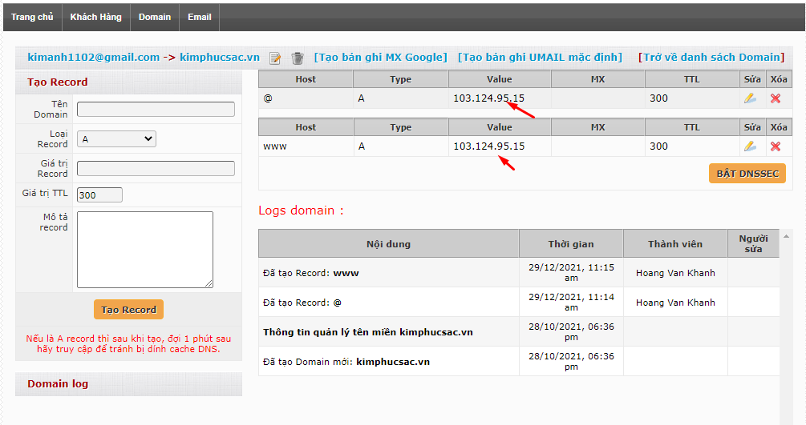

- Báo cáo lại đã thực hiện trỏ thành công
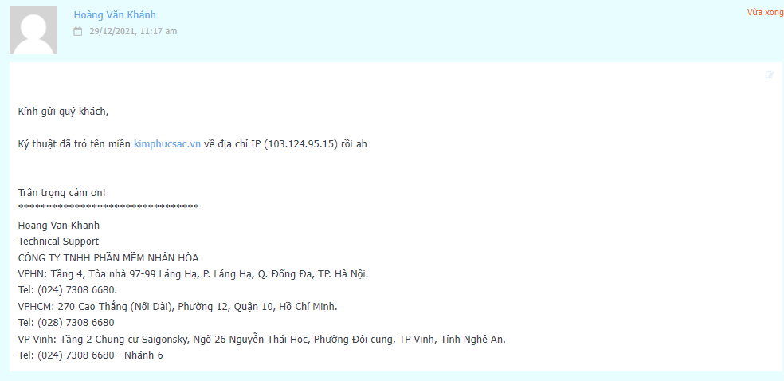

## 2. Xử lý tiket trỏ tên miền về địa chỉ ip
- nội dụng
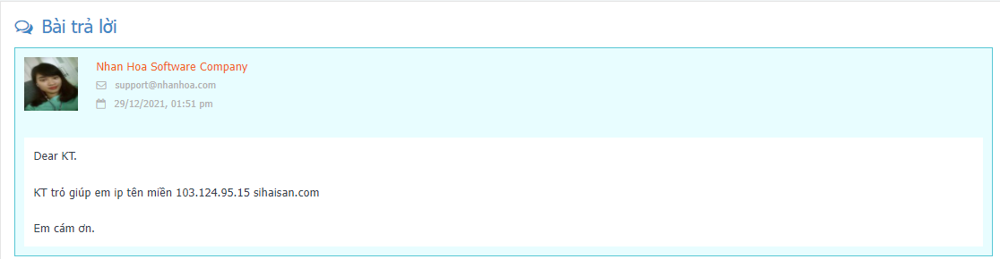

- Thực hiện
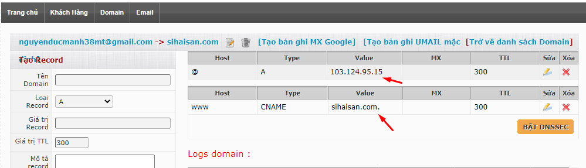

- Báo cáo đã trỏ thành công
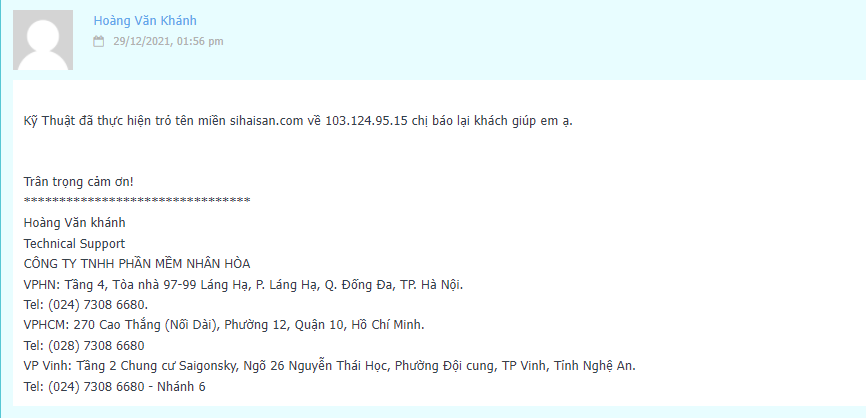

## 3. Hỗ trợ trỏ tên miền về hosting
- Nội dung
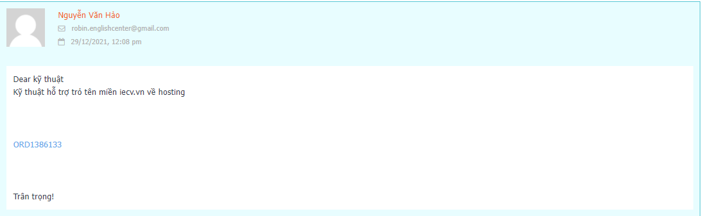

- Kiểm tra DNS
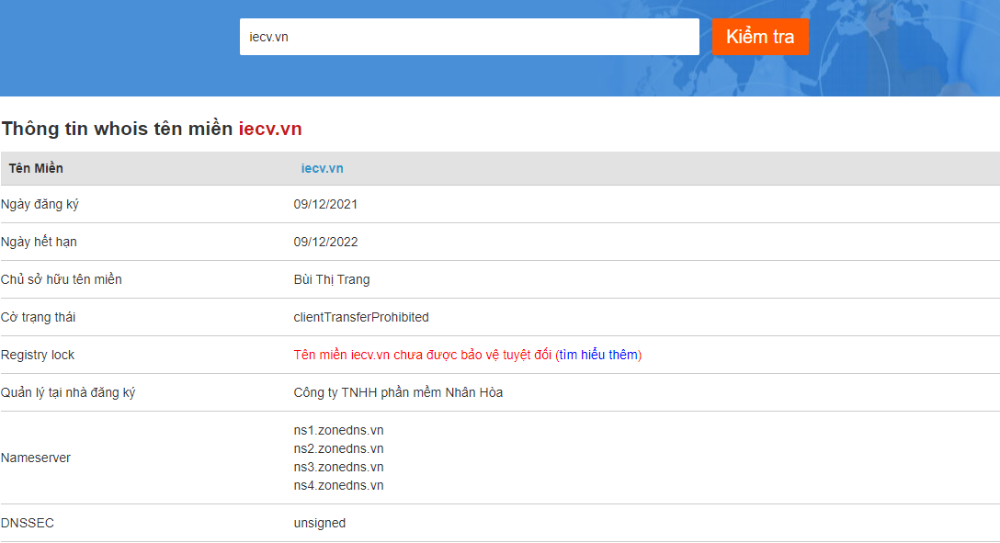

- Thực hiện Kiểm tra địa chỉ ip hosting
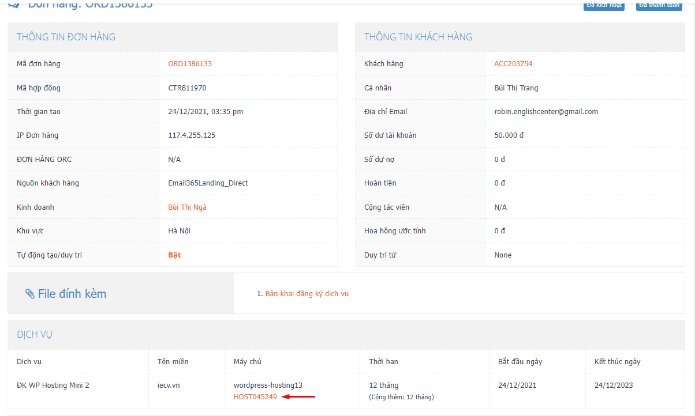
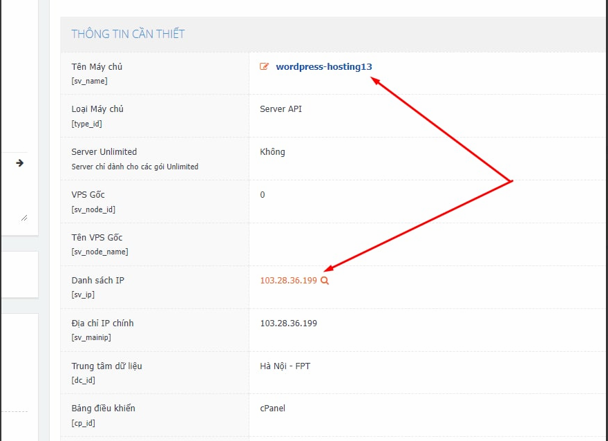

- Thực hiện trỏ 
- 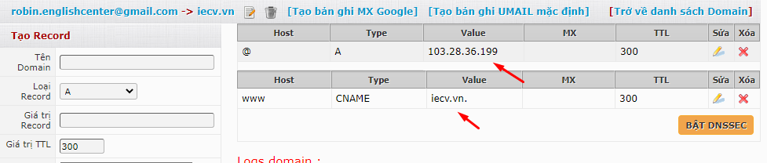

- Trả lời khách
- 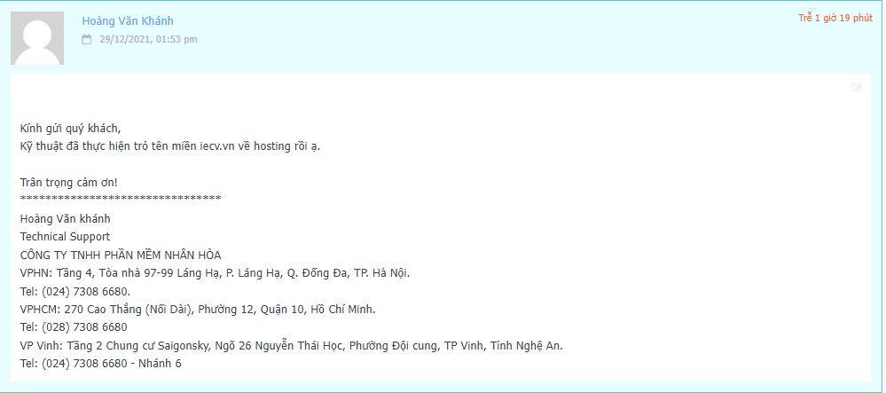
